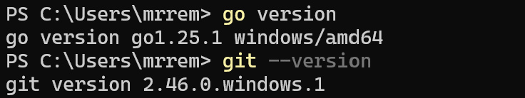
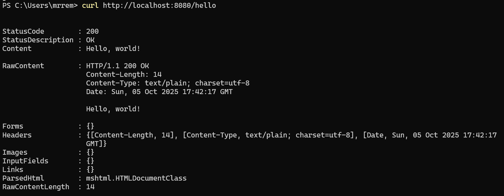
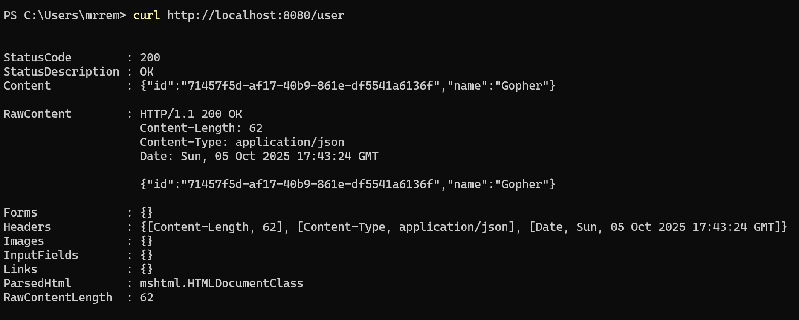
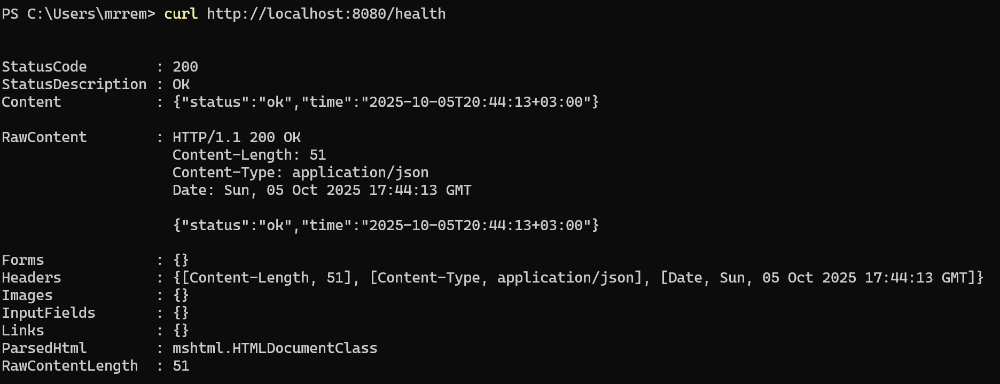
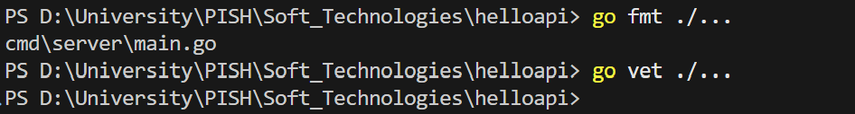

<h1>
Практическое задание №1<br><br>
Ремешевский В.А.<br>
ПИМО-01-25
</h1>
<br>

# HelloAPI

## Описание проекта

**HelloAPI** — это простой HTTP API-сервер на Go, предоставляющий три эндпоинта:

- `/hello` — возвращает текстовое приветствие.
- `/user` — возвращает JSON с уникальным идентификатором пользователя и именем.
- `/health` — возвращает JSON с текущим статусом и временем в формате RFC3339.

### Требования

- Установленный Go
- Установленный git
- Доступ в интернет для загрузки зависимостей (`github.com/google/uuid`)


  
## Структура проекта

```
helloapi/
├── assets/
│   ├── go_git_versions.png
│   ├── hello_endpoint.png
│   ├── user_endpoint.png
│   ├── health_endpoint.png
│   └── fmt_vet.png
├── cmd/
│   └── server/
│       └── main.go
├── go.mod
├── go.sum
├── helloapi.exe
└── README.md
```

---

## Как начать работу

### Инициализация и установка зависимостей

```sh
cd helloapi
go mod init example.com/helloapi # если go.mod ещё нет
go get github.com/google/uuid@latest
go mod tidy
```

### Настройка порта

По умолчанию сервер слушает `8080`. Чтобы указать другой порт, задайте переменную окружения `APP_PORT`:


**Windows (cmd):**
```cmd
set APP_PORT=8081
```

**Windows (PowerShell):**
```powershell
$env:APP_PORT="8081"
```

**Linux/macOS:**
```sh
APP_PORT=8081
```

### Запуск приложения
```powershell
go run ./cmd/server
```

## Сборка приложения (.exe для Windows)

```sh
go build -o helloapi.exe ./cmd/server
```

### Запуск приложения

```sh
helloapi.exe
```

---

## Примеры запросов

```sh
curl http://localhost:8080/hello
```

---

```sh
curl http://localhost:8080/user
```

---

```sh
curl http://localhost:8080/health
```


---

## Код-стайл и базовые проверки

Перед коммитом рекомендуется отформатировать и проверить код стандартными инструментами Go:

```sh
go fmt ./...
go vet ./...
```

Ожидаемо: команды завершаются без ошибок.  


Если `go vet` сообщает о проблемах, необходимо их исправить и повторить проверку.
 
---


## Примечания по конфигурации

- **Порт**: по умолчанию сервер слушает порт `8080`. Можно изменить через переменную окружения `APP_PORT`.
- **Зависимости**: для генерации UUID используется пакет `github.com/google/uuid`.
- **Логи**: при запуске в консоль выводится информация о старте сервера.

---