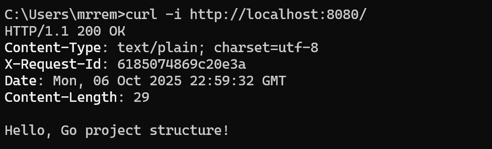
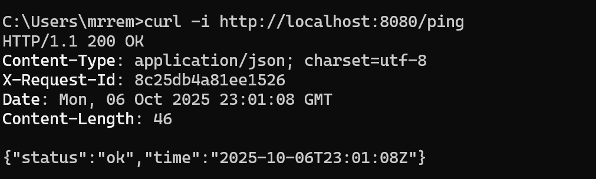
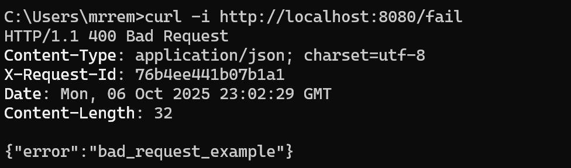
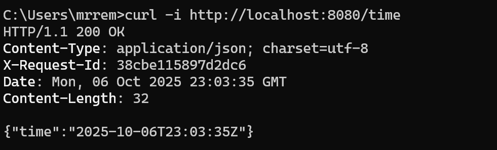
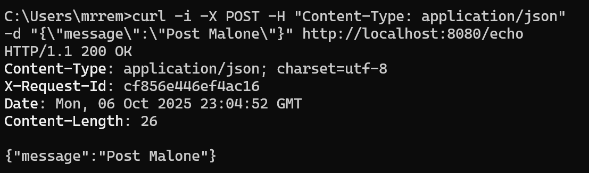
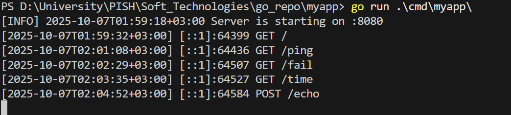
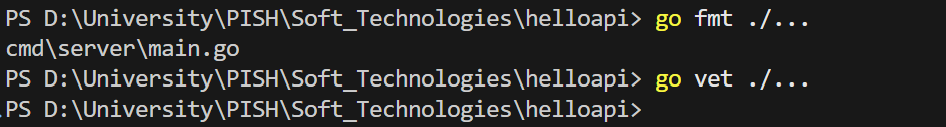

<h1>
Практическое задание №2<br><br>
Ремешевский В.А.<br>
ПИМО-01-25
</h1>
<br>


# MyApp

## Описание проекта

**MyApp** — это HTTP API-сервер на Go, реализующий несколько эндпоинтов для демонстрации работы с HTTP, логированием и обработкой JSON.  
Сервер предоставляет следующие эндпоинты:

- `/` — корневой эндпоинт, возвращает приветствие.
- `/ping` — возвращает ответ "pong".
- `/fail` — имитирует ошибку сервера.
- `/time` — возвращает текущее время в формате RFC3339.
- `/echo` — возвращает обратно полученное сообщение.

### Требования

- Установленный Go
- Установленный git
  


---

## Структура проекта

```
myapp/
├── assets/
├── cmd/
│   └── myapp/
│       └── main.go
├── internal/
│   └── app/
│       ├── app.go
│       └── handlers/
│           ├── echo.go
│           ├── fail.go
│           ├── ping.go
│           ├── root.go
│           └── time.go
├── utils/
│   ├── httpjson.go
│   └── logger.go
├── .gitignore
├── go.mod
├── README.md
```

---

## Как начать работу

### Инициализация и установка зависимостей

```sh
cd myapp
go mod init github.com/RemeshevskiyValeriy/myapp
go mod tidy
```

### Настройка порта

По умолчанию сервер слушает порт `8080`. Чтобы изменить порт, задайте переменную окружения `APP_PORT`:

**Windows (cmd):**
```cmd
set APP_PORT=8081
```

**Windows (PowerShell):**
```powershell
$env:APP_PORT="8081"
```

**Linux/macOS:**
```sh
APP_PORT=8081
```

### Запуск приложения

```powershell
go run ./cmd/myapp
```

## Сборка приложения (.exe для Windows)

```sh
go build -o bin/myapp.exe ./cmd/myapp
```

### Запуск приложения

```sh
bin\myapp.exe
```

---

## Примеры запросов

```sh
curl http://localhost:8080/
```

---

```sh
curl http://localhost:8080/ping
```

---

```sh
curl http://localhost:8080/fail
```

---

```sh
curl http://localhost:8080/time
```

---

```sh
curl -i -X POST -H "Content-Type: application/json" -d "{\"message\":\"Post Malone\"}" http://localhost:8080/echo
```

---

## Логи сервера



---

## Код-стайл и базовые проверки

Перед коммитом рекомендуется отформатировать и проверить код стандартными инструментами Go:

```sh
go fmt ./...
go vet ./...
```

Ожидаемо: команды завершаются без ошибок.  


Если `go vet` сообщает о проблемах, необходимо их исправить и повторить проверку.

---

## Список из 5 артефактов и папок, куда бы их следовало положить и почему

1. **main.go** — помещен в `cmd/myapp/`, потому что это точка входа приложения, и папка `cmd` традиционно используется для исполняемых файлов.
2. **app.go** — хранится в `internal/app/`, так как это внутренний код приложения, не предназначенный для использования вне проекта.
3. **echo.go, ping.go, fail.go, root.go, time.go** — размещены в `internal/app/handlers/`, чтобы логически сгруппировать обработчики HTTP-запросов.
4. **logger.go, httpjson.go** — помещены в `utils/`, так как это вспомогательные утилиты, которые могут использоваться в разных частях приложения.
5. **myapp.exe** — сложен в `bin/`, чтобы отделить собранные бинарные файлы от исходного кода, что облегчает деплой и организацию проекта.

Такая структура помогает поддерживать порядок, облегчает навигацию по проекту и способствует масштабируемости кода.