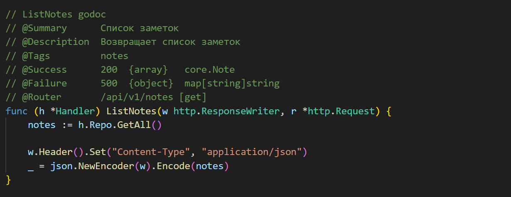
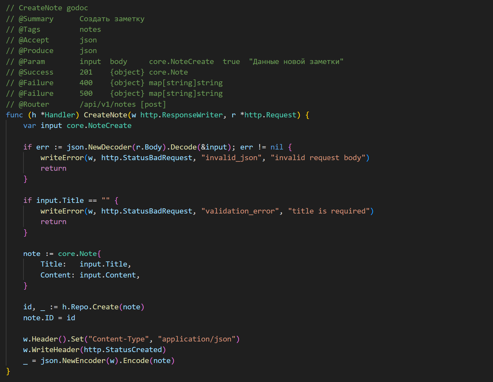
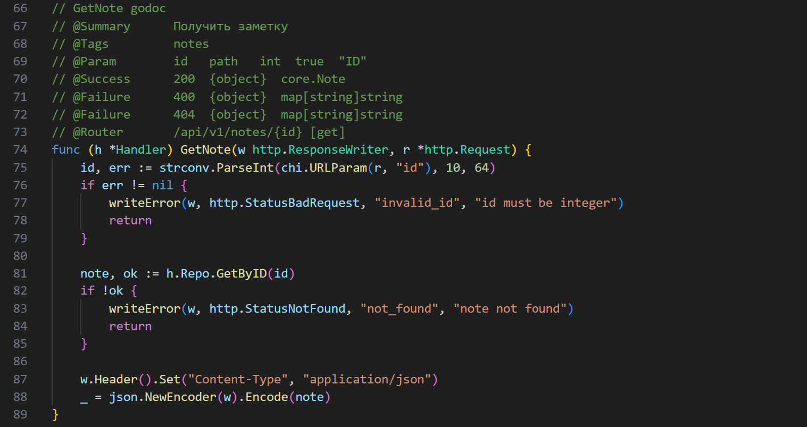
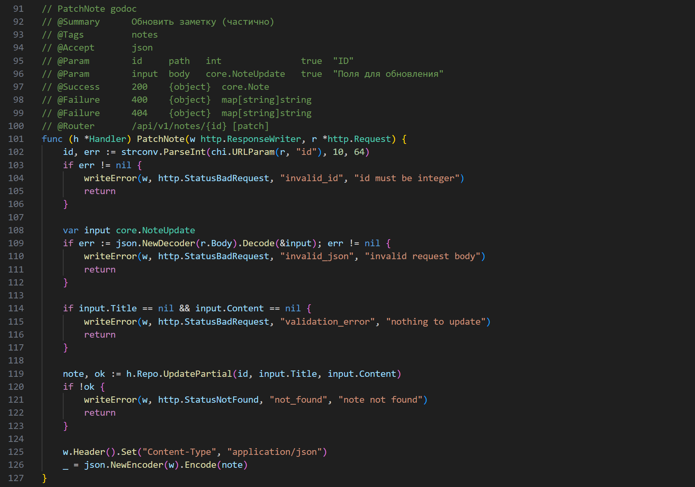
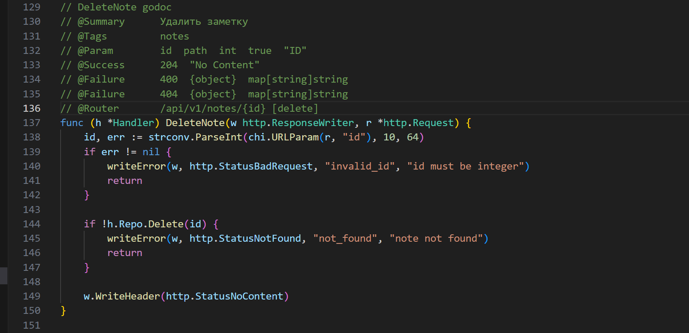
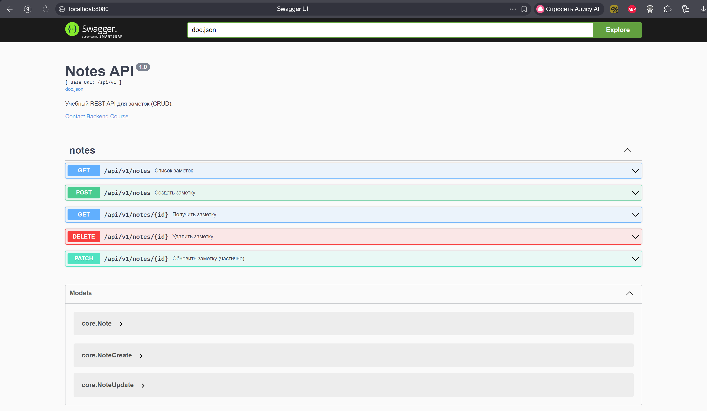

<h1>
Практическое задание №12<br><br>
Ремешевский В.А.<br>
ПИМО-01-25
</h1>

<h2><b>Тема</b><br>
Подключение Swagger/OpenAPI. Автоматическая генерация документации</h2>

# Цели

1. Освоить основы спецификации OpenAPI (Swagger) для REST API.
2. Подключить автогенерацию документации к проекту из ПЗ 11 (`notes-api`).
3. Научиться публиковать интерактивную документацию (Swagger UI / ReDoc) на эндпоинте `GET /docs`.
4. Синхронизировать код и спецификацию (комментарии-аннотации → генерация) и/или «schema-first» (генерация кода из `openapi.yaml`).
5. Подготовить процесс обновления документации (`Makefile`/скрипт).

---

# NOTES-API-SWAGGER

## Краткое описание проекта

**NOTES-API-SWAGGER** — это HTTP API‑сервис на Go, реализующий CRUD-операции для заметок и автогенерацию OpenAPI-документации с помощью `swaggo/swag`.  
В проекте используются аннотации в коде (code-first), а документация доступна через Swagger UI на эндпоинте `/docs`.

## Структура проекта

```
notes-api-swagger/
├── api/
│   └── openapi.yaml
├── assets/
├── cmd/
│   └── api/
│       └── main.go
├── docs/
│   ├── docs.go
│   ├── swagger.json
│   └── swagger.yaml
├── internal/
│   ├── core/
│   │   ├── dto.go
│   │   └── note.go
│   ├── http/
│   │   ├── router.go
│   │   └── handlers/
│   │       ├── error.go
│   │       └── notes.go
│   └── repo/
│       └── note_mem.go
├── go.mod
├── Makefile
├── README.md
```

---

## Подход к интеграции документации

**Code-First (аннотационный)**  
Программист пишет код API (хэндлеры, маршруты) и добавляет над функциями специальные комментарии-аннотации, из которых инструменты вроде swaggo/swag автоматически генерируют OpenAPI-файл.

Преимущества:
- быстрое подключение к уже готовому проекту;
- минимальная ручная работа с YAML;
- простая поддержка актуальности при изменениях кода.

Недостатки:
- ограниченная гибкость описания сложных сценариев;
- возможны расхождения, если аннотации забыли обновить.

---

## Как начать работу

### Инициализация и установка зависимостей

```sh
cd notes-api-swagger
go mod init example.com/notes-api-swagger
go get github.com/go-chi/chi/v5
go get github.com/swaggo/http-swagger
go install github.com/swaggo/swag/cmd/swag@latest
go get github.com/swaggo/swag/cmd/swag
```

### Генерация документации

```sh
swag init -g cmd/api/main.go -o docs
```

Или через `Makefile`:
```sh
make swagger
```

### Запуск приложения

```powershell
go run ./cmd/api
```

Или через `Makefile`:
```sh
make run
```

---

## Скриншоты

### Пример аннотаций над методами в файле notes.go
```ListNotes```:


```CreateNote```:


```GetNote```:


```PatchNote```:


```DeleteNote```:


### Swagger UI (GET /docs)


---

## Выводы

В ходе работы был реализован и автоматизирован процесс генерации OpenAPI-документации для REST API на Go.  
Удалось интегрировать swaggo/swag, настроить аннотации и опубликовать интерактивную документацию через Swagger UI.  
Автоматизация генерации документации через Makefile/скрипт позволяет быстро поддерживать спецификацию в актуальном состоянии.  
Остались вопросы по расширенному описанию сложных сценариев и поддержке согласованности между кодом и документацией при больших изменениях.