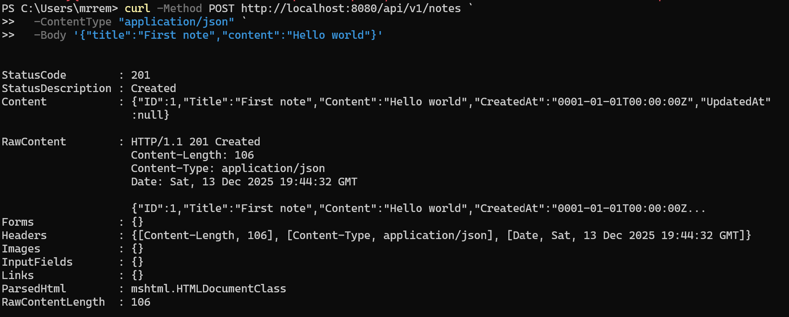
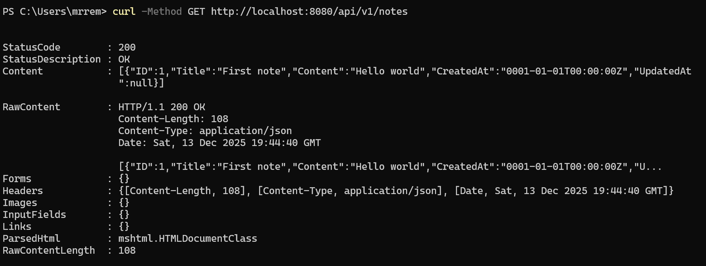
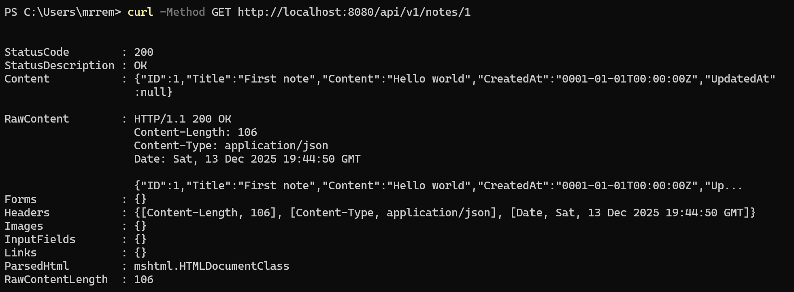
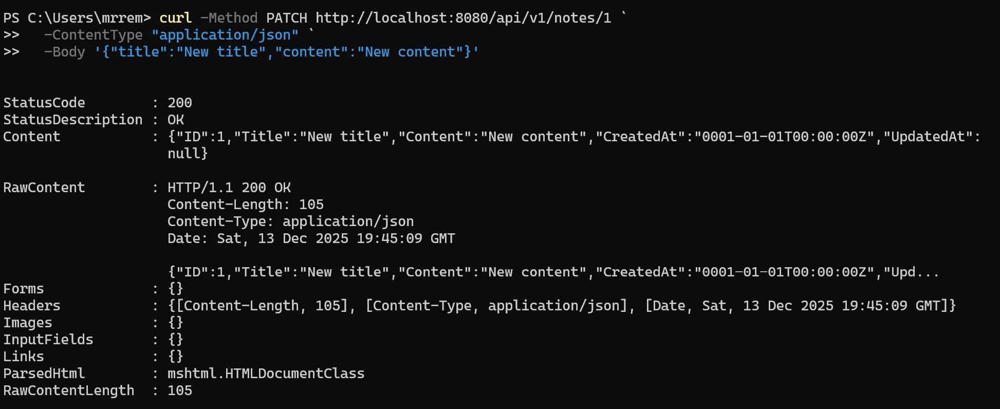
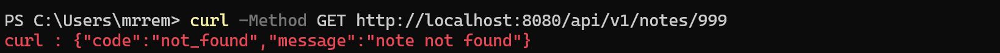
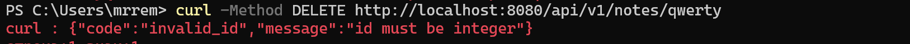
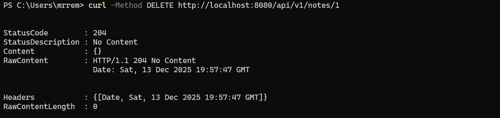

<h1>
Практическое задание №11<br><br>
Ремешевский В.А.<br>
ПИМО-01-25
</h1>

<h2><b>Тема</b><br>
Проектирование REST API (CRUD для заметок). Разработка структуры.</h2>

## Цели работы

1. Освоить принципы проектирования REST API.
2. Научиться разрабатывать структуру проекта backend-приложения на Go.
3. Спроектировать и реализовать CRUD-интерфейс (Create, Read, Update, Delete) для сущности «Заметка».
4. Освоить применение многослойной архитектуры (`handler` → `service` → `repository`).
5. Подготовить основу для интеграции с базой данных и JWT-аутентификацией в следующих занятиях.

---

# NOTES-API

## Краткое описание проекта

**NOTES-API** — это HTTP API‑сервис на Go, реализующий CRUD-операции для заметок. Проект построен по принципам REST, использует многослойную архитектуру и предоставляет эндпоинты для создания, получения, обновления и удаления заметок.

## Структура проекта

```
notes-api/
├── api/
│   └── openapi.yaml
├── assets/
├── cmd/
│   └── api/
│       └── main.go
├── internal/
│   ├── core/
│   │   └── note.go
│   ├── http/
│   │   ├── router.go
│   │   └── handlers/
│   │       ├── error.go
│   │       └── notes.go
│   └── repo/
│       └── note_mem.go
├── go.mod
├── README.md
```

---

## Теоретические положения REST API и CRUD

**REST API** (Representational State Transfer) — это архитектурный стиль для построения веб-сервисов, который использует стандартные HTTP-методы для работы с ресурсами. Каждый ресурс (например, заметка) имеет уникальный URL, а операции над ним выполняются с помощью методов:

- `GET` — получить данные (чтение)
- `POST` — создать новый ресурс
- `PATCH` — частично обновить ресурс
- `DELETE` — удалить ресурс

**CRUD** — это базовые операции для работы с данными:

- **Create** (создание)
- **Read** (чтение)
- **Update** (обновление)
- **Delete** (удаление)

Для документирования API используется файл `api/openapi.yaml`, в котором описаны все доступные эндпоинты, параметры и возможные ответы сервера.

---

## Как начать работу

### Инициализация и установка зависимостей

```sh
cd notes-api
go mod init example.com/notes-api
go get github.com/go-chi/chi/v5
```

### Запуск приложения

```powershell
go run ./cmd/api
```

---

## Код-листинг основных файлов

```main.go```:
```go
func main() {
  repo := repo.NewNoteRepoMem()
  h := &handlers.Handler{Repo: repo}
  r := httpx.NewRouter(h)

  log.Println("Server started at :8080")
  log.Fatal(http.ListenAndServe(":8080", r))
}
```

```note_mem.go```:
```go
type NoteRepoMem struct {
  mu    sync.Mutex
  notes map[int64]*core.Note
  next  int64
}

func NewNoteRepoMem() *NoteRepoMem {
  return &NoteRepoMem{notes: make(map[int64]*core.Note)}
}

func (r *NoteRepoMem) GetAll() []*core.Note {
	r.mu.Lock()
	defer r.mu.Unlock()

	res := make([]*core.Note, 0, len(r.notes))
	for _, n := range r.notes {
		res = append(res, n)
	}
	return res
}

func (r *NoteRepoMem) Create(n core.Note) (int64, error) {
  r.mu.Lock()
  defer r.mu.Unlock()

  r.next++
  n.ID = r.next
  r.notes[n.ID] = &n
  return n.ID, nil
}

func (r *NoteRepoMem) GetByID(id int64) (*core.Note, bool) {
	r.mu.Lock()
	defer r.mu.Unlock()

	n, ok := r.notes[id]
	return n, ok
}

func (r *NoteRepoMem) UpdatePartial(id int64, title, content *string) (*core.Note, bool) {
	r.mu.Lock()
	defer r.mu.Unlock()

	n, ok := r.notes[id]
	if !ok {
		return nil, false
	}

	if title != nil {
		n.Title = *title
	}
	if content != nil {
		n.Content = *content
	}

	return n, true
}

func (r *NoteRepoMem) Delete(id int64) bool {
	r.mu.Lock()
	defer r.mu.Unlock()

	if _, ok := r.notes[id]; !ok {
		return false
	}
	delete(r.notes, id)
	return true
}
```

```notes.go```:
```go
type Handler struct {
  Repo *repo.NoteRepoMem
}

type NotePatch struct {
	Title   *string `json:"title"`
	Content *string `json:"content"`
}

func (h *Handler) ListNotes(w http.ResponseWriter, r *http.Request) {
	notes := h.Repo.GetAll()

	w.Header().Set("Content-Type", "application/json")
	json.NewEncoder(w).Encode(notes)
}

func (h *Handler) CreateNote(w http.ResponseWriter, r *http.Request) {
  var n core.Note

	if err := json.NewDecoder(r.Body).Decode(&n); err != nil {
		writeError(w, http.StatusBadRequest, "invalid_json", "invalid request body")
		return
	}

	if n.Title == "" {
		writeError(w, http.StatusBadRequest, "validation_error", "title is required")
		return
	}

	id, _ := h.Repo.Create(n)
	n.ID = id

	w.Header().Set("Content-Type", "application/json")
	w.WriteHeader(http.StatusCreated)
	json.NewEncoder(w).Encode(n)
}

func (h *Handler) GetNote(w http.ResponseWriter, r *http.Request) {
	id, err := strconv.ParseInt(chi.URLParam(r, "id"), 10, 64)
	if err != nil {
		writeError(w, http.StatusBadRequest, "invalid_id", "id must be integer")
		return
	}

	note, ok := h.Repo.GetByID(id)
	if !ok {
		writeError(w, http.StatusNotFound, "not_found", "note not found")
		return
	}

	w.Header().Set("Content-Type", "application/json")
	json.NewEncoder(w).Encode(note)
}

func (h *Handler) PatchNote(w http.ResponseWriter, r *http.Request) {
	id, err := strconv.ParseInt(chi.URLParam(r, "id"), 10, 64)
	if err != nil {
		writeError(w, http.StatusBadRequest, "invalid_id", "id must be integer")
		return
	}

	var patch NotePatch
	if err := json.NewDecoder(r.Body).Decode(&patch); err != nil {
		writeError(w, http.StatusBadRequest, "invalid_json", "invalid request body")
		return
	}

	if patch.Title == nil && patch.Content == nil {
		writeError(w, http.StatusBadRequest, "validation_error", "nothing to update")
		return
	}

	note, ok := h.Repo.UpdatePartial(id, patch.Title, patch.Content)
	if !ok {
		writeError(w, http.StatusNotFound, "not_found", "note not found")
		return
	}

	w.Header().Set("Content-Type", "application/json")
	json.NewEncoder(w).Encode(note)
}

func (h *Handler) DeleteNote(w http.ResponseWriter, r *http.Request) {
	id, err := strconv.ParseInt(chi.URLParam(r, "id"), 10, 64)
	if err != nil {
		writeError(w, http.StatusBadRequest, "invalid_id", "id must be integer")
		return
	}

	if !h.Repo.Delete(id) {
		writeError(w, http.StatusNotFound, "not_found", "note not found")
		return
	}

	w.WriteHeader(http.StatusNoContent)
}
```

---

## Скриншоты

### Создание заметки
```sh
curl -Method POST http://localhost:8080/api/v1/notes `
  -ContentType "application/json" `
  -Body '{"title":"First note","content":"Hello world"}'
```


### Получение списка заметок
```sh
curl -Method GET http://localhost:8080/api/v1/notes
```


### Получение заметки по id
```sh
curl -Method GET http://localhost:8080/api/v1/notes/1
```


### Обновление заметки
```sh
curl -Method PATCH http://localhost:8080/api/v1/notes/1 `
  -ContentType "application/json" `
  -Body '{"title":"New title","content":"New content"}'
```


### Создание заметки без title (ошибка)
```sh
curl -Method POST http://localhost:8080/api/v1/notes `
  -ContentType "application/json" `
  -Body '{"content":"No title"}'
```


### Получение несуществующей заметки
```sh
curl -Method GET http://localhost:8080/api/v1/notes/999
```


### Удаление несуществующей заметки (ошибка)
```sh
curl -Method DELETE http://localhost:8080/api/v1/notes/qwerty
```


### Удаление заметки
```sh
curl -Method DELETE http://localhost:8080/api/v1/notes/1
```


---

## Выводы

В ходе работы был спроектирован и реализован REST API для управления заметками на языке Go.  
Проект построен по многослойной архитектуре, что облегчает поддержку и расширение кода.  
Реализованы все базовые CRUD-операции, добавлена документация openapi.yaml, что позволяет легко интегрировать и тестировать API.  
Полученные навыки и структура проекта станут основой для дальнейшей интеграции с базой данных и внедрения аутентификации.