<h1>
Практическое задание №10<br><br>
Ремешевский В.А.<br>
ПИМО-01-25
</h1>

<h2><b>Тема</b><br>
JWT-аутентификация: создание и проверка токенов. Middleware для авторизации</h2><br>

# PZ10-AUTH

## Краткое описание проекта

**PZ10-AUTH** — это учебный HTTP API-сервис на Go, реализующий полноценную аутентификацию и авторизацию пользователей с помощью JWT (access/refresh токены), разграничение прав по ролям (admin/user), а также защищённые эндпоинты для профиля и админ-статистики.

---

## Краткое описание: что сделано

В проекте реализованы:
- Регистрация и логин пользователей с выдачей access/refresh JWT-токенов.
- Хранение пользователей в памяти (user_mem.go), поддержка ролей (admin/user).
- Middleware для проверки подлинности токена (authn) и проверки прав (authz).
- Эндпоинты для получения профиля, обновления токенов, просмотра пользователей, админ-статистики.
- Вся логика JWT вынесена в отдельный пакет, поддерживается настройка TTL и секретов через переменные окружения.

---

## Структура проекта

```
pz10-auth/
├── assets/
├── cmd/
│   └── server/
│       └── main.go
├── internal/
│   ├── core/
│   │   ├── service.go
│   │   └── user.go
│   ├── http/
│   │   ├── router.go
│   │   └── middleware/
│   │       ├── authn.go
│   │       └── authz.go
│   ├── platform/
│   │   ├── config/
│   │   │   └── config.go
│   │   └── jwt/
│   │       └── jwt.go
│   └── repo/
│       └── user_mem.go
├── go.mod
├── README.md
```

---

## Как начать работу

### Инициализаци и установка зависимостей

```sh
cd pz10-auth
go mod init example.com/pz10-auth
go get github.com/go-chi/chi/v5
go get github.com/golang-jwt/jwt/v5
go get golang.org/x/crypto/bcrypt
```

### Команда запуска

```powershell
$env:JWT_SECRET="dev-secret"; $env:JWT_TTL="2h"; $env:APP_PORT="8080"; go run ./cmd/server
```

---

## Скриншоты

### HAPPY-PATH: ADMIN

#### Логин admin
```powershell
$adminLoginResponse = curl -Method POST http://localhost:8080/api/v1/login `
  -Headers @{"Content-Type"="application/json"} `
  -Body '{"email":"admin@example.com","password":"secret123"}'
$adminLoginResponse.Content
```
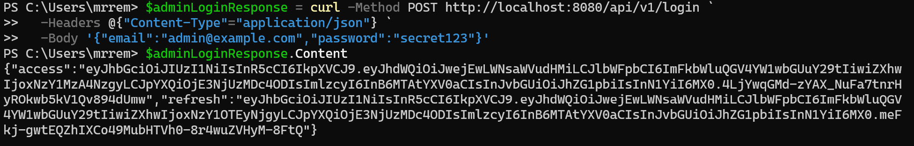

#### Сохранение токена
```powershell
$ADMIN_TOKEN = "<ACCESS_TOKEN>"
$ADMIN_REFRESH = "<REFRESH_TOKEN>"
```
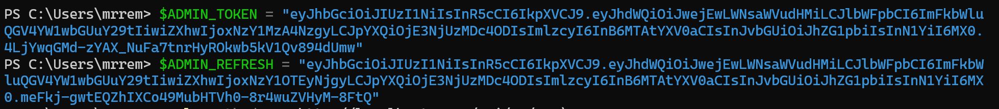

#### Получить свой профиль /me
```powershell
curl -Method GET http://localhost:8080/api/v1/me `
  -Headers @{"Authorization"="Bearer $ADMIN_TOKEN"}
```
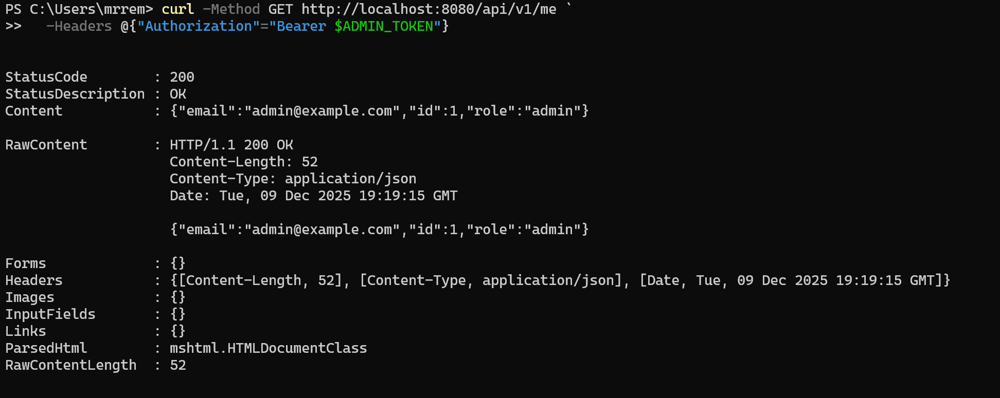

#### Доступ к /admin/stats
```powershell
curl -Method GET http://localhost:8080/api/v1/admin/stats `
  -Headers @{"Authorization"="Bearer $ADMIN_TOKEN"}
```
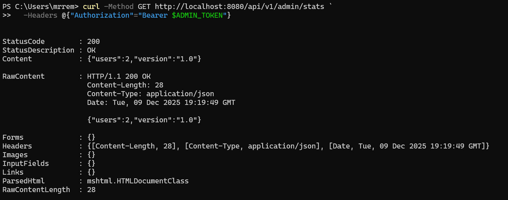

#### Admin может смотреть любого юзера /users/{id}
```powershell
curl -Method GET http://localhost:8080/api/v1/users/1 `
  -Headers @{"Authorization"="Bearer $ADMIN_TOKEN"}
```
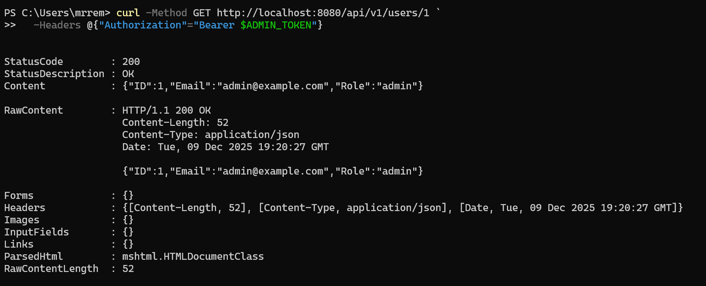

#### Admin может обновлять токены (refresh)
```powershell
$adminRefreshResponse = curl -Method POST http://localhost:8080/api/v1/refresh `
  -Headers @{"Content-Type"="application/json"} `
  -Body "{`"Refresh`": `"$ADMIN_REFRESH`"}"
$adminRefreshResponse.Content
```
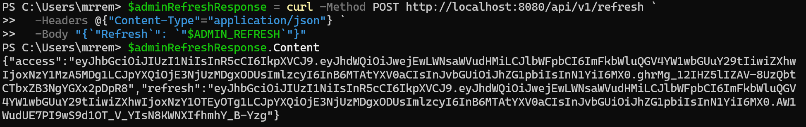

---

### HAPPY-PATH: USER

#### Логин user
```powershell
$userLoginResponse = curl -Method POST http://localhost:8080/api/v1/login `
  -Headers @{"Content-Type"="application/json"} `
  -Body '{"email":"user@example.com","password":"secret123"}'
$userLoginResponse.Content
```
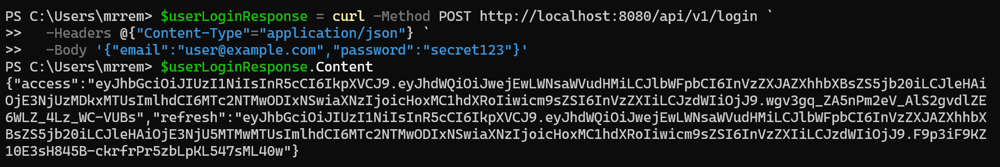

#### Сохранить токены
```powershell
$USER_TOKEN = "<ACCESS_TOKEN>"
$USER_REFRESH = "<REFRESH_TOKEN>"
```
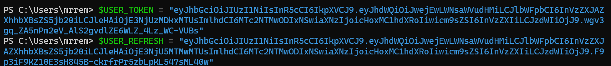

#### User получает свой профиль /me
```powershell
curl -Method GET http://localhost:8080/api/v1/me `
  -Headers @{"Authorization"="Bearer $USER_TOKEN"}
```
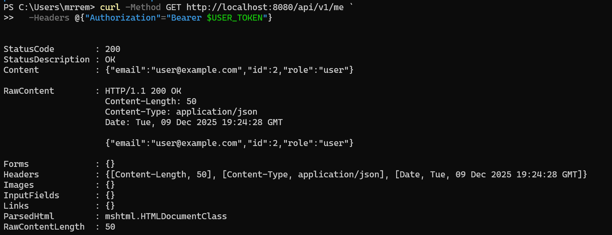

#### User может посмотреть ТОЛЬКО себя /users/{id}
```powershell
curl -Method GET http://localhost:8080/api/v1/users/2 `
  -Headers @{"Authorization"="Bearer $USER_TOKEN"}
```
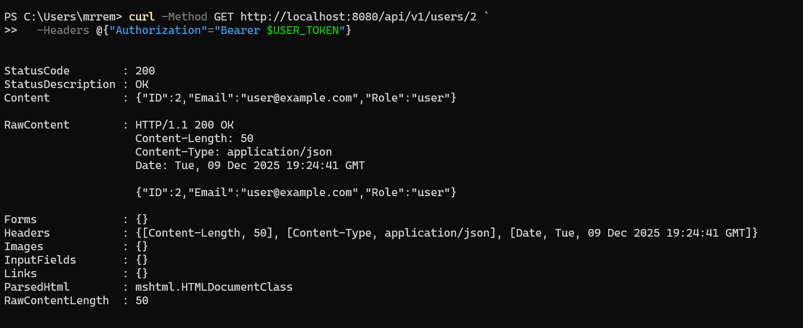

#### User может обновить токены (refresh)
```powershell
$userRefreshResponse = curl -Method POST http://localhost:8080/api/v1/refresh `
  -Headers @{"Content-Type"="application/json"} `
  -Body "{`"Refresh`": `"$USER_REFRESH`"}"
$userRefreshResponse.Content
```
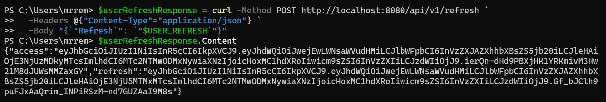

---

### НЕ HAPPY-PATH — проверка ошибок

#### ❌ User НЕ может зайти в /admin/stats
```powershell
curl -Method GET http://localhost:8080/api/v1/admin/stats `
  -Headers @{"Authorization"="Bearer $USER_TOKEN"}
```
_Ожидаем: 403 Forbidden_
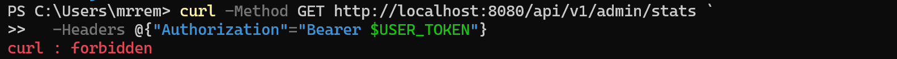

#### ❌ User НЕ может получить /users/1 (админа)
```powershell
curl -Method GET http://localhost:8080/api/v1/users/1 `
  -Headers @{"Authorization"="Bearer $USER_TOKEN"}
```
_Ожидаем: 403 Forbidden_
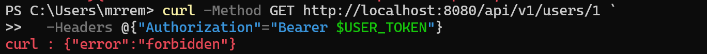

---