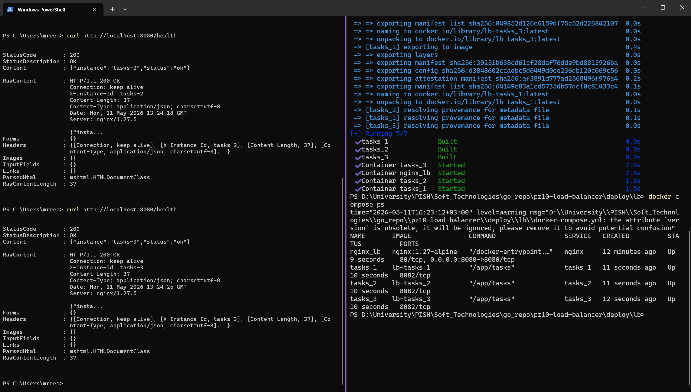
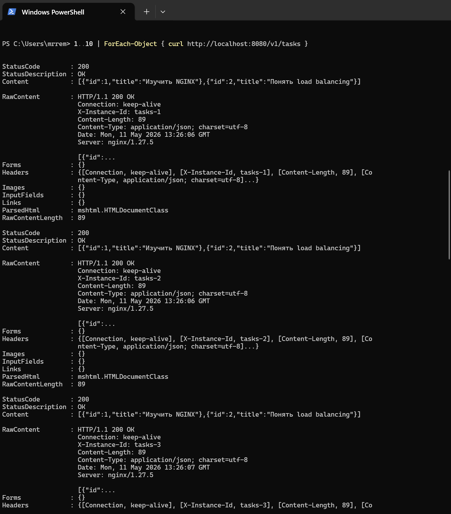
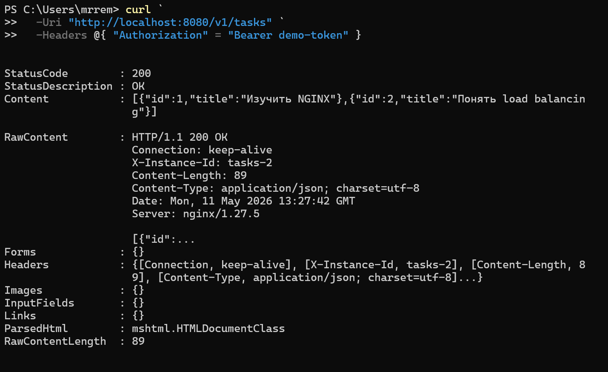
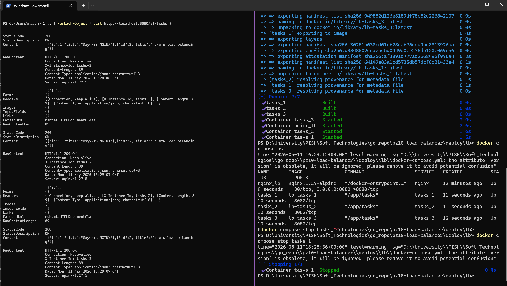
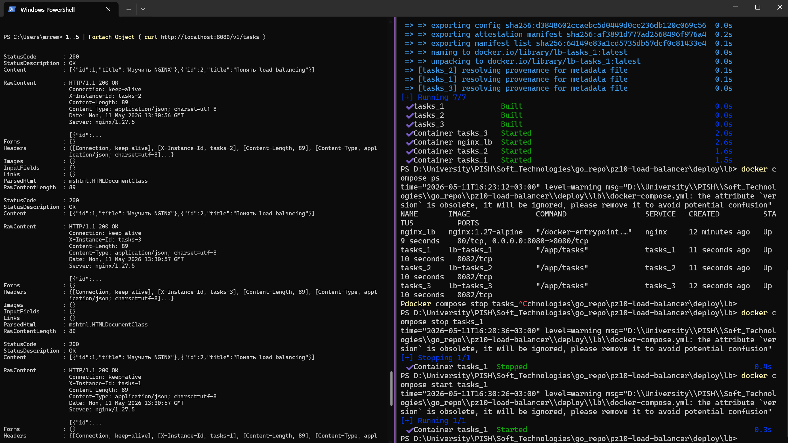

<h1>
Практическое задание №10<br><br>
Ремешевский В.А.<br>
ПИМО-01-25
</h1>

<h2><b>Тема</b><br>
Горизонтальное масштабирование: использование Load Balancer (NGINX).</h2>

## Цель практической работы
Освоить базовый подход к горизонтальному масштабированию backend-приложения за счёт запуска нескольких экземпляров одного сервиса и распределения входящих HTTP-запросов через NGINX в роли балансировщика нагрузки.

## Описание проекта
В проекте реализован простой HTTP-сервис `tasks`, который возвращает список задач и отвечает на `/health` для проверки здоровья.
Для показа горизонтального масштабирования запускаются три экземпляра сервиса `tasks`, а все входящие запросы проксируются и распределяются через NGINX, настроенный как load balancer.

## Структура проекта
```
pz10-load-balancer/
├── assets/
├── deploy/
│   └── lb/
│       ├── docker-compose.yml
│       └── nginx.conf
├── services/
│   └── tasks/
│       ├── Dockerfile
│       ├── go.mod
│       └── cmd/
│           └── server/
│               └── main.go
└── README.md
```

## Контрольные вопросы

1. Что такое горизонтальное масштабирование?
   - Горизонтальное масштабирование — это увеличение вычислительных ресурсов за счёт запуска нескольких экземпляров одного сервиса на разных узлах или контейнерах, а не за счёт усиления одного сервера.

2. Чем оно отличается от вертикального масштабирования?
   - При вертикальном масштабировании увеличиваются ресурсы одного сервера: CPU, RAM, диск. При горизонтальном — добавляются новые копии сервиса, и нагрузка распределяется между ними.

3. Зачем нужен load balancer?
   - Load balancer распределяет входящие запросы между несколькими инстансами сервиса, обеспечивая более равномерную нагрузку, отказоустойчивость и масштабируемость.

4. Какую роль в этой работе выполняет NGINX?
   - NGINX выступает в роли балансировщика нагрузки, принимает запросы на порт `8080` и проксирует их на одну из реплик сервиса `tasks`.

5. Что такое upstream в NGINX?
   - `upstream` — это блок конфигурации NGINX, в котором задаются адреса бэкенд-серверов. В этой работе он описывает три реплики `tasks_1`, `tasks_2` и `tasks_3`.

6. Почему для горизонтального масштабирования желательно делать сервис stateless?
   - Stateless-сервис не хранит состояние между запросами на одном экземпляре. Это позволяет при любом запросе перенаправлять пользователя на любую реплику без необходимости синхронизации состояния.

7. Зачем нужен health endpoint?
   - Health endpoint позволяет балансировщику и оператору проверять, что сервис работает корректно и готов принимать запросы.

8. Почему полезно добавлять X-Instance-ID?
   - Заголовок `X-Instance-ID` показывает, какая именно реплика обработала запрос. Это помогает отлаживать распределение нагрузки и проверять работу load balancer.

9. Что происходит при остановке одной из реплик?
   - Запросы перестают идти на остановленную реплику, а NGINX продолжает проксировать трафик на оставшиеся активные реплики.

10. Почему клиенту удобнее работать с одной точкой входа, а не с несколькими адресами реплик?
    - Одна точка входа упрощает конфигурацию клиента и скрывает детали масштабирования, а также позволяет централизованно распределять трафик и обеспечивать отказоустойчивость.

## Как начать работу

### Инициализация и установка зависимостей
```sh
cd pz10-load-balancer/services/tasks
go mod init example.com/tasks-lb
go mod tidy
```

### Запуск приложения
```sh
cd ../../deploy/lb
docker compose up -d --build
docker compose ps
```

После запуска балансировщик будет доступен на `http://localhost:8080`, а сервисы `tasks` — на внутренних портах `8082`.

## Скриншоты

### Проверка health endpoint
```sh
curl http://localhost:8080/health
curl http://localhost:8080/health
```


### Проверка балансировки
```sh
1..10 | ForEach-Object { curl http://localhost:8080/v1/tasks }
```


### Заголовки NGINX
```sh
curl `
  -Uri "http://localhost:8080/v1/tasks" `
  -Headers @{ "Authorization" = "Bearer demo-token" }
```


### Остановка одной реплики
```sh
docker compose stop tasks_1
1..5 | ForEach-Object { curl http://localhost:8080/v1/tasks }
```


### Включение реплики
```sh
docker compose start tasks_1
1..5 | ForEach-Object { curl http://localhost:8080/v1/tasks }
```

