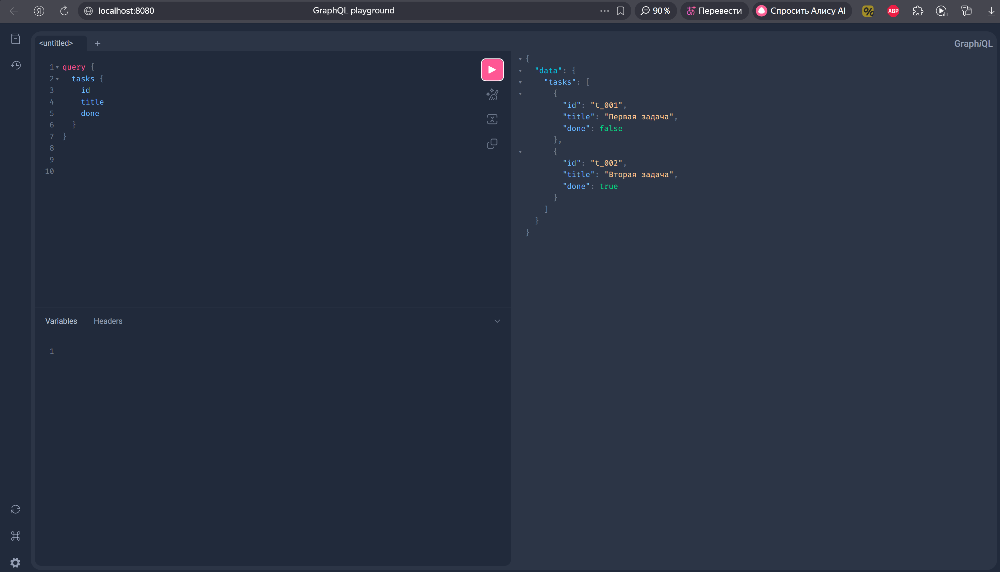
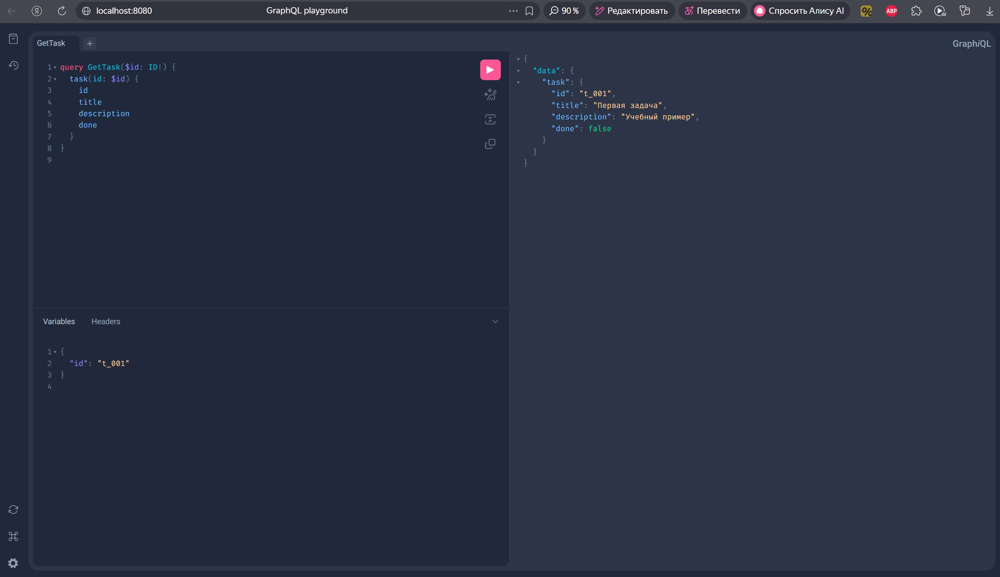
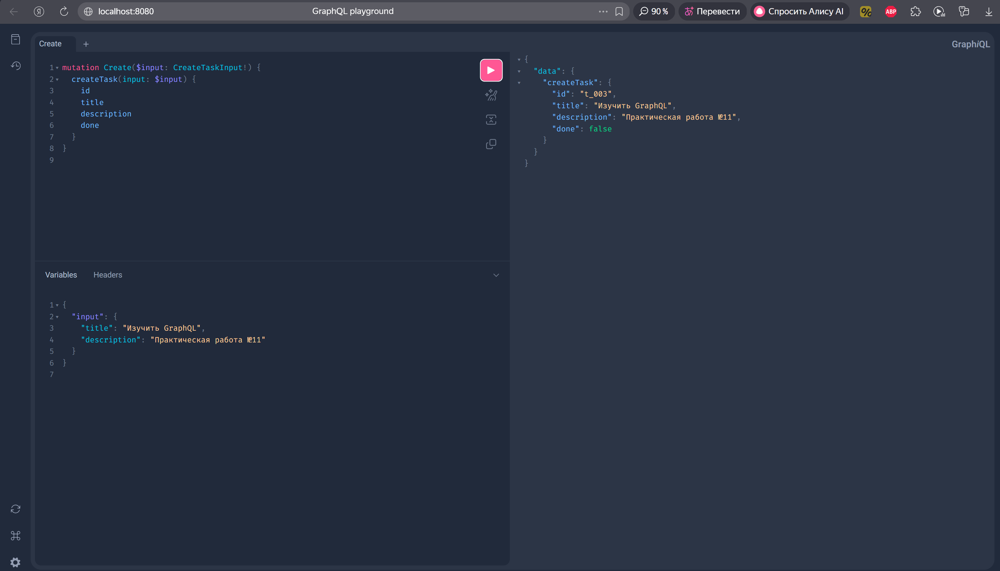
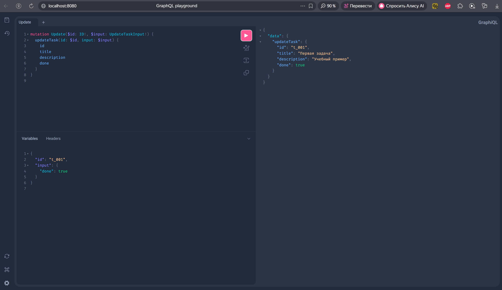
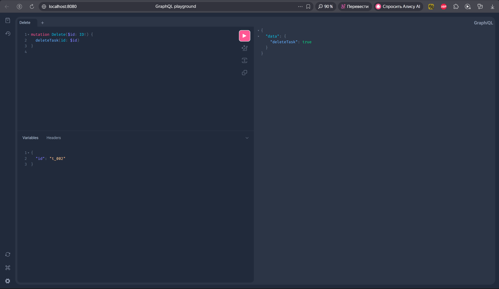

<h1>
Практическое задание №11<br><br>
Ремешевский В.А.<br>
ПИМО-01-25
</h1>

<h2><b>Тема</b><br>
Создание GraphQL API с использованием gqlgen. Запросы и мутации.</h2>

## Цель практической работы
Освоить разработку GraphQL API на языке Go с использованием библиотеки gqlgen, научиться описывать GraphQL-схему, генерировать серверный каркас приложения, реализовывать резолверы для запросов и мутаций, а также тестировать работу API через Playground.

## Описание проекта
Проект реализует GraphQL-сервер на Go с помощью `gqlgen`. В приложении определена схема с типом `Task`, запросами `tasks` и `task`, а также мутациями `createTask`, `updateTask` и `deleteTask`.
Данные хранятся в простом in-memory хранилище, а GraphQL Playground доступен для интерактивного тестирования запросов.

## Структура проекта
```
pz11-graphql/
├── assets/
├── cmd/
│   └── graphql/
│       └── main.go
├── graph/
│   ├── generated.go
│   ├── resolver.go
│   ├── schema.graphqls
│   └── schema.resolvers.go
├── internal/
│   └── repository/
│       └── task_store.go
├── go.mod
├── go.sum
├── gqlgen.yml
├── README.md
└── server.go
```

## Контрольные вопросы

1. Что такое GraphQL и в чём его основное отличие от REST API?
   - GraphQL — это язык запросов и среда выполнения для API, где клиент сам описывает, какие поля ему нужны. В отличие от REST, GraphQL позволяет получать данные одной запросной структурой вместо множества отдельных эндпоинтов.

2. Для чего используется GraphQL-схема?
   - Схема описывает типы данных, доступные запросы и мутации, их поля и аргументы. Она служит контрактом между клиентом и сервером.

3. Чем Query отличается от Mutation?
   - Query выполняет только чтение данных и не изменяет состояние. Mutation используется для создания, изменения или удаления данных на сервере.

4. Что такое резолвер и какую роль он выполняет?
   - Резолвер — это функция, которая обрабатывает конкретный запрос или поле схемы и возвращает результаты. В gqlgen резолверы реализуют логику получения и изменения данных.

5. Почему GraphQL позволяет уменьшить over-fetching данных?
   - Клиент запрашивает только те поля, которые ему нужны, вместо получения всего объекта. Это сокращает передачу лишней информации.

6. Для чего используется библиотека gqlgen в Go-проекте?
   - gqlgen генерирует типобезопасный серверный каркас по GraphQL-схеме, позволяет быстро реализовать резолверы и упрощает разработку GraphQL API на Go.

7. Почему желательно использовать общий сервисный или репозиторный слой для REST и GraphQL?
   - Общий слой позволяет переиспользовать бизнес-логику и работу с данными, уменьшая дублирование кода и обеспечивая единообразие поведения для разных интерфейсов.

8. Что произойдёт, если GraphQL-запрос попытается получить слишком большой объём данных?
   - Запрос может сильно нагрузить сервер, увеличить время ответа и потребление памяти. В production обычно вводят лимиты глубины запросов и ограничения на сложность.

9. Какие преимущества даёт Playground при тестировании API?
   - Playground позволяет интерактивно строить запросы, просматривать документацию схемы и сразу видеть ответы сервера. Это удобно для отладки и изучения API.

10. В каких случаях GraphQL особенно удобен на практике?
    - Когда клиентам нужны разные наборы полей, требуется объединить данные из нескольких источников или важно минимизировать количество запросов по сети.

## Как начать работу

### Инициализация и установка зависимостей
```sh
cd pz11-graphql
go get github.com/99designs/gqlgen
go mod tidy
go run github.com/99designs/gqlgen init
```

### Запуск приложения
```sh
go run server.go
```

После запуска GraphQL Playground будет доступен по адресу `http://localhost:8080/`.

## Скриншоты

### Запрос списка задач
```graphql
query {
  tasks {
    id
    title
    done
  }
}
```


### Запрос одной задачи по идентификатору
```graphql
query GetTask($id: ID!) {
  task(id: $id) {
    id
    title
    description
    done
  }
}
```
Переменные:
```json
{
  "id": "t_001"
}
```


### Создание задачи
```graphql
mutation Create($input: CreateTaskInput!) {
  createTask(input: $input) {
    id
    title
    description
    done
  }
}
```
Переменные:
```json
{
  "input": {
    "title": "Изучить GraphQL",
    "description": "Практическая работа №11"
  }
}
```


### Обновление задачи
```graphql
mutation Update($id: ID!, $input: UpdateTaskInput!) {
  updateTask(id: $id, input: $input) {
    id
    title
    description
    done
  }
}
```
Переменные:
```json
{
  "id": "t_001",
  "input": {
    "done": true
  }
}
```


### Удаление задачи
```graphql
mutation Delete($id: ID!) {
  deleteTask(id: $id)
}
```
Переменные:
```json
{
  "id": "t_002"
}
```

