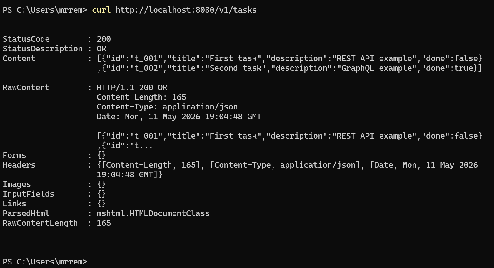
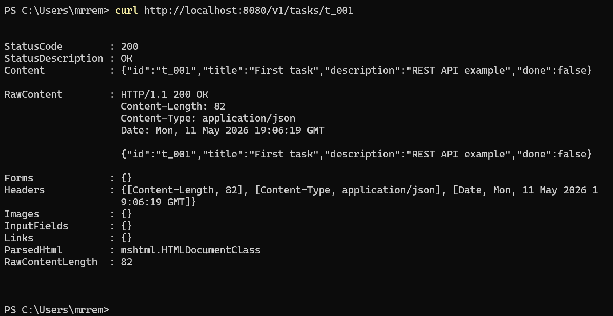
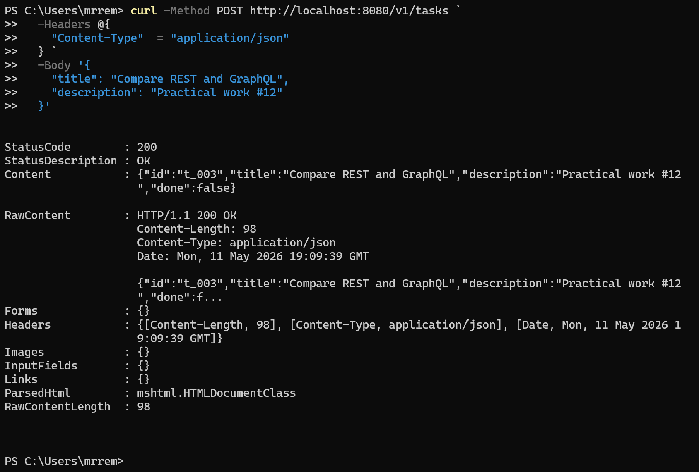
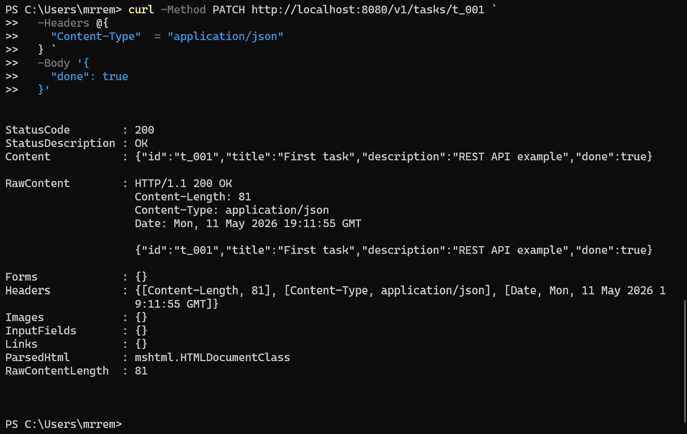
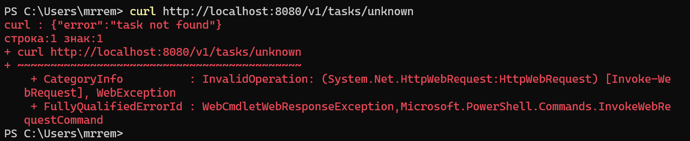
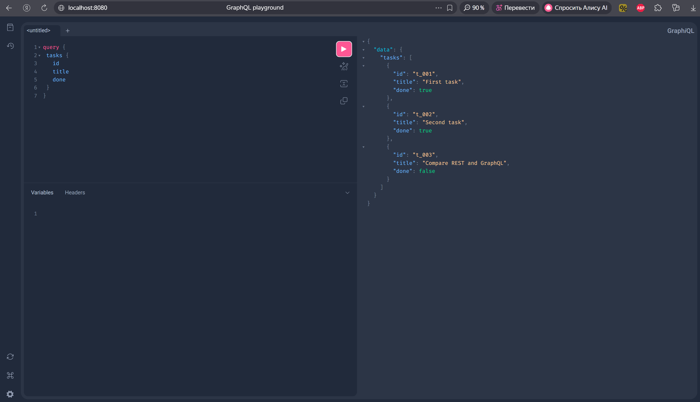
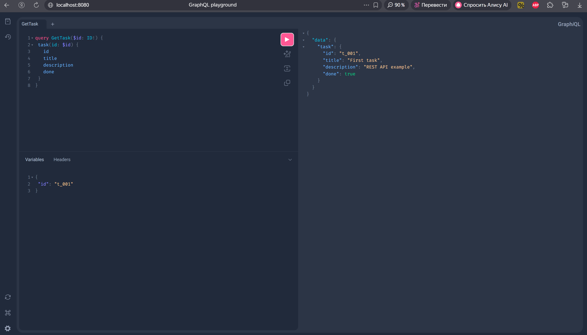
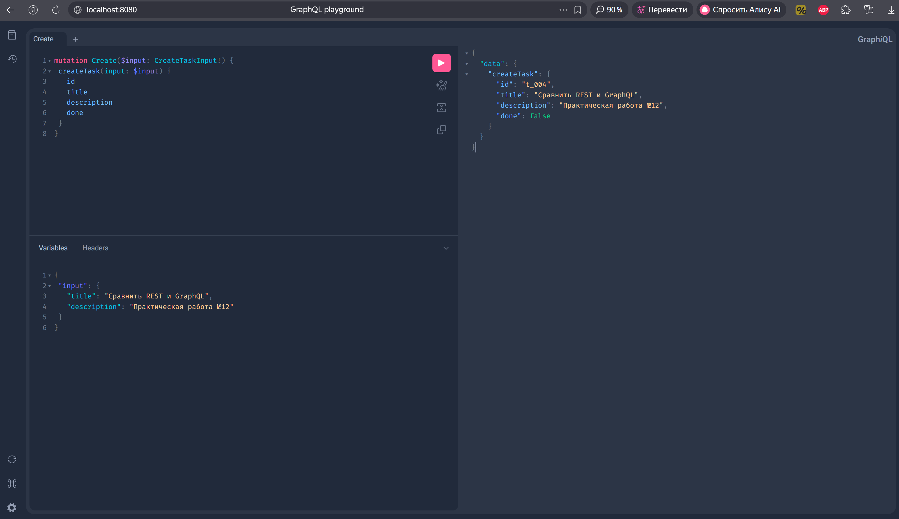
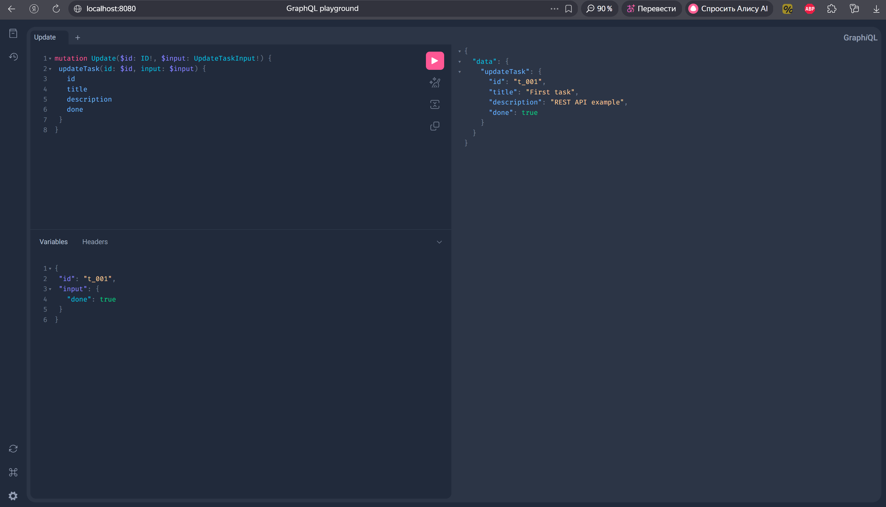
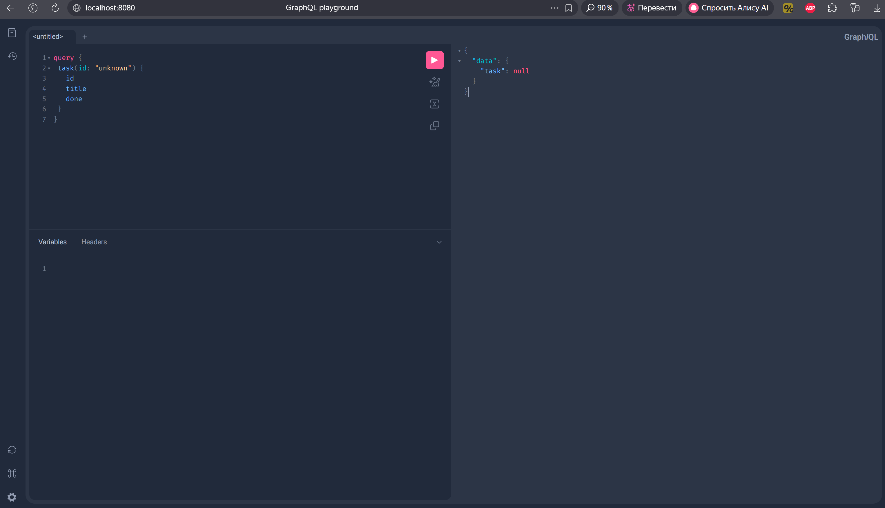

<h1>
Практическое задание №12<br><br>
Ремешевский В.А.<br>
ПИМО-01-25
</h1>

<h2><b>Тема</b><br>
Сравнение REST и GraphQL: разработка одного и того же функционала двумя способами.</h2>

## Цель практической работы
Освоить практическое сравнение REST и GraphQL на примере одного и того же прикладного сценария, научиться реализовывать одинаковый функционал двумя подходами, анализировать различия в структуре запросов и ответов, а также делать обоснованный вывод о целесообразности использования каждого из подходов в backend-разработке.

## Описание проекта
Проект реализует один и тот же функционал для сущности `Task` двумя способами: через REST API и через GraphQL API.
REST-часть использует роутер `chi`, GraphQL-часть реализована на `gqlgen`.
Оба варианта работают с единым хранилищем данных и используют одинаковую модель данных.
Приложение запускается на порту `8080`, REST-endpoint'ы доступны по пути `/v1/tasks`, GraphQL Playground доступен по корневому пути `/`.

## Структура проекта
```
pz12-rest-vs-graphql/
├── assets/                     
├── cmd/
│   └── app/
│       └── main.go             
├── graph/
│   ├── generated.go
│   ├── resolver.go
│   ├── schema.graphqls         
│   └── schema.resolvers.go
├── internal/
│   ├── rest/
│   │   └── handlers.go         
│   └── store/
│       └── task_store.go       
├── go.mod
├── go.sum
├── gqlgen.yml
├── server.go                   
└── README.md
```

## Как начать работу

### Инициализация и установка зависимостей
```sh
cd pz12-rest-vs-graphql
go mod tidy
```

### Запуск приложения
```sh
go run ./cmd/app
```

Приложение запустится на `http://localhost:8080/`.
- GraphQL Playground доступен по адресу `http://localhost:8080/`
- REST API доступен по адресам вида `http://localhost:8080/v1/tasks`

---

## Сценарий сравнения

**Выбранный пользовательский сценарий:**
- Экран списка задач выводит поля: `id`, `title`, `done`
- Экран деталей задачи выводит поля: `id`, `title`, `description`, `done`
- Дополнительное действие: создание новой задачи

Этот сценарий позволяет продемонстрировать как over-fetching в REST, так и точность выборки в GraphQL.

## REST API

### Получение списка задач
**Endpoint:** `GET /v1/tasks`

REST возвращает ВСЕ поля объекта, в том числе `description`, хотя для экрана списка нужны только `id`, `title`, `done`.

```sh
curl http://localhost:8080/v1/tasks
```

**Ожидаемый ответ:**
```json
[
  {
    "id": "t_001",
    "title": "Первая задача",
    "description": "Учебный пример",
    "done": false
  },
  {
    "id": "t_002",
    "title": "Вторая задача",
    "description": "Проверка API",
    "done": true
  }
]
```

### Получение одной задачи
**Endpoint:** `GET /v1/tasks/{id}`

```sh
curl http://localhost:8080/v1/tasks/t_001
```

**Ожидаемый ответ:**
```json
{
  "id": "t_001",
  "title": "Первая задача",
  "description": "Учебный пример",
  "done": false
}
```

### Создание новой задачи
**Endpoint:** `POST /v1/tasks`

```sh
curl -Method POST http://localhost:8080/v1/tasks `
  -Headers @{
    "Content-Type"  = "application/json"
  } `
  -Body '{
    "title": "Compare REST and GraphQL",
    "description": "Practical work #12"
  }'
```

**Ожидаемый ответ:**
```json
{
  "id": "t_003",
  "title": "Сравнить REST и GraphQL",
  "description": "Практическая работа №12",
  "done": false
}
```

### Обновление задачи (отметить как выполнено)
**Endpoint:** `PATCH /v1/tasks/{id}`

```sh
curl -Method PATCH http://localhost:8080/v1/tasks/t_001 `
  -Headers @{
    "Content-Type"  = "application/json"
  } `
  -Body '{
    "done": true
  }'
```

**Ожидаемый ответ:**
```json
{
  "id": "t_001",
  "title": "Первая задача",
  "description": "Учебный пример",
  "done": true
}
```

### Ошибка: запрос несуществующей задачи
**Endpoint:** `GET /v1/tasks/unknown`

```sh
curl http://localhost:8080/v1/tasks/unknown
```

**Ожидаемый ответ (404 Not Found):**
```
{"error":"task not found"}
```

## GraphQL API

Все запросы выполняются через единый endpoint `POST /query` или интерактивный Playground по адресу `http://localhost:8080/`.

### Запрос списка задач (только нужные поля)
```graphql
query {
  tasks {
    id
    title
    done
  }
}
```

**Преимущество:** GraphQL вернёт только `id`, `title`, `done` — без лишнего `description`.

### Запрос одной задачи
```graphql
query GetTask($id: ID!) {
  task(id: $id) {
    id
    title
    description
    done
  }
}
```

**Переменные:**
```json
{
  "id": "t_001"
}
```

### Создание новой задачи
```graphql
mutation Create($input: CreateTaskInput!) {
  createTask(input: $input) {
    id
    title
    description
    done
  }
}
```

**Переменные:**
```json
{
  "input": {
    "title": "Сравнить REST и GraphQL",
    "description": "Практическая работа №12"
  }
}
```

### Обновление задачи (отметить как выполнено)
```graphql
mutation Update($id: ID!, $input: UpdateTaskInput!) {
  updateTask(id: $id, input: $input) {
    id
    title
    description
    done
  }
}
```

**Переменные:**
```json
{
  "id": "t_001",
  "input": {
    "done": true
  }
}
```

### Ошибка: запрос несуществующей задачи
```graphql
query {
  task(id: "unknown") {
    id
    title
    done
  }
}
```

GraphQL вернёт `null` для поля `task`, а в поле `errors` будет указана причина.

## Сравнительный анализ

### 1. Количество запросов
Для сценария «список → детали → обновление»:
- **REST:** 3 запроса (GET `/v1/tasks`, GET `/v1/tasks/t_001`, PATCH `/v1/tasks/t_001`)
- **GraphQL:** 3 запроса (query для списка, query для деталей, mutation для обновления)

**Вывод:** В простых CRUD-операциях GraphQL не уменьшает число обращений автоматически. Его преимущество проявляется в более сложных сценариях с вложенными данными.

### 2. Объём данных (over-fetching)
Для экрана списка задач:
- **REST:** возвращает 4 поля на объект (`id`, `title`, `description`, `done`), хотя нужны только 3 (`id`, `title`, `done`)
  - Лишний `description` — это over-fetching
- **GraphQL:** клиент явно запросил только нужные поля, ответ точно соответствует потребности

**Вывод:** REST в этом сценарии даёт избыточные данные (~25% лишних данных на один объект), GraphQL позволяет выбрать только нужные поля.

### 3. Обработка ошибок

**REST:**
- Использует HTTP-статусы (404, 400, 500 и т.д.)
- Ошибка при запросе несуществующей задачи:
  ```
  HTTP/1.1 404 Not Found
  {"error":"task not found"}
  ```
- Просто и стандартно, удобно для HTTP-кэширования и логирования

**GraphQL:**
- Всегда возвращает HTTP 200
- Ошибки помещаются в поле `errors` JSON-ответа
- При запросе несуществующей задачи:
  ```json
  {
    "data": {
      "task": null
    },
    "errors": [
      {
        "message": "task not found",
        "path": ["task"]
      }
    ]
  }
  ```
- Требует дополнительной обработки на клиенте

**Вывод:** REST проще анализировать через HTTP-статусы, GraphQL требует явной проверки поля `errors`.

### 4. Кэширование

**REST:**
- Стандартное HTTP-кэширование по URL работает из коробки
- GET-запросы можно кэшировать прокси, браузером, CDN
- Просто настроить заголовки `Cache-Control`, `ETag`, `Last-Modified`

**GraphQL:**
- Единый endpoint (`/query`) затрудняет стандартное HTTP-кэширование
- Один и тот же URL может выполнять разные запросы
- Требуются альтернативные подходы:
  - Persisted queries (фиксированные запросы по ID)
  - Кэширование на уровне данных (Apollo Client, Relay)
  - Кэширование результатов на сервере по hash-функции

**Вывод:** REST кэшировать проще стандартными средствами, GraphQL требует специализированных решений.

### 5. Документирование и тестирование

**REST:**
- Явные URL-endpoint'ы и HTTP-методы
- Интеграция со Swagger/OpenAPI
- curl-команды простые и понятные
- Легко документировать в постмане

**GraphQL:**
- Самодокументируемая схема (introspection)
- GraphQL Playground для интерактивного исследования
- Схема сама служит документацией
- Требует понимания типов, Query и Mutation

**Вывод:** В учебном контексте GraphQL Playground удобнее для исследования, REST проще объяснить новичкам через curl и URL.

### 6. Сложность внедрения

**REST:**
- Проще начать: просто добавьте обработчики для разных URL
- Стандартные HTTP-методы и статусы
- Легче отлаживать (curl, Postman, browser)

**GraphQL:**
- Требует изучения gqlgen (или другого инструмента)
- Нужно написать GraphQL-схему
- Резолверы требуют дополнительного кода
- Сложнее для небольших CRUD-сервисов

**Вывод:** Для учебного CRUD-приложения REST оказывается проще.

## Итоговая таблица сравнения

| Критерий | REST | GraphQL |
|----------|------|---------|
| **Структура API** | Несколько endpoint'ов по URL | Один endpoint |
| **Выбор полей** | Определяет сервер | Определяет клиент |
| **Избыточность ответа** | Часто возможна (over-fetching) | Обычно минимальна |
| **Обработка ошибок** | HTTP-статусы (4xx, 5xx) | Поле `errors` в JSON |
| **HTTP-кэширование** | Простое (по URL) | Сложное (единый endpoint) |
| **Документирование** | Swagger/OpenAPI | Introspection + Playground |
| **Тестирование** | curl, Postman, browser | Playground, curl |
| **Сложность внедрения** | Низкая | Средняя |
| **Для CRUD-сервисов** | Хорошо подходит | Оverkill для простого случая |
| **Гибкость для клиента** | Низкая | Высокая |
| **Кол-во запросов** | Может быть избыточным | Не гарантирует уменьшение |

## Вывод

На примере сценария «список → детали → обновление» мы увидели, что **для учебного CRUD-приложения REST оказывается более практичным решением**. GraphQL не автоматически уменьшает количество запросов и требует дополнительных инструментов для полноценного использования.

Однако GraphQL обладает явными преимуществами в более сложных сценариях:
- когда клиентам нужны **разные наборы полей** для одной сущности;
- когда нужно **объединить данные** из нескольких источников в одном запросе;
- когда важно **минимизировать объём передачи данных** (over-fetching);
- когда клиентов много и все они имеют **разные требования к данным**.

REST лучше подходит для:
- простых CRUD-сервисов с четкими endpoint'ами;
- когда нужно **стандартное HTTP-кэширование**;
- когда приоритет — **простота реализации и отладки**;
- когда структура ответа **предсказуема и не меняется**.

**Практический совет:** начните с REST для MVP, а затем добавьте GraphQL, если появится потребность в большей гибкости для разных клиентов.

## Скриншоты

### REST API — Получение списка задач
```sh
curl -s http://localhost:8080/v1/tasks
```


### REST API — Получение одной задачи
```sh
curl -s http://localhost:8080/v1/tasks/t_001
```


### REST API — Создание новой задачи
```sh
curl -Method POST http://localhost:8080/v1/tasks `
  -Headers @{
    "Content-Type"  = "application/json"
  } `
  -Body '{
    "title": "Compare REST and GraphQL",
    "description": "Practical work #12"
  }'
```


### REST API — Обновление задачи
```sh
curl -Method PATCH http://localhost:8080/v1/tasks/t_001 `
  -Headers @{
    "Content-Type"  = "application/json"
  } `
  -Body '{
    "done": true
  }'
```


### REST API — Ошибка (несуществующая задача)
```sh
curl -s http://localhost:8080/v1/tasks/unknown
```


### GraphQL — Запрос списка задач (только нужные поля)
```graphql
query {
  tasks {
    id
    title
    done
  }
}
```


### GraphQL — Запрос одной задачи
```graphql
query GetTask($id: ID!) {
  task(id: $id) {
    id
    title
    description
    done
  }
}
```
Переменные:
```json
{
  "id": "t_001"
}
```


### GraphQL — Создание новой задачи
```graphql
mutation Create($input: CreateTaskInput!) {
  createTask(input: $input) {
    id
    title
    description
    done
  }
}
```
Переменные:
```json
{
  "input": {
    "title": "Compare REST and GraphQL",
    "description": "Practical work #12"
  }
}
```


### GraphQL — Обновление задачи
```graphql
mutation Update($id: ID!, $input: UpdateTaskInput!) {
  updateTask(id: $id, input: $input) {
    id
    title
    description
    done
  }
}
```
Переменные:
```json
{
  "id": "t_001",
  "input": {
    "done": true
  }
}
```


### GraphQL — Ошибка (несуществующая задача)
```graphql
query {
  task(id: "unknown") {
    id
    title
    done
  }
}
```

