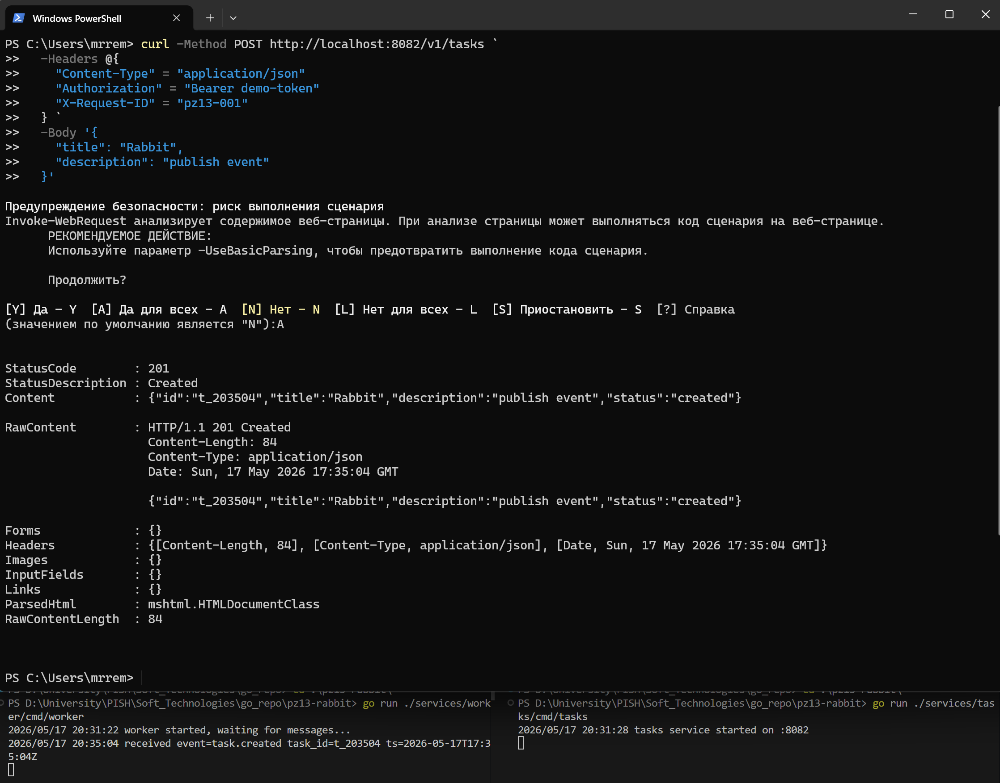
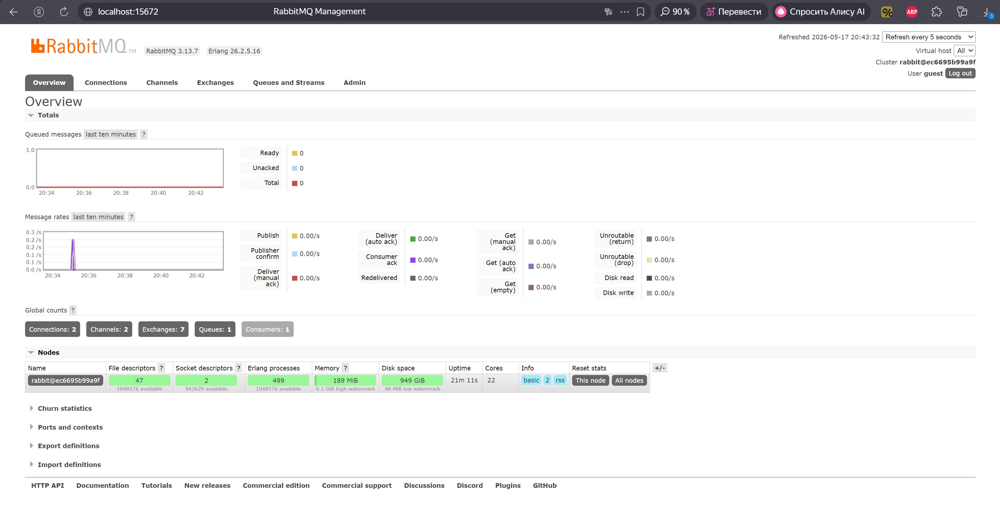
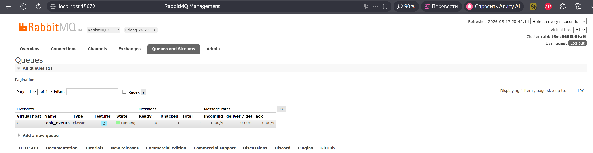

<h1>
Практическое задание №13<br><br>
Ремешевский В.А.<br>
ПИМО-01-25
</h1>

<h2><b>Тема</b><br>
Подключение к RabbitMQ. Отправка и получение сообщений</h2>

**Цель практической работы**

Освоить базовую работу с брокером сообщений RabbitMQ в приложении на Go, научиться публиковать сообщения в очередь, реализовывать отдельного потребителя сообщений, подтверждать успешную обработку через ack и понимать назначение очередей сообщений в микросервисной архитектуре.

## pz13-rabbit

Проект демонстрирует простой набор сервисов на Go и взаимодействие с RabbitMQ: HTTP-сервис `tasks` создаёт задачу и публикует событие в брокер, отдельный `worker` подписывается на очередь, получает сообщения и подтверждает обработку (ack). В проекте показаны минимальные настройки для durable очередей, параметр `prefetch` для контроля загрузки воркера и запуск RabbitMQ через docker-compose.

## Структура проекта

```
pz13-rabbit/
├── assets/
├── deploy/
│   └── rabbit/
│       └── docker-compose.yml
├── docs/
├── services/
│   ├── tasks/
│   │   └── cmd/
│   │       └── tasks/
│   │           └── main.go
│   └── worker/
│       └── cmd/
│           └── worker/
│               └── main.go
├── go.mod
└── README.md
```

## Контрольные вопросы

1. Зачем нужен брокер сообщений, если между сервисами можно использовать HTTP?

	Брокер сообщений даёт асинхронную и надёжную передачу данных между сервисами, снижает связанность (loose coupling), позволяет буферизовать нагрузку и выдерживать пиковые обращения — producer отправляет сообщение и не ожидает блокирующего ответа от потребителя.

2. Что такое producer и consumer?

	Producer — отправитель сообщений (публикатор), consumer — получатель (подписчик/воркер), который обрабатывает сообщения из очереди.

3. Почему сообщение нужно публиковать только после успешного создания задачи?

	Чтобы избежать рассинхронизации: если сообщение отправлено до сохранения данных, потребитель может обработать событие, опираясь на несуществующее состояние. Публикация после успешного создания обеспечивает консистентность (post-commit publish).

4. Что такое ack и зачем он нужен?

	Ack (acknowledgement) — подтверждение от consumer, что сообщение успешно обработано. Без ack брокер может считать сообщение не доставленным и повторно отправить его другому consumer, что обеспечивает надёжность доставки.

5. Почему возможна повторная доставка сообщения?

	Повторная доставка возможна при сбоях consumer до отправки ack или при сетевых сбоях. Также брокер может переотправить сообщение при рестарте или при перебалансировке потребителей.

6. Что делает параметр prefetch?

	Prefetch (QoS) ограничивает количество неподтверждённых (unacked) сообщений, которые брокер отправляет consumer одновременно. Это позволяет избежать перегрузки воркера и равномернее распределять нагрузку.

7. Чем durable queue отличается от non-durable queue?

	Durable очередь сохраняется при перезапуске брокера (если сообщения помечены persistent), non-durable — временная и теряет своё состояние после рестарта RabbitMQ.

8. Почему JSON удобен как учебный формат сообщения?

	JSON читаемый человеком, прост в сериализации/десериализации в большинстве языков и хорошо подходит для демонстрационных структур данных и быстрых тестов.

9. Что означает режим best effort при публикации события?

	Best effort означает попытку доставки без строгих гарантий: сообщение может быть потеряно при сбоях (нет подтверждений, либо нет persistent-флага), зато достигается лучшая производительность.

10. Почему worker лучше выносить в отдельный процесс, а не смешивать с HTTP-обработчиками?

	Разделение обязанностей повышает надёжность и масштабируемость: воркер может иметь собственный lifecycle, настройки pool'ов и prefetch, не блокирует HTTP-потоки и проще масштабируется независимо от фронтенд-сервисов.

---

## Как начать работу

### Инициализация и установка зависимостей

```sh
cd pz13-rabbit
go mod init example.com/pz13-rabbit
go get github.com/rabbitmq/amqp091-go
go mod tidy
```

### Поднимите RabbitMQ через Docker Compose

Файл docker-compose для локального запуска RabbitMQ расположен в `deploy/rabbit/docker-compose.yml`.

Содержимое `deploy/rabbit/docker-compose.yml`:

```yaml
version: "3.9"

services:
  rabbitmq:
	 image: rabbitmq:3-management
	 container_name: pz13-rabbitmq
	 ports:
		- "5672:5672"
		- "15672:15672"
	 environment:
		RABBITMQ_DEFAULT_USER: guest
		RABBITMQ_DEFAULT_PASS: guest
```

Запуск:

```sh
cd deploy/rabbit
docker compose up -d
```

После запуска веб-интерфейс управления будет доступен по адресу http://localhost:15672 (user: `guest`, pass: `guest`).

### Запуск приложений

В проекте два самостоятелных процесса:

- HTTP-сервис (publishes tasks and events):

```sh
go run ./services/tasks/cmd/tasks
```

Используется режим **best effort** — если событие не отправилось в RabbitMQ, задача всё равно считается созданной, а ошибка записывается в лог.

- Worker (consumer), который читает сообщения из очереди и обрабатывает их:

```sh
go run ./services/worker/cmd/worker
```

`prefetch = 1`, чтобы worker получал только одно неподтверждённое сообщение за раз.

Запустите RabbitMQ, затем сначала HTTP-сервис, а затем worker — или наоборот (worker будет ждать сообщений).

---

## Скриншоты

### Публикация задачи (отправка события в RabbitMQ)
```sh
curl -Method POST http://localhost:8082/v1/tasks `
     -Headers @{
       "Content-Type" = "application/json"
       "Authorization" = "Bearer demo-token"
       "X-Request-ID" = "pz13-001"
     } `
     -Body '{
       "title": "Rabbit",
       "description": "publish event"
     }'
```


### Обзор статистики RabbitMQ
```sh
# Web UI: http://localhost:15672
```


### Список очередей в интерфейсе RabbitMQ
```sh
# Web UI: http://localhost:15672 -> Queues
```


---
