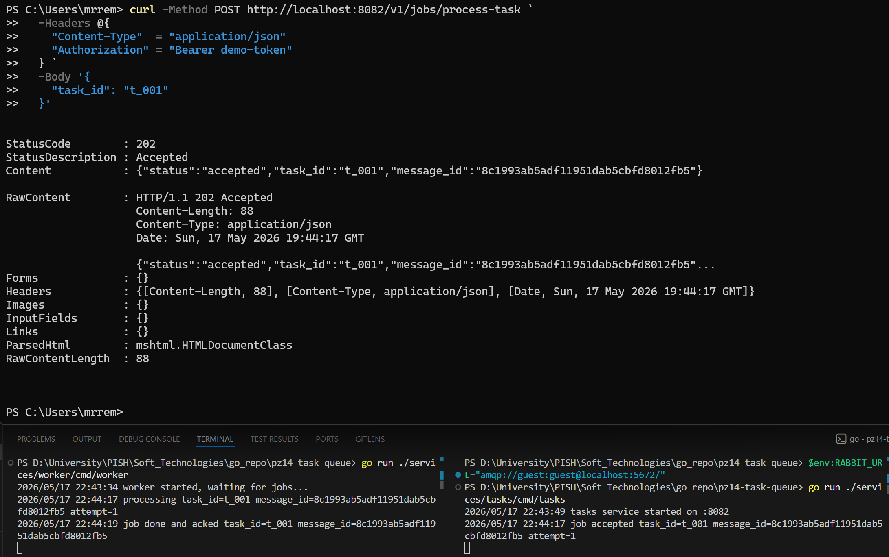
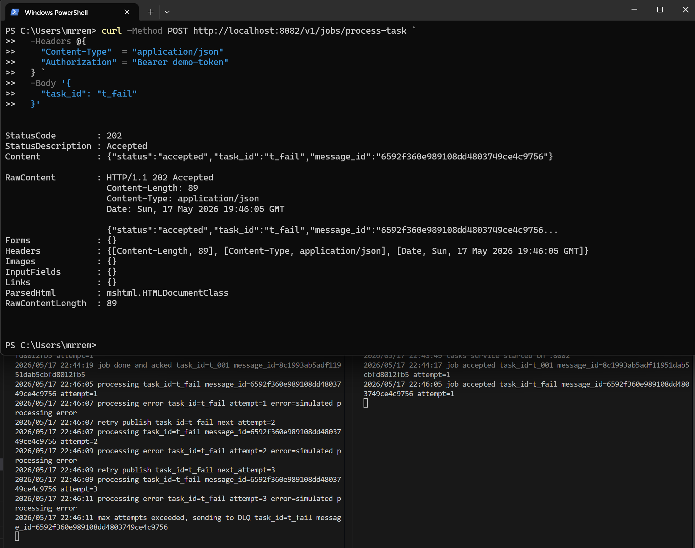
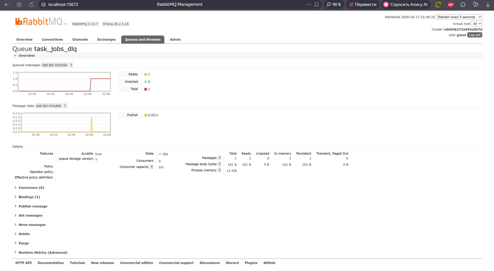

<h1>
Практическое задание №14<br><br>
Ремешевский В.А.<br>
ПИМО-01-25
</h1>

<h2><b>Тема</b><br>
Реализация очереди задач (producer–consumer)</h2>

**Цель практической работы**

Освоить построение очереди задач по модели producer–consumer с использованием RabbitMQ, научиться организовывать повторные попытки обработки, настраивать очередь проблемных сообщений (DLQ), а также реализовывать базовую идемпотентность обработчика для защиты от повторной обработки одного и того же сообщения.

## pz14-task-queue

Проект демонстрирует реализацию очереди задач по модели producer–consumer на Go с использованием RabbitMQ. HTTP-сервис `tasks` принимает запросы на постановку задач, формирует job-сообщение и публикует его в очередь `task_jobs`. Отдельный `worker` получает задачи, выполняет обработку, поддерживает retries, реализует базовую идемпотентность через `message_id` и отправляет проблемные сообщения в DLQ (`task_jobs_dlq`) после превышения лимита попыток.

## Структура проекта

```text
pz14-task-queue/
├── assets/
├── deploy/
│   └── rabbit/
│       └── docker-compose.yml
├── services/
│   ├── tasks/
│   │   └── cmd/
│   │       └── tasks/
│   │           └── main.go
│   └── worker/
│       └── cmd/
│           └── worker/
│               └── main.go
├── go.mod
├── go.sum
└── README.md
```

## Контрольные вопросы

1. Чем задача в очереди отличается от простого события?

	Событие сообщает о факте, который уже произошёл (например, `task.created`), а задача представляет собой инструкцию на выполнение некоторой работы. Задача может выполняться долго, завершаться ошибкой и требовать повторных попыток обработки.

2. Зачем нужны retries?

	Retries позволяют повторно обработать задачу при временных ошибках: сетевых сбоях, недоступности сервиса, временной перегрузке и других нестабильных состояниях системы.

3. Почему нельзя бесконечно возвращать ошибочное сообщение в основную очередь?

	Бесконечные повторы создают циклическую обработку проблемного сообщения, перегружают систему и блокируют нормальную обработку остальных задач. Поэтому количество попыток необходимо ограничивать.

4. Что такое DLQ и зачем она используется?

	DLQ (Dead Letter Queue) — очередь проблемных сообщений. В неё попадают задачи, которые не удалось успешно обработать после допустимого числа попыток. DLQ позволяет сохранить проблемные сообщения для анализа и ручной обработки.

5. Почему в системах очередей возможна повторная доставка одного и того же сообщения?

	Повторная доставка возможна при сбоях worker до отправки `ack`, при сетевых ошибках или рестарте consumer. RabbitMQ использует модель at-least-once delivery и может повторно выдать неподтверждённое сообщение.

6. Что такое идемпотентность обработчика?

	Идемпотентность означает, что повторная обработка одного и того же сообщения не приводит к повторному выполнению бизнес-операции. Это защищает систему от дублирования действий.

7. Зачем нужен message_id?

	`message_id` используется для уникальной идентификации сообщения и позволяет worker определить, было ли сообщение уже обработано ранее.

8. Почему хранение обработанных message_id даже в памяти полезно для учебного примера?

	Даже простое хранение `message_id` в памяти демонстрирует базовый принцип защиты от повторной обработки и помогает понять механизм идемпотентности.

9. Что произойдёт, если worker выполнит обработку, но не успеет отправить ack?

	RabbitMQ посчитает сообщение неподтверждённым и может повторно доставить его consumer после восстановления соединения или перезапуска worker.

10. Почему модель producer–consumer удобна для тяжёлых фоновых задач?

	Она разделяет приём HTTP-запросов и выполнение длительных операций. Клиент быстро получает ответ о постановке задачи, а тяжёлая обработка выполняется асинхронно в отдельных worker-процессах.

---

## Как начать работу

### Инициализация и установка зависимостей

```powershell
cd pz14-task-queue
go mod init example.com/pz14-task-queue
go get github.com/rabbitmq/amqp091-go
go mod tidy
```

### Поднимите RabbitMQ через Docker Compose

Файл docker-compose расположен в `deploy/rabbit/docker-compose.yml`.

Содержимое `deploy/rabbit/docker-compose.yml`:

```yaml
version: "3.9"

services:
  rabbitmq:
    image: rabbitmq:3-management
    container_name: pz14-rabbitmq
    ports:
      - "5672:5672"
      - "15672:15672"
    environment:
      RABBITMQ_DEFAULT_USER: guest
      RABBITMQ_DEFAULT_PASS: guest
```

Запуск:

```powershell
cd deploy/rabbit
docker compose up -d
docker compose ps
```

После запуска RabbitMQ Management UI будет доступен по адресу:

```text
http://localhost:15672
```

Логин и пароль:

```text
guest / guest
```

---

## Используемые очереди

### Основная очередь задач

```text
task_jobs
```

Используется для обработки обычных задач.

### Очередь проблемных сообщений (DLQ)

```text
task_jobs_dlq
```

Используется для хранения сообщений, которые не удалось обработать успешно после превышения лимита retries.

---

## Формат сообщения

Пример JSON-сообщения задачи:

```json
{
  "job": "process_task",
  "task_id": "t_001",
  "attempt": 1,
  "message_id": "uuid-here"
}
```

Описание полей:

| Поле | Назначение |
|---|---|
| `job` | Тип задачи |
| `task_id` | Идентификатор бизнес-объекта |
| `attempt` | Номер текущей попытки обработки |
| `message_id` | Уникальный идентификатор сообщения |

---

## Запуск приложений

### Запуск HTTP-сервиса tasks

```powershell
go run ./services/tasks/cmd/tasks
```

### Запуск worker

```powershell
go run ./services/worker/cmd/worker
```

---

## Логика retries и DLQ

В проекте используется ограничение:

```text
maxAttempts = 3
```

Алгоритм обработки:

1. Worker получает сообщение.
2. Выполняется обработка задачи.
3. Если обработка успешна:
   - сообщение помечается как обработанное;
   - отправляется `ack`.
4. Если произошла ошибка:
   - увеличивается `attempt`;
   - сообщение повторно публикуется в `task_jobs`.
5. Если число попыток превышено:
   - сообщение отправляется в `task_jobs_dlq`.

Для демонстрации ошибки используется:

```text
task_id = "t_fail"
```

В этом случае worker искусственно генерирует ошибку обработки.

---

## Проверка успешной обработки

### Отправка обычной задачи

```powershell
curl -Method POST http://localhost:8082/v1/jobs/process-task `
  -Headers @{
    "Content-Type"  = "application/json"
    "Authorization" = "Bearer demo-token"
  } `
  -Body '{
    "task_id": "t_001"
  }'
```

Ожидаемый результат:
- сервис возвращает статус `accepted`;
- worker успешно обрабатывает задачу;
- сообщение подтверждается через `ack`.

### Скриншот



---

## Проверка retries и DLQ

### Отправка проблемной задачи

```powershell
curl -Method POST http://localhost:8082/v1/jobs/process-task `
  -Headers @{
    "Content-Type"  = "application/json"
    "Authorization" = "Bearer demo-token"
  } `
  -Body '{
    "task_id": "t_fail"
  }'
```

Ожидаемое поведение:
- первая попытка завершается ошибкой;
- выполняется retry;
- вторая попытка завершается ошибкой;
- выполняется retry;
- третья попытка завершается ошибкой;
- сообщение отправляется в `task_jobs_dlq`.

### Скриншот



---

## RabbitMQ Management UI

Проверка очередей выполняется через интерфейс RabbitMQ:

```text
http://localhost:15672
```

В разделе `Queues and Streams` должны присутствовать:
- `task_jobs`;
- `task_jobs_dlq`.

После обработки проблемного сообщения в DLQ должно появиться сообщение.

### Скриншот



---

## Идемпотентность

Для защиты от повторной обработки worker хранит обработанные `message_id` в памяти:

```go
map[string]bool
```

Если сообщение с тем же `message_id` приходит повторно:
- worker не выполняет обработку заново;
- сообщение сразу подтверждается через `ack`.

Это демонстрирует базовый принцип идемпотентности обработчиков в системах очередей.
