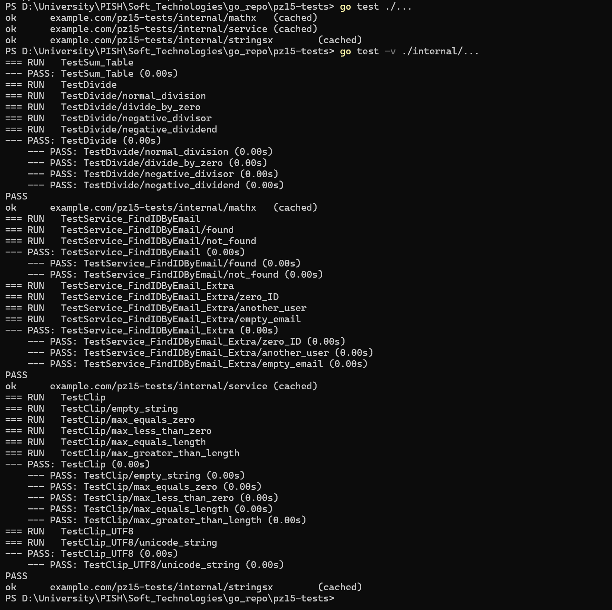
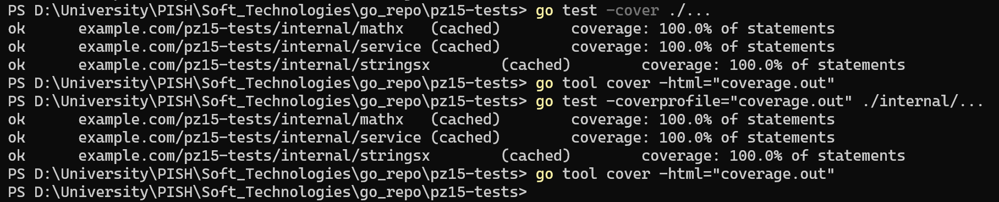
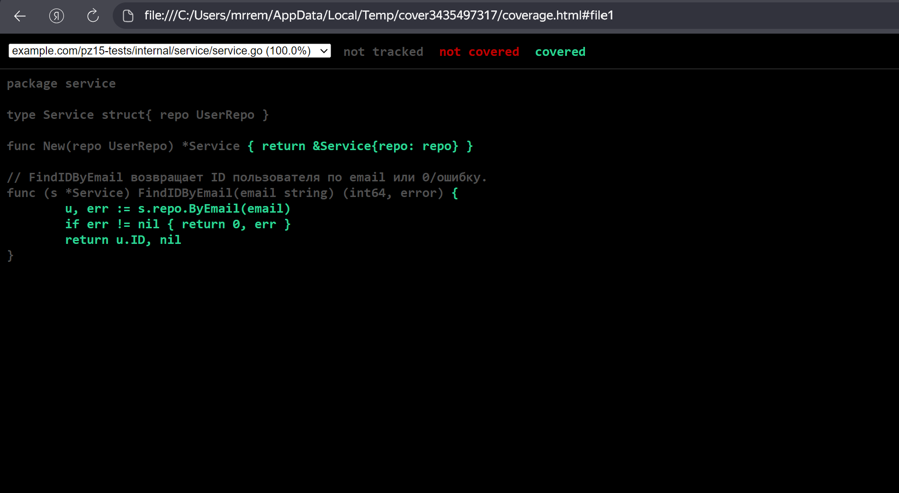

<h1>
Практическое задание №15<br><br>
Ремешевский В.А.<br>
ПИМО-01-25
</h1>

<h2><b>Тема</b><br>
Unit-тестирование функций (testing, testify)
</h2>

# Цели работы

- Освоить базовые приёмы unit-тестирования в Go с помощью стандартного пакета `testing`.
- Научиться писать табличные тесты, подзадачи `t.Run`, тестировать ошибки и паники.
- Освоить библиотеку утверждений `testify` (`assert`, `require`) для лаконичных проверок.
- Научиться измерять покрытие кода (`go test -cover`) и формировать html-отчёт покрытия.
- Подготовить минимальную структуру проектных тестов и общий чек-лист качества тестов.

---

# PZ15-TESTS

## Краткое описание стенда

**PZ15-TESTS** — это лабораторный проект на Go, предназначенный для освоения unit-тестирования, проверки покрытия кода и работы с библиотекой `testify`.  
В проекте реализованы табличные тесты, подзадачи, проверки ошибок и паник, а также автоматизировано измерение покрытия кода.

## Структура проекта

```
pz15-tests/
├── assets/
├── internal/
│   ├── mathx/
│   │   ├── mathx.go
│   │   └── mathx_test.go
│   ├── service/
│   │   ├── repo.go
│   │   ├── service.go
│   │   └── service_test.go
│   └── stringsx/
│       ├── stringsx.go
│       └── stringsx_test.go
├── go.mod
├── README.md
```

---

## Как начать работу

### Инициализация и установка зависимостей

```sh
cd pz15-tests
go mod init example.com/pz15-tests
go get github.com/stretchr/testify@latest
```

---

## Команды запуска тестирования (PowerShell)

```powershell
go test ./...
go test -v ./internal/...
go test -cover ./...
go test -coverprofile="coverage.out" ./internal/...
go tool cover -html="coverage.out"
```

---

## Скриншоты

### Запуск базовых и подробных тестов
```powershell
go test ./...
go test -v ./internal/...
```


### Проверка покрытия кода и генерация отчёта
```powershell
go test -cover ./...
go test -coverprofile="coverage.out" ./internal/...
go tool cover -html="coverage.out"
```


### HTML-отчёт покрытия кода


---

## Краткие выводы

В ходе работы были написаны unit-тесты для всех основных функций и методов проекта, включая табличные тесты, проверки ошибок и паник.  
Использование библиотеки `testify` позволило сделать проверки лаконичными и читаемыми.  
Покрытие кода измерено с помощью стандартных инструментов Go, сформирован html-отчёт.  
Сложнее всего оказалось корректно покрыть ветвления с ошибками и граничные случаи.  
В результате покрыты все основные ветвления, ошибки и исключительные ситуации, что повысило надёжность и качество кода.