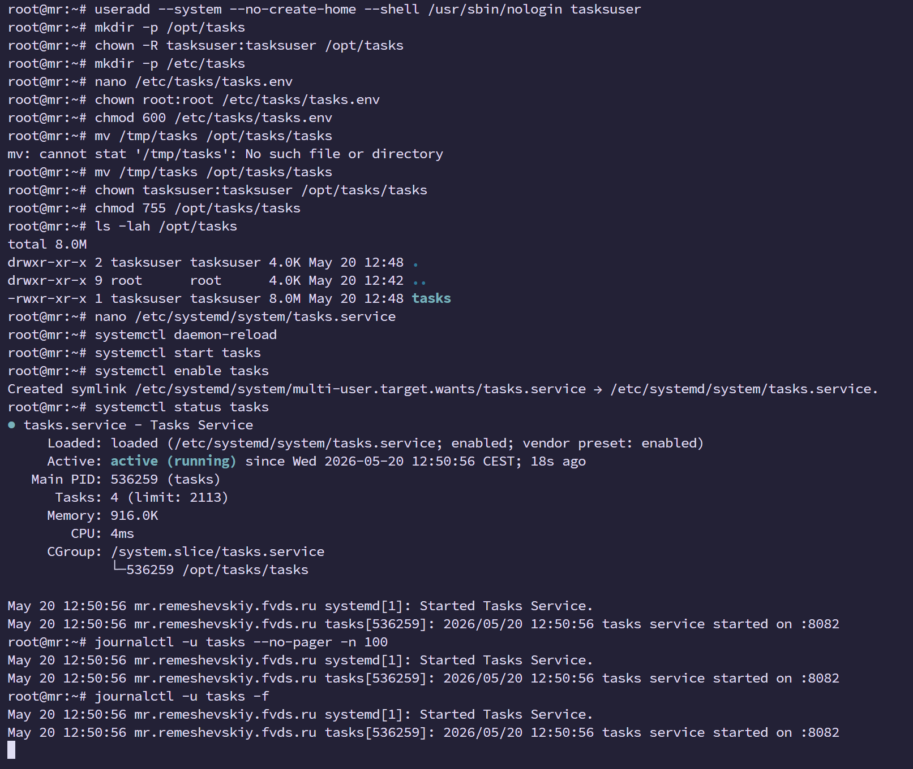
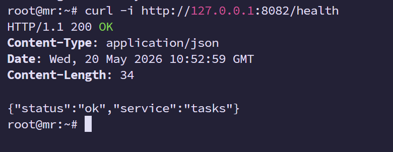
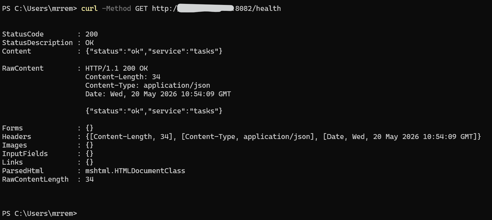

<h1>
Практическое задание №15<br><br>
Ремешевский В.А.<br>
ПИМО-01-25
</h1>

<h2><b>Тема</b><br>
Деплой приложения на VPS. Настройка systemd</h2>

**Цель практической работы**

Освоить публикацию backend-приложения на удалённом Linux-сервере, научиться подключаться к VPS по SSH, размещать исполняемый файл приложения, настраивать переменные окружения, создавать unit-файл systemd, управлять сервисом через systemctl, анализировать логи через journalctl и выполнять базовую процедуру обновления версии приложения.

---

## pz15-vps-deploy

Проект демонстрирует публикацию минимального backend-сервиса `tasks` на удалённом Linux VPS с использованием **systemd**.

В рамках проекта реализован простой HTTP-сервис на Go с endpoint:

```text
GET /health
```

Сервис собирается в Linux-бинарник, переносится на VPS, запускается как полноценная системная служба через `systemd`, получает конфигурацию из внешнего env-файла и поддерживает автозапуск после перезагрузки сервера.

---

## Структура проекта

```text
pz15-vps-deploy/
├── assets/
├── bin/
│   └── tasks
├── cmd/
│   └── tasks/
│       └── main.go
├── go.mod
└── README.md
```

---

## Контрольные вопросы

### 1. Что такое VPS и зачем он нужен backend-разработчику?

VPS (Virtual Private Server) — виртуальный сервер, на котором можно размещать собственные backend-приложения, управлять сервисами и настраивать серверное окружение. Для backend-разработчика VPS является базовой средой публикации приложений.

### 2. Почему запуск приложения на VPS отличается от локального запуска на компьютере разработчика?

На VPS приложение должно работать постоянно, независимо от SSH-сессии, поддерживать автозапуск, логирование, обновление и восстановление после сбоев.

### 3. Для чего используется systemd?

`systemd` используется для управления службами Linux:

- запуск сервисов;
- автозапуск после reboot;
- автоматический restart;
- просмотр статуса;
- просмотр логов.

### 4. Почему не рекомендуется запускать серверное приложение от root?

Запуск от root опасен:

- ошибка приложения может затронуть всю систему;
- компрометация приложения даёт максимальные права злоумышленнику;
- нарушается принцип минимальных привилегий.

Поэтому сервис запускается от отдельного пользователя.

### 5. Зачем выносить конфигурацию в отдельный env-файл?

Это позволяет:

- изменять параметры без перекомпиляции;
- не хранить секреты в коде;
- использовать один бинарник в разных средах;
- упростить сопровождение.

### 6. Что делает параметр Restart=always?

`Restart=always` заставляет systemd автоматически перезапускать сервис после аварийного завершения.

### 7. Для чего нужен EnvironmentFile в unit-файле?

`EnvironmentFile` подключает внешний env-файл и передаёт переменные окружения приложению.

### 8. Как проверить состояние службы через systemctl?

Команда:

```bash
systemctl status tasks
```

### 9. Как посмотреть логи сервиса через journalctl?

Последние записи:

```bash
journalctl -u tasks --no-pager -n 100
```

Просмотр в реальном времени:

```bash
journalctl -u tasks -f
```

### 10. Что нужно сделать перед обновлением unit-файла systemd?

Нужно перечитать конфигурацию:

```bash
systemctl daemon-reload
```

### 11. Почему полезно иметь процедуру отката версии?

Rollback позволяет быстро вернуть рабочую версию при неудачном обновлении.

### 12. Зачем в реальных системах часто используют NGINX перед приложением?

NGINX обычно выполняет роль reverse proxy:

- принимает внешний HTTP/HTTPS-трафик;
- выполняет TLS-терминацию;
- балансирует нагрузку;
- проксирует запросы к backend-сервису.

---

# Как начать работу

## Инициализация проекта

```powershell
cd pz15-vps-deploy
go mod init example.com/pz15-vps-deploy
```

---

## Сборка Linux-бинарника

На локальной машине:

```powershell
mkdir bin

$env:GOOS="linux"
$env:GOARCH="amd64"

go build -o bin/tasks ./cmd/tasks
```

После сборки появляется файл:

```text
bin/tasks
```

---


## Подготовка окружения на VPS

### Обновление пакетов

```bash
apt update && apt upgrade -y
```

### Создание пользователя сервиса

```bash
useradd --system --no-create-home --shell /usr/sbin/nologin tasksuser
```

### Создание директории приложения

```bash
mkdir -p /opt/tasks
chown -R tasksuser:tasksuser /opt/tasks
```

### Создание директории конфигурации

```bash
mkdir -p /etc/tasks
```

---

## Конфигурационный env-файл

Создание:

```bash
nano /etc/tasks/tasks.env
```

Содержимое:

```env
TASKS_PORT=8082
LOG_LEVEL=info
```

Безопасные права:

```bash
chown root:root /etc/tasks/tasks.env
chmod 600 /etc/tasks/tasks.env
```

---

## Перенос бинарника на VPS

С локальной машины:

```powershell
scp .\bin\tasks root@<VPS_IP>:/tmp/tasks
```

---

## Размещение бинарника

На VPS:

```bash
mv /tmp/tasks /opt/tasks/tasks
chown tasksuser:tasksuser /opt/tasks/tasks
chmod 755 /opt/tasks/tasks
```

---

## Настройка systemd

Создание unit-файла:

```bash
nano /etc/systemd/system/tasks.service
```

Содержимое:

```ini
[Unit]
Description=Tasks Service
After=network.target

[Service]
Type=simple
User=tasksuser
WorkingDirectory=/opt/tasks
EnvironmentFile=/etc/tasks/tasks.env
ExecStart=/opt/tasks/tasks
Restart=always
RestartSec=2
NoNewPrivileges=true
LimitNOFILE=65535

[Install]
WantedBy=multi-user.target
```

---

## Активация службы

Перечитать конфигурацию:

```bash
systemctl daemon-reload
```

Запустить сервис:

```bash
systemctl start tasks
```

Включить автозапуск:

```bash
systemctl enable tasks
```

Проверить статус:

```bash
systemctl status tasks
```

---

## Просмотр логов

Последние записи:

```bash
journalctl -u tasks --no-pager -n 100
```

Просмотр в реальном времени:

```bash
journalctl -u tasks -f
```

---

## Скриншот деплоя и запуска

На изображении показаны все команды, использованные для публикации приложения на VPS, создания systemd-службы и запуска сервиса.



---

## Проверка /health на VPS

Проверка непосредственно на удалённом сервере:

```bash
curl -i http://127.0.0.1:8082/health
```


---

## Проверка /health с локального компьютера

Проверка извне:

```powershell
curl -Method GET http://<VPS_IP>:8082/health
```


---

## Команды управления сервисом

Запуск:

```bash
systemctl start tasks
```

Остановка:

```bash
systemctl stop tasks
```

Перезапуск:

```bash
systemctl restart tasks
```

Статус:

```bash
systemctl status tasks
```

Отключение автозапуска:

```bash
systemctl disable tasks
```

Включение автозапуска:

```bash
systemctl enable tasks
```

---

## Процедура обновления версии

Сборка новой версии:

```powershell
$env:GOOS="linux"
$env:GOARCH="amd64"

go build -o bin/tasks ./cmd/tasks
```

Копирование:

```powershell
scp .\bin\tasks root@<VPS_IP>:/tmp/tasks
```

Обновление на VPS:

```bash
systemctl stop tasks

mv /opt/tasks/tasks /opt/tasks/tasks.old

mv /tmp/tasks /opt/tasks/tasks

chown tasksuser:tasksuser /opt/tasks/tasks

chmod 755 /opt/tasks/tasks

systemctl start tasks
```

---

## Процедура rollback

При неудачном обновлении:

```bash
systemctl stop tasks

mv /opt/tasks/tasks.old /opt/tasks/tasks

systemctl start tasks
```

После rollback рекомендуется проверить:

```bash
systemctl status tasks

journalctl -u tasks --no-pager -n 100
```
