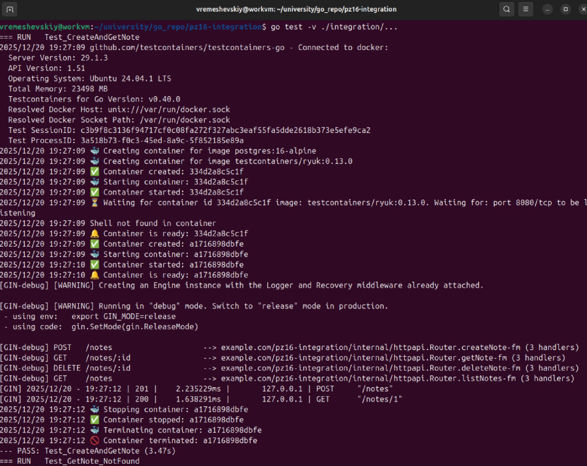
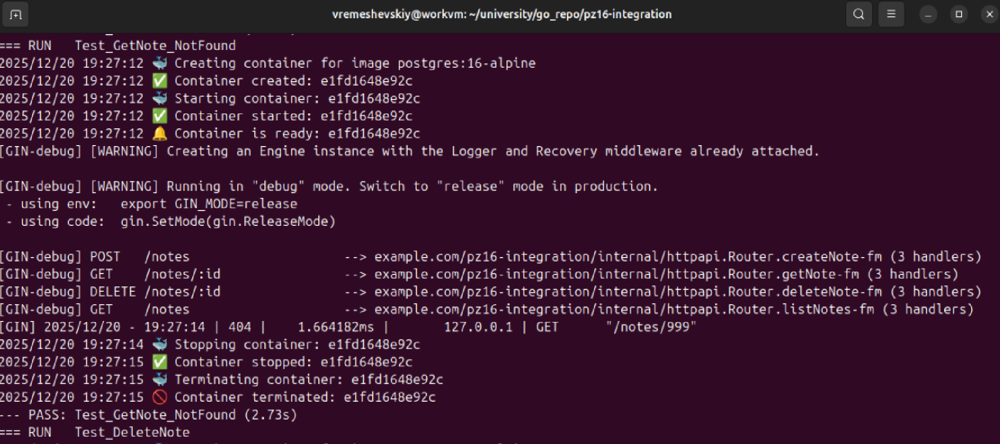
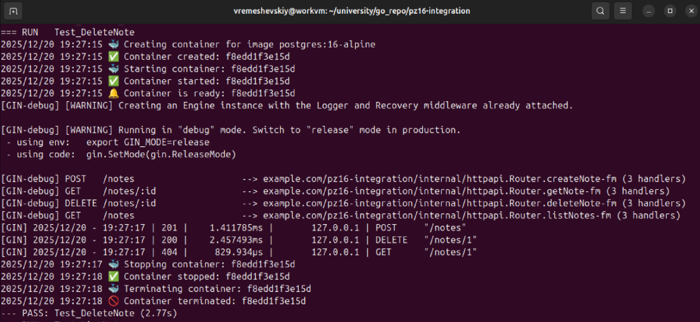
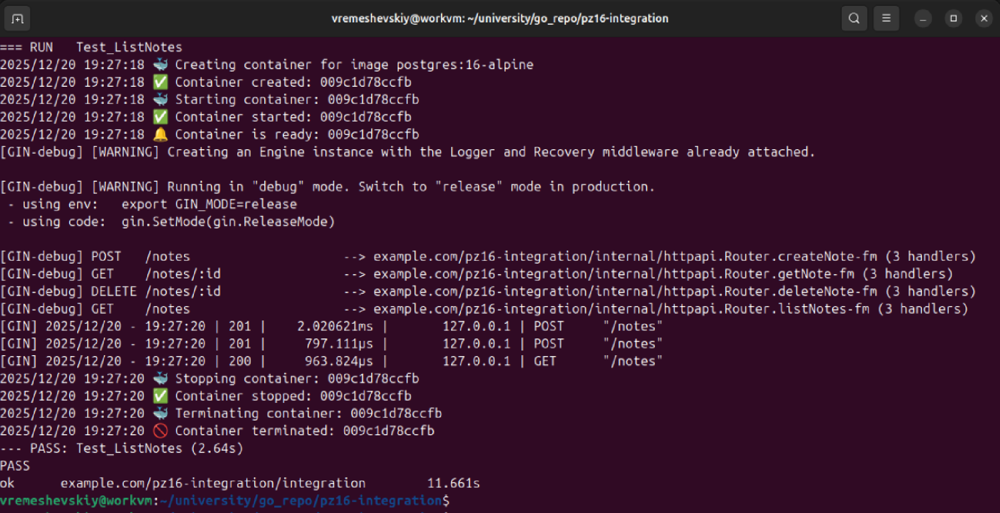

<h1>
Практическое задание №16<br><br>
Ремешевский В.А.<br>
ПИМО-01-25
</h1>

<h2><b>Тема</b><br>
Интеграционное тестирование REST API, тестовая БД, миграции, testcontainers-go
</h2>

# Цели работы

- Освоить интеграционное тестирование REST API: проверка «маршрут → хендлер → сервис → репозиторий → **реальная БД**».
- Научиться поднимать изолированную тестовую среду БД в Docker.
- Освоить 2 подхода к инфраструктуре тестов:
  - A. Локальная среда через `docker-compose` (просто и наглядно).
  - B. Программный подъём контейнеров через `testcontainers-go` (изолировано и удобно для CI).
- Научиться инициализировать схему БД (миграции/auto-migrate), сидировать тестовые данные, очищать окружение.
- Внедрить интеграционные проверки CRUD-эндпоинтов (статусы, заголовки, JSON-ответы, эффекты в БД).

---

# PZ16-INTEGRATION

## Краткое описание стенда

**PZ16-INTEGRATION** — это лабораторный проект на Go, предназначенный для освоения интеграционного тестирования REST API с реальной PostgreSQL.  
В проекте реализованы интеграционные тесты для CRUD-эндпоинтов заметок, автоматизирован запуск тестовой БД, миграции и очистка данных.

## Структура проекта

```
pz16-integration/
├── assets/
├── cmd/
│   └── api/
│       └── main.go
├── integration/
│   └── notes_tc_integration_test.go
├── internal/
│   ├── db/
│   │   └── migrate.go
│   ├── httpapi/
│   │   └── handlers.go
│   ├── models/
│   │   └── note.go
│   ├── repo/
│   │   └── postgres.go
│   └── service/
│       └── service.go
├── go.mod
├── README.md
```

---

## Как начать работу

### Инициализация и установка зависимостей

```sh
cd pz16-integration
go mod tidy
go get github.com/go-chi/chi/v5
go get github.com/jackc/pgx/v5
go get github.com/testcontainers/testcontainers-go
go get github.com/stretchr/testify
```

### Запуск интеграционных тестов

```powershell
go test -v ./integration/...
```

---

## Скриншоты

### Выполнение интеграционного теста по созданию и получению заметки


### Выполнение интеграционного теста по получению несуществующей заметки


### Выполнение интеграционного теста по удалению заметки


### Выполнение интеграционного теста по получению списка заметок


---

## Краткие выводы

В ходе работы были реализованы интеграционные тесты для всех CRUD-операций с заметками, включая создание, чтение, обновление и удаление через реальные HTTP-запросы и работу с реальной PostgreSQL.  
Схема БД и тестовые данные инициализировались автоматически с помощью миграций и сидирования.  
Сложности возникли с очисткой окружения между тестами и поддержанием идемпотентности тестов, а также с синхронизацией миграций и сид-данных.  
Для CI был опробован подход с `testcontainers-go`, что позволило запускать тесты изолированно и без ручной настройки окружения.  
В дальнейшем стоит улучшить транзакционность тестов, автоматизировать откат изменений и расширить покрытие edge-case сценариев.  
Интеграционное тестирование позволило выявить ошибки на стыке слоёв и повысить надёжность всего приложения.