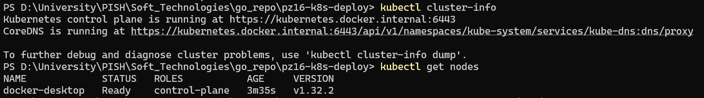
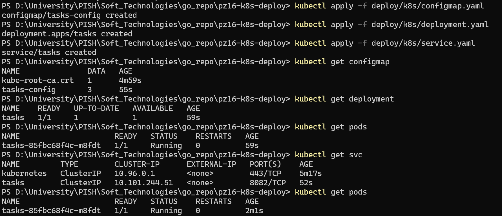
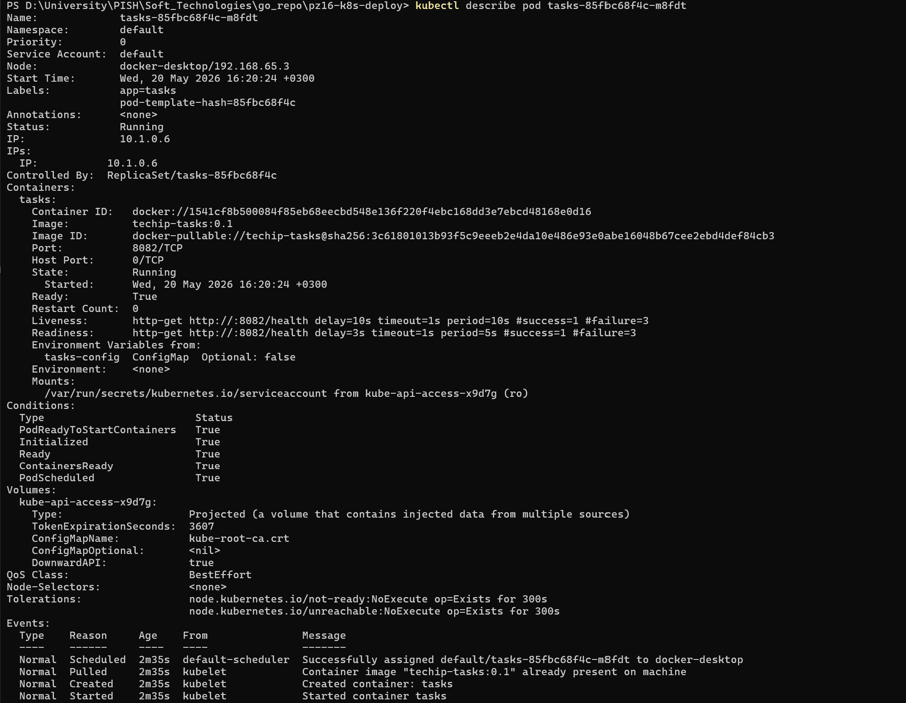
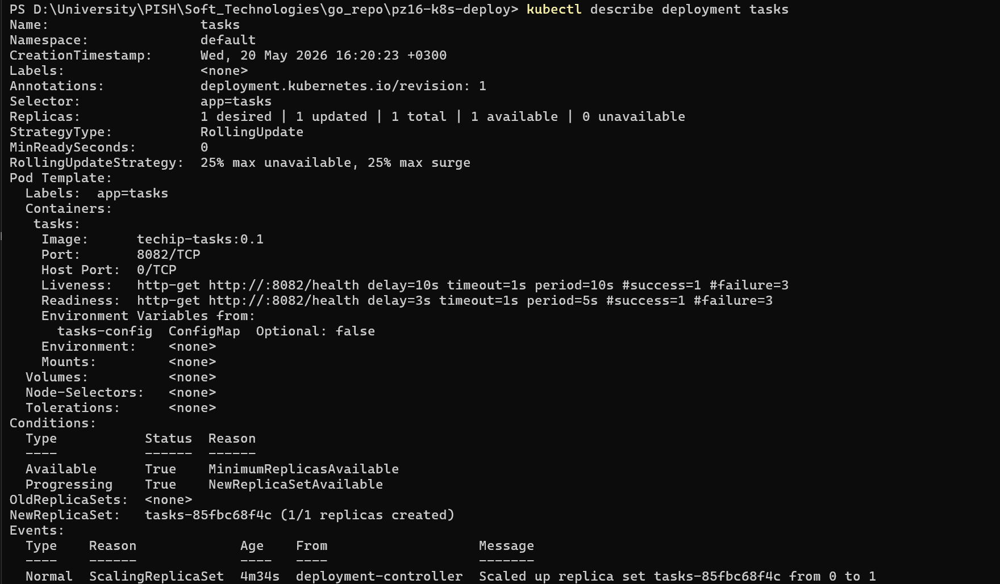
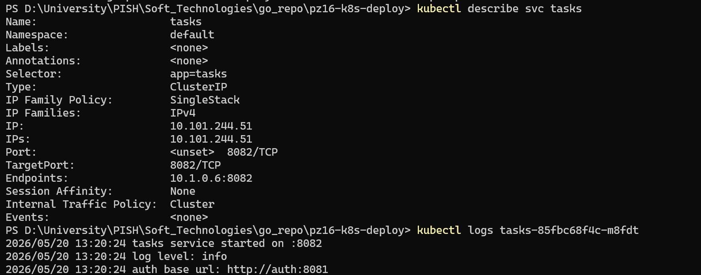
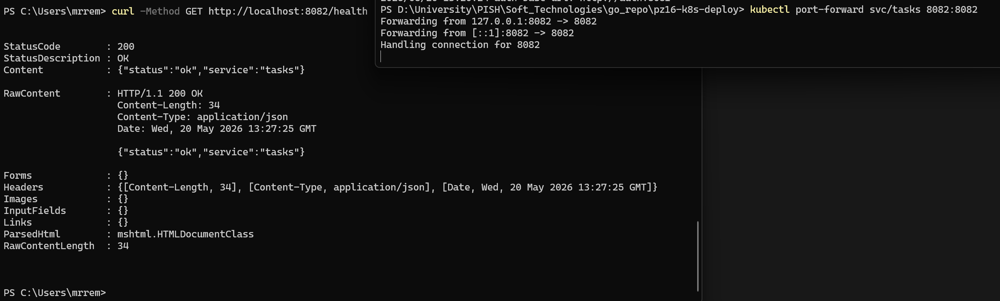
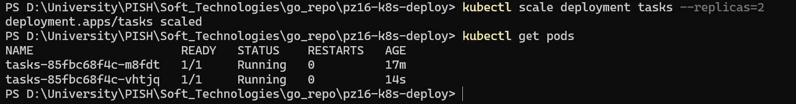
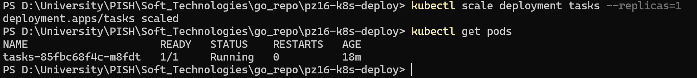

<h1>
Практическое задание №16<br><br>
Ремешевский В.А.<br>
ПИМО-01-25
</h1>

<h2><b>Тема</b><br>
Публикация приложения в Kubernetes (минимальный манифест)</h2>

**Цель практической работы**

Освоить базовую публикацию контейнеризированного backend-приложения в Kubernetes, научиться описывать Deployment и Service, передавать конфигурацию через ConfigMap, настраивать readiness и liveness probes, применять манифесты через kubectl и проверять состояние Pod и Service.

---

## pz16-k8s-deploy

Проект демонстрирует публикацию контейнеризированного backend-сервиса `tasks` в локальном Kubernetes-кластере Docker Desktop.

В качестве backend-сервиса используется минимальное HTTP-приложение Go с endpoint:

```text
GET /health
```

---

## Структура проекта

```text
pz16-k8s-deploy/
│   Dockerfile
│   go.mod
│   README.md
│
├───assets
├───cmd
│   └───tasks
│           main.go
│
└───deploy
    └───k8s
            configmap.yaml
            deployment.yaml
            service.yaml
```

---

# Контрольные вопросы

## 1. Что такое Kubernetes и для чего он используется?

Kubernetes — система оркестрации контейнеров, предназначенная для запуска, управления, масштабирования и сопровождения контейнеризированных приложений.

Kubernetes позволяет:

- запускать контейнеры;
- автоматически восстанавливать сервисы после сбоев;
- масштабировать приложения;
- управлять конфигурацией;
- стандартизировать публикацию backend-сервисов.

---

## 2. Чем Pod отличается от Deployment?

**Pod** — минимальная единица запуска контейнеров в Kubernetes.

**Deployment** — объект более высокого уровня, управляющий Pod.

Deployment:

- создаёт Pod;
- контролирует число реплик;
- автоматически восстанавливает Pod;
- выполняет обновления.

---

## 3. Почему приложение в Kubernetes обычно публикуют через Deployment, а не через одиночный Pod?

Одиночный Pod неудобен для эксплуатации.

Если Pod будет удалён или аварийно завершится, его придётся запускать заново вручную.

Deployment автоматически поддерживает требуемое состояние приложения.

---

## 4. Зачем нужен Service и почему нельзя строить обращение к приложению напрямую через Pod?

Pod не является стабильной точкой доступа.

Его:

- IP может измениться;
- имя может измениться;
- Pod может быть пересоздан.

Service предоставляет постоянную точку входа и маршрутизирует запросы к нужным Pod.

---

## 5. Что такое ConfigMap?

ConfigMap — объект Kubernetes для хранения несекретной конфигурации приложения.

Через ConfigMap удобно передавать:

- порт приложения;
- URL внешнего сервиса;
- уровень логирования;
- переменные окружения.

---

## 6. Чем ConfigMap отличается от Secret?

ConfigMap используется для обычной конфигурации.

Secret предназначен для хранения чувствительных данных:

- токенов;
- паролей;
- ключей;
- сертификатов.

---

## 7. Для чего используется readiness probe?

Readiness probe проверяет, готово ли приложение принимать запросы.

Пока readiness не проходит:

- Kubernetes считает Pod неготовым;
- Service не направляет трафик на контейнер.

---

## 8. Для чего используется liveness probe?

Liveness probe проверяет жизнеспособность приложения.

Если liveness стабильно падает:

Kubernetes считает контейнер неисправным и выполняет его перезапуск.

---

## 9. Почему важно использовать фиксированный тег образа, а не только latest?

Фиксированный тег позволяет:

- точно понимать, какая версия работает;
- воспроизводить деплой;
- упрощать обновления;
- облегчать диагностику.

В проекте используется:

```text
techip-tasks:0.1
```

---

## 10. Зачем нужен kubectl port-forward?

`kubectl port-forward` позволяет временно открыть доступ к сервису Kubernetes извне.

Он используется для локальной проверки приложения без настройки ingress и LoadBalancer.

---

## 11. Что делает команда kubectl scale deployment ... ?

Команда изменяет число реплик Deployment.

Пример:

```powershell
kubectl scale deployment tasks --replicas=2
```

увеличивает количество Pod до двух экземпляров.

---

## 12. Почему публикация приложения в Kubernetes считается декларативной?

В Kubernetes описывается **желаемое состояние системы**, а не последовательность действий.

Разработчик описывает:

- образ;
- количество реплик;
- probes;
- Service;
- конфигурацию.

Kubernetes самостоятельно приводит систему к описанному состоянию.

---

# Как начать работу

## Подготовка проекта

Создание проекта:

```powershell
cd pz16-k8s-deploy
go mod init example.com/pz16-k8s-deploy
```

---

## Dockerfile

Файл:

```text
Dockerfile
```

Docker-образ собирается в два этапа:

1. Build-stage на golang-образе.
2. Runtime-stage на alpine.

Сборка образа:

```powershell
docker build -t techip-tasks:0.1 .
```

Используется фиксированный тег:

```text
0.1
```

а не `latest`.

---

## Kubernetes-кластер

В работе использовался локальный Kubernetes-кластер Docker Desktop.

Проверка подключения:

```powershell
kubectl cluster-info
kubectl get nodes
```

### Скриншот



---

## ConfigMap

Файл:

```text
deploy/k8s/configmap.yaml
```

Содержимое ConfigMap:

```yaml
apiVersion: v1
kind: ConfigMap
metadata:
  name: tasks-config
data:
  TASKS_PORT: "8082"
  AUTH_BASE_URL: "http://auth:8081"
  LOG_LEVEL: "info"
```

ConfigMap используется для передачи переменных окружения контейнеру.

---

## Deployment

Файл:

```text
deploy/k8s/deployment.yaml
```

Deployment описывает:

- образ контейнера;
- число реплик;
- readiness probe;
- liveness probe;
- containerPort;
- envFrom ConfigMap.

Используется:

```yaml
replicas: 1
```

---

## Service

Файл:

```text
deploy/k8s/service.yaml
```

Используется Service типа:

```yaml
ClusterIP
```

Service обеспечивает стабильный доступ к Pod внутри кластера.

---

## Применение манифестов

Последовательность применения:

```powershell
kubectl apply -f deploy/k8s/configmap.yaml
kubectl apply -f deploy/k8s/deployment.yaml
kubectl apply -f deploy/k8s/service.yaml
```

### Скриншот



---

# Проверка ресурсов Kubernetes

## Проверка Pod

После применения манифестов необходимо проверить создание Pod:

```powershell
kubectl get pods
```

Для более подробной диагностики:

```powershell
kubectl describe pod <POD_NAME>
```

Проверяется:

- статус Pod;
- readiness;
- liveness;
- события Kubernetes;
- количество restart.

### Скриншот



---

## Проверка Deployment

Проверка Deployment:

```powershell
kubectl get deployment
```

Подробная информация:

```powershell
kubectl describe deployment tasks
```

Проверяется:

- число реплик;
- стратегия развёртывания;
- selector;
- container image;
- условия Deployment.

### Скриншот



---

## Проверка Service

Проверка Service:

```powershell
kubectl get svc
```

Подробная информация:

```powershell
kubectl describe svc tasks
```

Проверяется:

- тип Service;
- selector;
- port;
- targetPort;
- endpoints.

---

## Просмотр логов контейнера

Логи Pod:

```powershell
kubectl logs <POD_NAME>
```

### Скриншот



---

# Проверка доступа через port-forward

Для демонстрации доступа к сервису используется:

```powershell
kubectl port-forward svc/tasks 8082:8082
```

После запуска команды Service становится доступным локально.

Проверка выполняется во втором терминале:

```powershell
curl -Method GET http://localhost:8082/health
```

### Скриншот



---

# Проверка readiness и liveness probes

В проекте используются две probe:

## Readiness probe

```yaml
readinessProbe:
  httpGet:
    path: /health
    port: 8082
```

Назначение:

проверяет готовность приложения принимать запросы.

---

## Liveness probe

```yaml
livenessProbe:
  httpGet:
    path: /health
    port: 8082
```

Назначение:

проверяет жизнеспособность контейнера.

---

Проверка выполняется командами:

```powershell
kubectl get pods
kubectl describe pod <POD_NAME>
```

Необходимо убедиться:

- Pod имеет статус `Running`;
- контейнер готов (`Ready`);
- отсутствуют аварийные restart;
- readiness и liveness не приводят к сбоям.

---

# Масштабирование Deployment

Kubernetes позволяет изменять число экземпляров приложения.

Увеличение числа реплик:

```powershell
kubectl scale deployment tasks --replicas=2
```

Проверка:

```powershell
kubectl get pods
```

После масштабирования должны появиться два Pod.

### Скриншот



---

## Возврат к одной реплике

Возврат исходного состояния:

```powershell
kubectl scale deployment tasks --replicas=1
```

Проверка:

```powershell
kubectl get pods
```

После выполнения должен остаться один Pod.

### Скриншот



---

# Удаление ресурсов

После завершения работы ресурсы Kubernetes можно удалить.

Удаление Service:

```powershell
kubectl delete -f deploy/k8s/service.yaml
```

Удаление Deployment:

```powershell
kubectl delete -f deploy/k8s/deployment.yaml
```

Удаление ConfigMap:

```powershell
kubectl delete -f deploy/k8s/configmap.yaml
```

Допускается удаление всей конфигурации сразу:

```powershell
kubectl delete -f deploy/k8s/
```
