<h1>
Практическое задание №3<br><br>
Ремешевский В.А.<br>
ПИМО-01-25
</h1>
<br>

# PZ3-HTTP

## Описание проекта

**PZ3-HTTP** — это HTTP API-сервер на Go, реализующий базовый CRUD для задач с поддержкой фильтрации, логирования, CORS, валидации и graceful shutdown.  
Сервер предоставляет следующие эндпоинты:

- `/health` — проверка состояния сервера.
- `/tasks` — список задач, поддерживает фильтр по тексту (?q=).
- `/tasks` (POST) — создание задачи по JSON {"title":"..."}.
- `/tasks/{id}` — получение задачи по id.
- `/tasks/{id}` (PATCH) — отметить задачу как выполненную.
- `/tasks/{id}` (DELETE) — удалить задачу.

### Требования

- Установленный Go
- Установленный git
- ПО для тестирования API: Postman, Bruno, Insomnia или curl

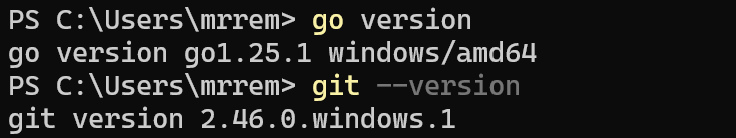

---

## Структура проекта

```
pz3-http/
├── assets/
├── cmd/
│   └── server/
│       └── main.go
├── internal/
│   ├── api/
│   │   ├── cors.go
│   │   ├── handlers.go
│   │   ├── handlers_test.go
│   │   ├── middleware.go
│   │   └── responses.go
│   └── storage/
│       └── memory.go
├── .gitignore
├── go.mod
├── make.ps1
├── README.md
├── requests.md
```

---

## Как начать работу

### Инициализация и установка зависимостей

```sh
cd pz3-http
go mod init example.com/pz3-http
go mod tidy
```

### Настройка порта

По умолчанию сервер слушает порт `8080`. Чтобы изменить порт, задайте переменную окружения `APP_PORT`:

**Windows (cmd):**
```cmd
set APP_PORT=8081
```

**Windows (PowerShell):**
```powershell
$env:APP_PORT="8081"
```

**Linux/macOS:**
```sh
APP_PORT=8081
```

### Запуск приложения

```powershell
go run ./cmd/server
```

## Сборка приложения (.exe для Windows)

```sh
go build -o bin/server.exe ./cmd/server
```

### Запуск приложения

```sh
bin\server.exe
```

### Запуск и сборка через PowerShell-скрипт

В проекте есть скрипт `make.ps1` для удобного запуска, сборки и тестирования:

**Запуск сервера:**
```powershell
.\make.ps1 run
```

**Сборка бинарника:**
```powershell
.\make.ps1 build
```

**Запуск тестов:**
```powershell
.\make.ps1 test
```

---

## Примеры запросов

### Проверка работоспособности сервера
```sh
curl http://localhost:8080/health
```
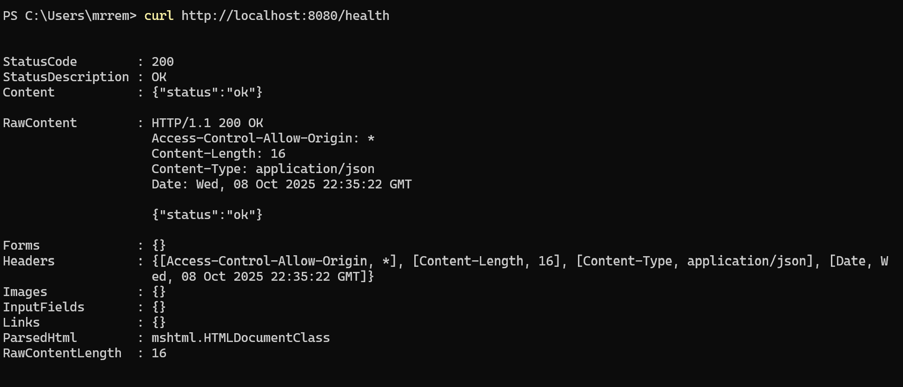
---

### Создать задачу (корректный title)
```sh
curl -Method POST http://localhost:8080/tasks `
  -Headers @{"Content-Type"="application/json"} `
  -Body '{"title":"Listen to Post Malone"}'
```
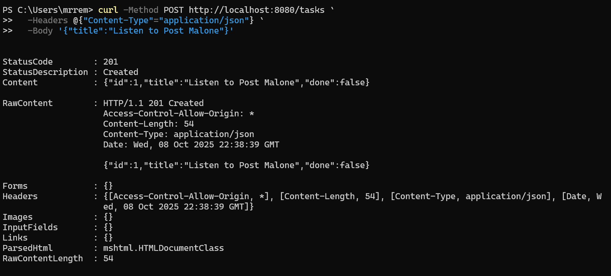
---

### Создать задачу (title слишком короткий)
```sh
curl -Method POST http://localhost:8080/tasks `
  -Headers @{"Content-Type"="application/json"} `
  -Body '{"title":"no"}'
```
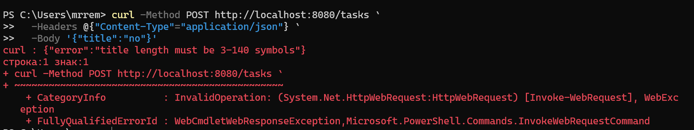
---

### Получить список задач
```sh
curl http://localhost:8080/tasks
```
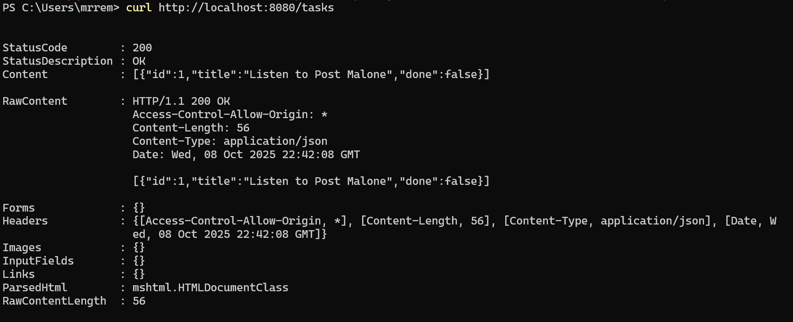
---

### Фильтрация задач
```sh
curl "http://localhost:8080/tasks?q=Post Malone"
```
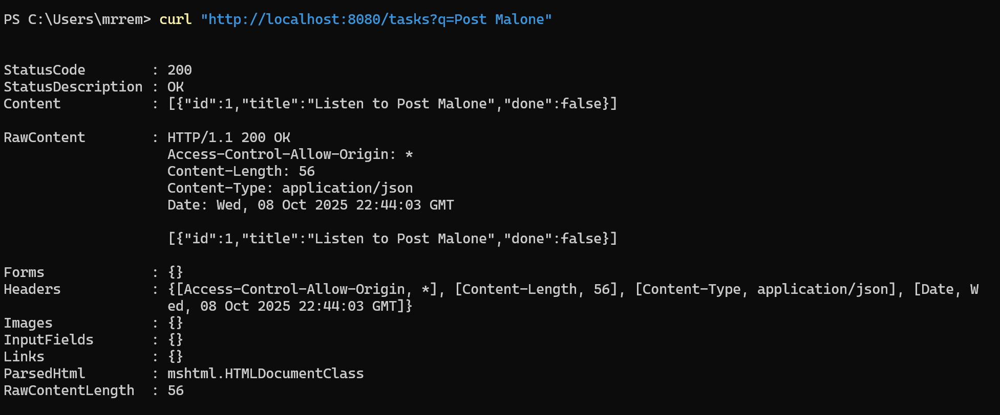
---

### Получить задачу по id
```sh
curl http://localhost:8080/tasks/1
```
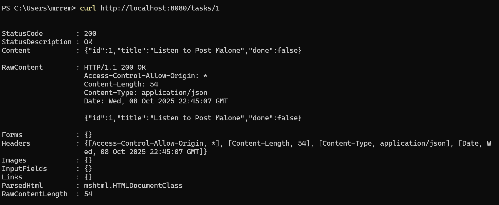
---

### Получить задачу по несуществующему id
```sh
curl http://localhost:8080/tasks/999
```
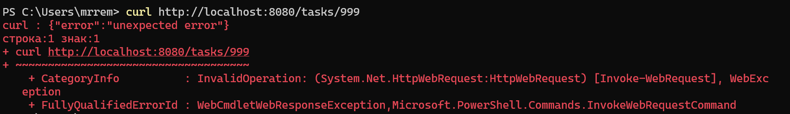
---

### Отметить задачу как выполненную
```sh
curl -Method PATCH http://localhost:8080/tasks/1
```
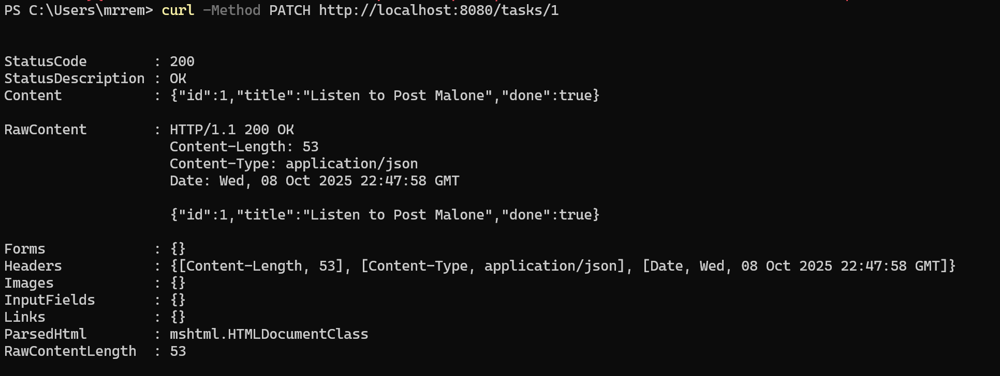
---

### Удалить задачу
```sh
curl -Method DELETE http://localhost:8080/tasks/1
```
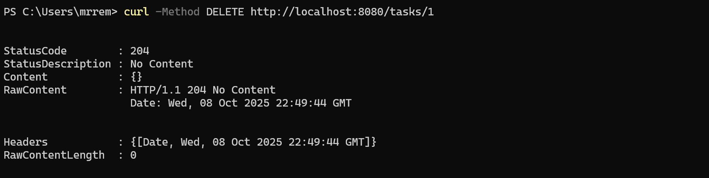
---

## Логи сервера

**Описание логов:**  
В логах сервера отображаются: HTTP-метод, путь, статус ответа и время обработки запроса.

Также сервер настроен на корректное завершение работы (graceful shutdown): при получении сигнала завершения (например, Ctrl+C) сервер дожидается завершения активных запросов и только после этого выключается, что отражается в логах соответствующим сообщением.

### Пример логов:

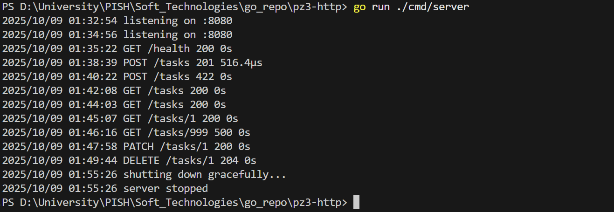
---

## Тесты

В проекте реализованы юнит-тесты для всех основных обработчиков API (создание, получение, обновление, удаление задач, фильтрация, ошибки).  
Тесты находятся в файле `internal/api/handlers_test.go`.

**Запуск тестов:**
```powershell
.\make.ps1 test
```
или
```sh
go test ./internal/api
```

**Пример вывода:**

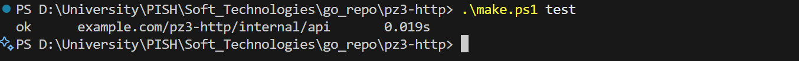

---