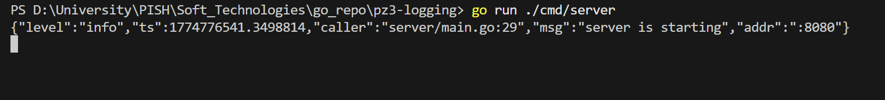
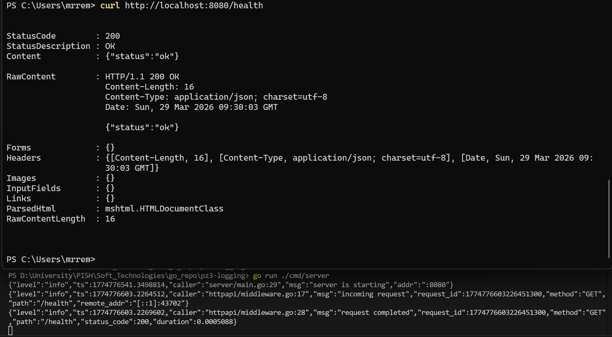
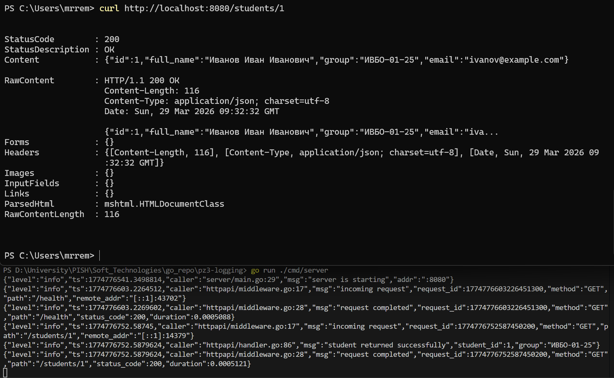
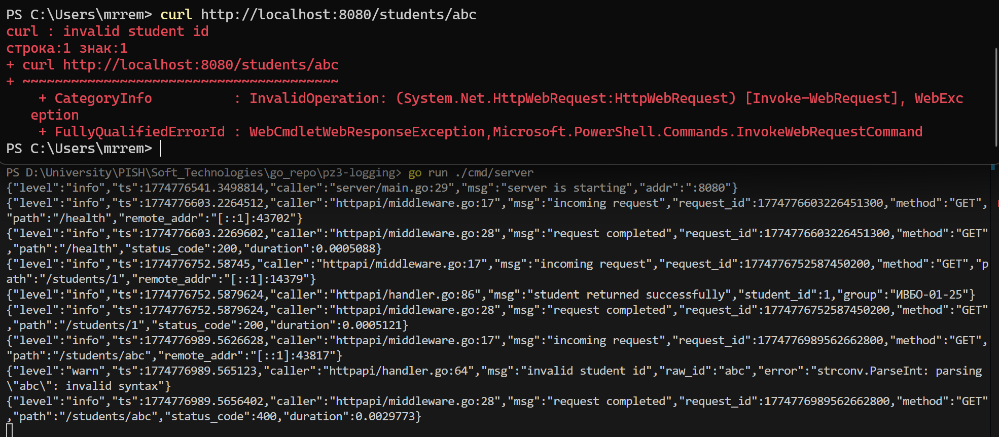
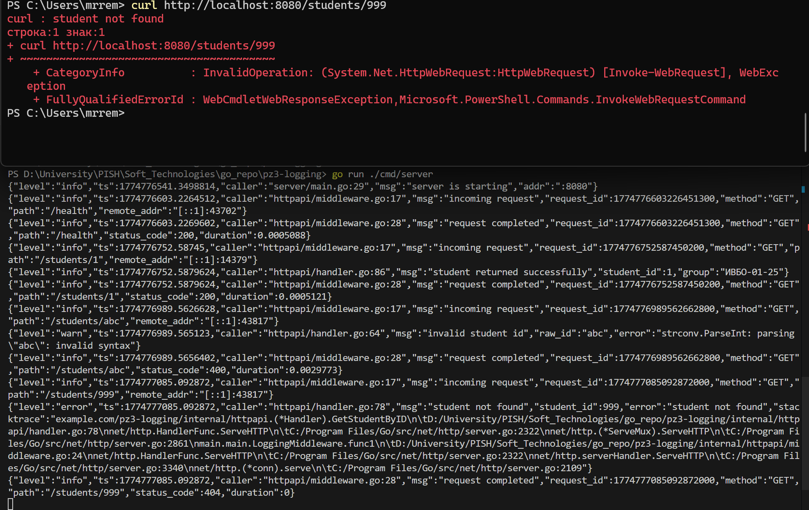

<h1>
Практическое задание №3<br><br>
Ремешевский В.А.<br>
ПИМО-01-25
</h1>

<h2><b>Тема</b><br>
Логирование с помощью zap. Ведение структурированных логов</h2>

# pz3-logging


Проект демонстрирует использование библиотеки zap для логирования в Go-приложении. Реализовано ведение структурированных логов с различными уровнями логирования, а также обработка запросов с использованием middleware.

## Структура проекта
```
pz3-logging/
├── assets/                      
├── cmd/
│   └── server/
│       └── main.go              
├── internal/
│   ├── httpapi/
│   │   ├── handler.go
│   │   ├── middleware.go
│   │   └── response_writer.go
│   └── student/
│       ├── model.go
│       └── repo.go
├── pkg/
│   └── logger/
│       └── logger.go
├── go.mod
└── README.md
```

## Использование zap

### Почему в работе использовался zap
Zap был выбран для логирования благодаря его высокой производительности, поддержке структурированных логов и гибкости в настройке. Он позволяет эффективно обрабатывать большие объемы логов без значительного влияния на производительность приложения.

### Отличия Logger и SugaredLogger
- **Logger**: Предоставляет строго типизированный API для логирования, что позволяет избежать ошибок, связанных с форматированием строк.
- **SugaredLogger**: Предоставляет более удобный API для логирования с использованием форматированных строк, что упрощает запись логов, но может быть менее производительным.

### Уровни логгирования
В zap доступны следующие уровни логгирования:
- `Debug`
- `Info`
- `Warn`
- `Error`
- `DPanic`
- `Panic`
- `Fatal`

### Где в приложении нужно логировать события
- Входящие HTTP-запросы (`middleware.go`)
- Ошибки при обработке запросов (`handler.go`)
- Важные события в бизнес-логике (например, успешное выполнение операций)
- Исключительные ситуации (например, некорректные данные или отсутствие записей в базе данных)

## Как начать работу

### Инициализация и установка зависимостей

```sh
cd pz3-logging/
go mod tidy
go get go.uber.org/zap
```

### Запуск приложения (PowerShell)

```powershell
cd pz3-logging
go run ./cmd/server
```

## Скриншоты

### Запуск сервера
```sh
go run ./cmd/server
```


### Проверка состояния сервера
```sh
curl http://localhost:8080/health
```


### Получение информации о студенте по ID
```sh
curl http://localhost:8080/students/1
```


### Ошибка: некорректный ID студента
```sh
curl http://localhost:8080/students/abc
```


### Ошибка: студент не найден
```sh
curl http://localhost:8080/students/999
```
