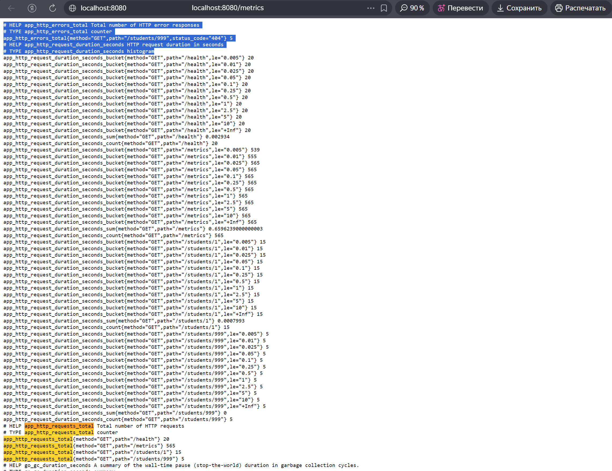
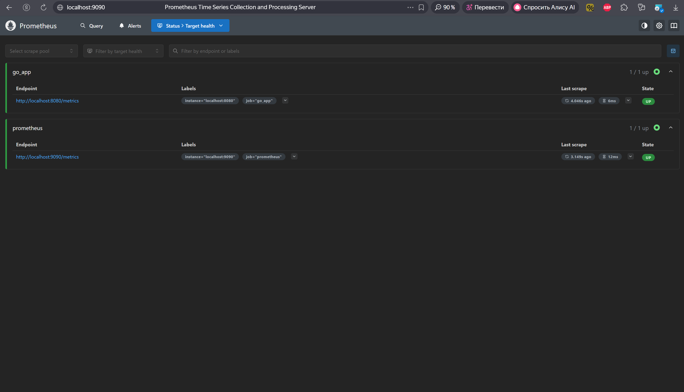
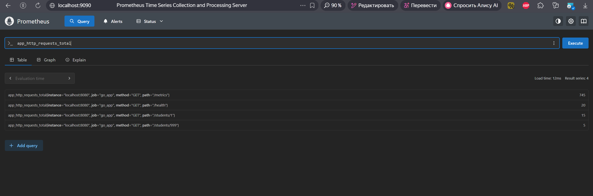
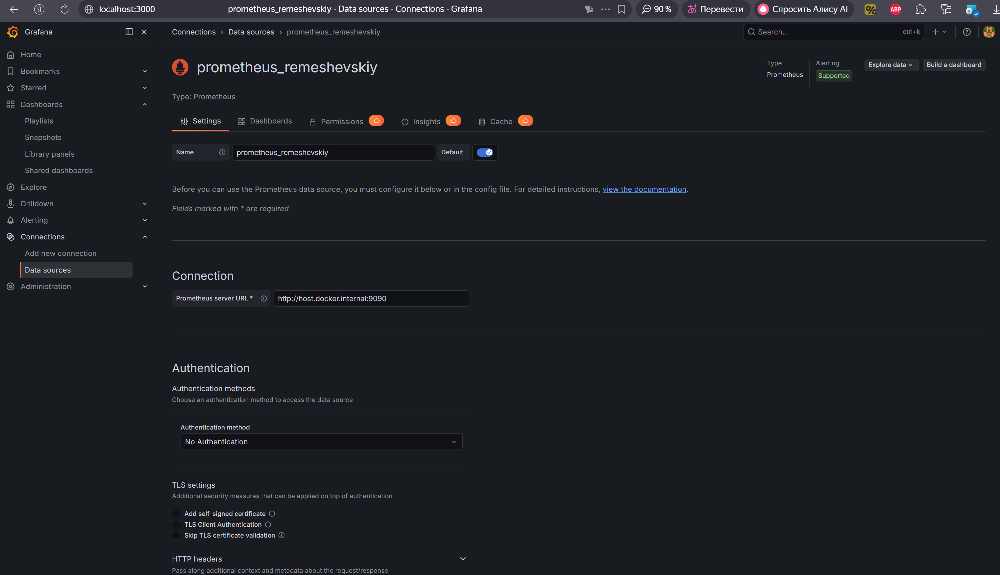
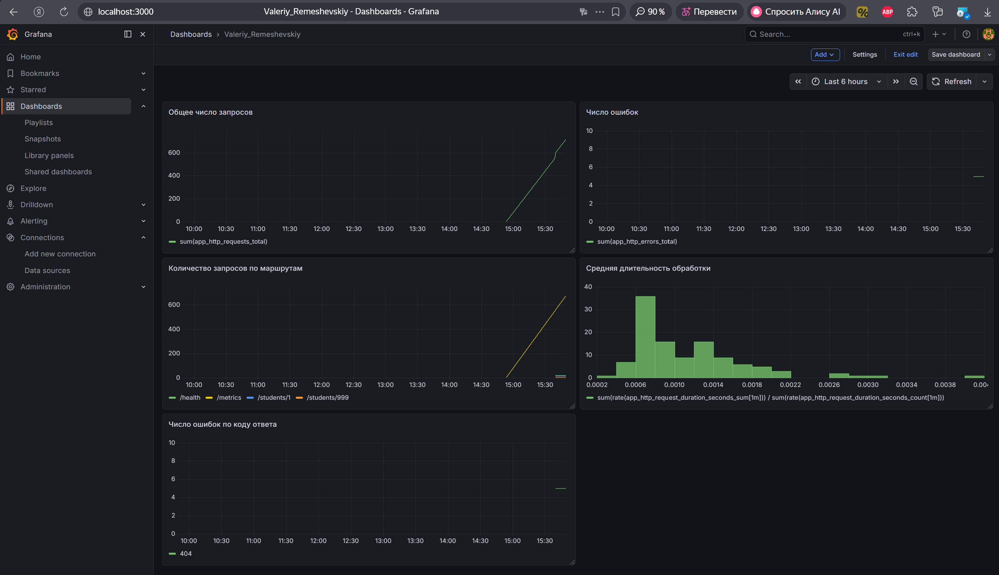

<h1>
Практическое задание №4<br><br>
Ремешевский В.А.<br>
ПИМО-01-25
</h1>

<h2><b>Тема</b><br>
Настройка Prometheus + Grafana для метрик. Интеграция с приложением</h2>

# pz4-monitoring

## Краткое описание
Проект демонстрирует интеграцию Go-приложения с системой мониторинга **Prometheus** и визуализацией метрик в **Grafana**. Реализован экспорт пользовательских метрик (количество запросов, ошибки, длительность обработки) и настройка мониторинга с помощью **Prometheus** и **Grafana**.

## Структура проекта
```
pz4-monitoring/
├── assets/                      
├── cmd/
│   └── server/
│       └── main.go              
├── internal/
│   ├── httpapi/
│   │   ├── handler.go
│   │   ├── middleware.go
│   │   └── response_writer.go
│   ├── metrics/
│   │   └── metrics.go
│   └── student/
│       ├── model.go
│       └── repo.go
├── monitoring/
│   └── prometheus.yml
├── go.mod
├── .gitignore
└── README.md
```

## Как начать работу

### Инициализация и установка зависимостей

```sh
cd pz4-monitoring/
go mod tidy
go get github.com/prometheus/client_golang/prometheus
```

### Запуск приложения

```sh
go run ./cmd/server
```

## Настройка Prometheus

**Prometheus** используется для сбора метрик с эндпоинта `/metrics` приложения. Конфигурация **Prometheus задаётся** в файле `monitoring/prometheus.yml`:

```yaml
global:
  scrape_interval: 5s

scrape_configs:
  - job_name: "go_app"
    static_configs:
      - targets: ["localhost:8080"]

  - job_name: "prometheus"
    static_configs:
      - targets: ["localhost:9090"]
```

Для запуска **Prometheus** используйте официальный дистрибутив и укажите путь к конфигу:

```sh
prometheus --config.file=monitoring/prometheus.yml
```

Интерфейс Prometheus будет доступен по адресу: [http://localhost:9090](http://localhost:9090)

## Настройка Grafana

Для визуализации метрик используйте **Grafana**. Запуск через Docker:

```sh
docker run -d --name=grafana -p 3000:3000 grafana/grafana-enterprise:12.4.2-ubuntu
```

Интерфейс **Grafana** будет доступен по адресу: [http://localhost:3000](http://localhost:3000)

## Дашборд Grafana: панели метрик

1. **Общее число запросов**
   - Запрос: `sum(app_http_requests_total)`
2. **Число ошибок**
   - Запрос: `sum(app_http_errors_total)`
3. **Количество запросов по маршрутам**
   - Запрос: `sum by (path) (app_http_requests_total)`
4. **Средняя длительность обработки**
   - Запрос:
     ```
     sum(rate(app_http_request_duration_seconds_sum[1m])) /
     sum(rate(app_http_request_duration_seconds_count[1m]))
     ```
5. **Число ошибок по коду ответа**
   - Запрос: `sum by (status_code) (app_http_errors_total)`

## Скриншоты

### Метрики приложения на эндпоинте /metrics
```sh
http://localhost:8080/metrics
```


### Интерфейс Prometheus
```sh
http://localhost:9090
```


### Выполнение запроса app_http_requests_total в Prometheus
```sh
app_http_requests_total
```


### Подключение Prometheus в Grafana


### Дашборд с метриками в Grafana
```sh
http://localhost:3000
```

