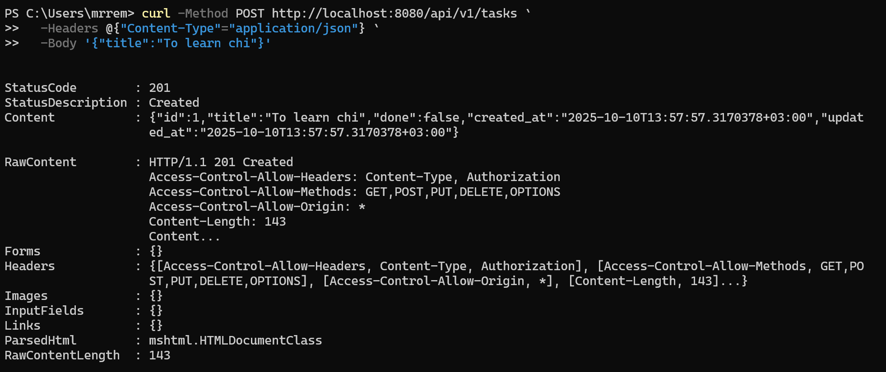
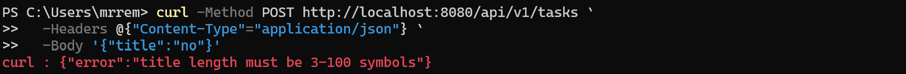
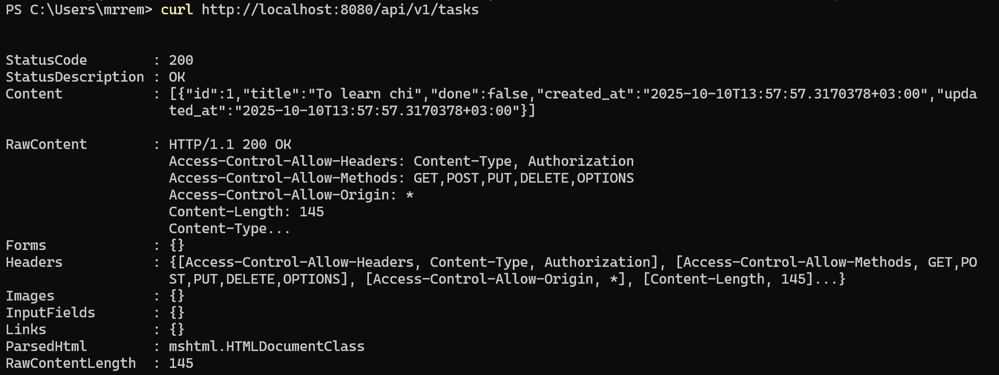
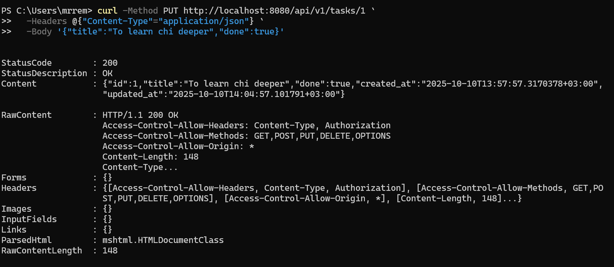
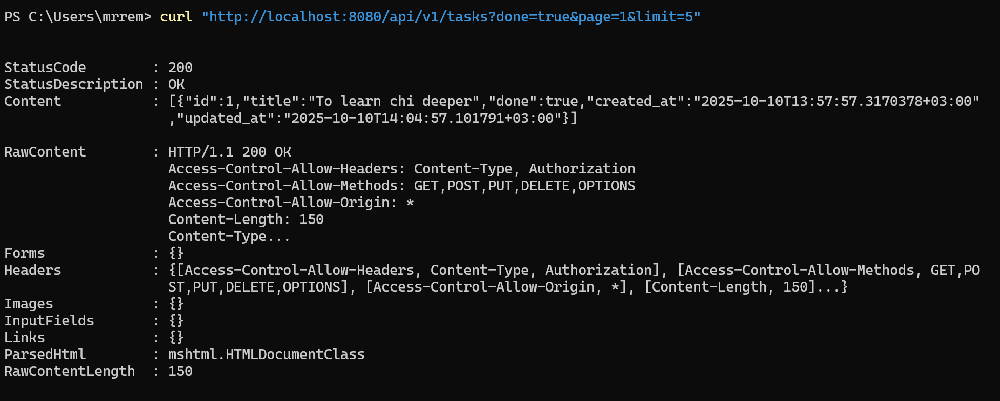
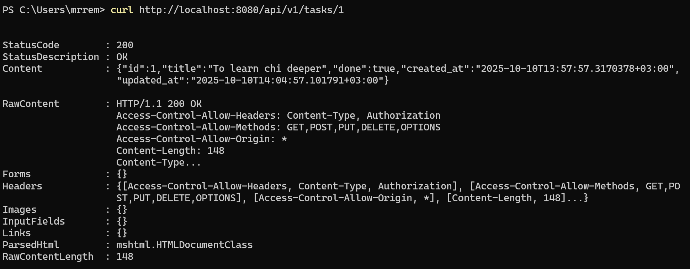
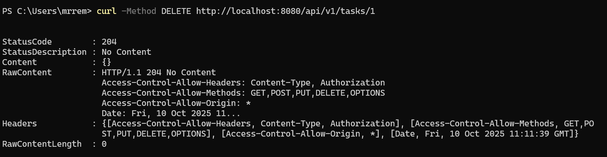

<h1>
Практическое задание №4<br><br>
Ремешевский В.А.<br>
ПИМО-01-25
</h1>
<br>

# PZ4-ToDo

## Описание проекта

**PZ4-ToDo** — это HTTP API-сервер на Go, реализующий базовый CRUD для задач (ToDo) с поддержкой:
- версионирования API (`/api/v1/...`);
- логирования и CORS через middleware;
- валидации полей и обработки ошибок;
- фильтрации, пагинации и сохранения задач в JSON-файл.
  
### Сервер предоставляет следующие эндпоинты:

- `/health` — проверка состояния сервера.
- `/api/v1/tasks` — получение списка задач (с поддержкой фильтров и пагинации).
- `/api/v1/tasks` (POST) — создание новой задачи по JSON {"title":"..."}.
- `/api/v1/tasks/{id}` — получение задачи по id.
- `/api/v1/tasks/{id}` (PUT) — обновление задачи.
- `/api/v1/tasks/{id}` (DELETE) — удаление задачу.

---

## Цели работы

1. Освоить базовую маршрутизацию HTTP-запросов в Go с помощью роутера **chi**.  
2. Научиться строить REST-маршруты и обрабатывать методы **GET / POST / PUT / DELETE**.  
3. Реализовать CRUD-сервис «ToDo» с хранением в памяти и сохранением на диск.  
4. Добавить middleware (логирование, CORS).  
5. Научиться тестировать REST API-запросы с помощью **curl / Bruno**.  

---

## Структура проекта

```
pz4-todo/
├── assets/
├── cmd/
│   └── server/
│       └── main.go
├── internal/
│   ├── task/
│   │   ├── handler.go
│   │   ├── model.go
│   │   ├── repo.go
├── pkg/
│   ├── middleware/
│   │   ├── cors.go
│   │   ├── logger.go
├── go.mod
├── go.sum
├── README.md
```

---

## Как начать работу

### Инициализация и установка зависимостей

```sh
cd pz4-todo
go mod init example.com/pz4-todo
go get github.com/go-chi/chi/v5
go get github.com/go-chi/chi/v5/middleware
go mod tidy
```

### Запуск приложения

```powershell
go run .\cmd\server
```

---

## Основные фрагменты кода

#### 🔹 Роутер и запуск сервера (`cmd/server/main.go`)

```go
repo := task.NewRepo("tasks.json")
h := task.NewHandler(repo)

r := chi.NewRouter()
r.Use(chimw.RequestID)
r.Use(chimw.Recoverer)
r.Use(myMW.Logger)
r.Use(myMW.SimpleCORS)

r.Get("/health", func(w http.ResponseWriter, r *http.Request) {
    w.Write([]byte("OK"))
})

r.Route("/api/v1", func(v1 chi.Router) {
    v1.Mount("/tasks", h.Routes())
})

addr := ":8080"
log.Printf("listening on %s", addr)
log.Fatal(http.ListenAndServe(addr, r))
```

#### 🔹 Middleware: логирование (`pkg/middleware/logger.go`)
```go
func Logger(next http.Handler) http.Handler {
    return http.HandlerFunc(func(w http.ResponseWriter, r *http.Request) {
        start := time.Now()
        next.ServeHTTP(w, r)
        log.Printf("%s %s %s", r.Method, r.URL.Path, time.Since(start))
    })
}
```

#### 🔹 Middleware: CORS (`pkg/middleware/cors.go`)
```go
func SimpleCORS(next http.Handler) http.Handler {
    return http.HandlerFunc(func(w http.ResponseWriter, r *http.Request) {
        w.Header().Set("Access-Control-Allow-Origin", "*")
        w.Header().Set("Access-Control-Allow-Methods", "GET,POST,PUT,DELETE,OPTIONS")
        w.Header().Set("Access-Control-Allow-Headers", "Content-Type")
        if r.Method == http.MethodOptions {
            w.WriteHeader(http.StatusNoContent)
            return
        }
        next.ServeHTTP(w, r)
    })
}
```

#### 🔹 Обработчик создания задачи (`internal/task/handler.go`)
```go
func (h *Handler) create(w http.ResponseWriter, r *http.Request) {
	var req createReq
	if err := json.NewDecoder(r.Body).Decode(&req); err != nil || req.Title == "" {
		httpError(w, http.StatusBadRequest, "invalid json: require non-empty title")
		return
	}

	// Валидация длины title
	if len(req.Title) < 3 || len(req.Title) > 100 {
		httpError(w, 422, "title length must be 3-100 symbols")
		return
	}

	t := h.repo.Create(req.Title)
	writeJSON(w, http.StatusCreated, t)
}
```

## Примеры запросов

### Проверка работоспособности сервера
```sh
curl http://localhost:8080/health
```

---

### Создать задачу (корректный title)
```sh
curl -Method POST http://localhost:8080/api/v1/tasks `
  -Headers @{"Content-Type"="application/json"} `
  -Body '{"title":"To learn chi"}'
```

---

### Создать задачу (title слишком короткий)
```sh
curl -Method POST http://localhost:8080/api/v1/tasks `
  -Headers @{"Content-Type"="application/json"} `
  -Body '{"title":"no"}'
```

---

### Получить список задач
```sh
curl http://localhost:8080/api/v1/tasks
```

---

### Обновление задачи (PUT)
```sh
curl -Method PUT http://localhost:8080/api/v1/tasks/1 `
  -Headers @{"Content-Type"="application/json"} `
  -Body '{"title":"To learn chi deeper","done":true}'
```

---

### Фильтрация и пагинация
```sh
curl "http://localhost:8080/api/v1/tasks?done=false&page=1&limit=5"
```

---

### Получить задачу по id
```sh
curl http://localhost:8080/api/v1/tasks/1
```

---

### Удалить задачу
```sh
curl -Method DELETE http://localhost:8080/api/v1/tasks/1
```

---

## Обработка ошибок и кодов ответов

В нашем сервере ошибки обрабатываются централизованно с помощью вспомогательной функции `httpError`:

```go
func httpError(w http.ResponseWriter, code int, msg string) {
	writeJSON(w, code, map[string]string{"error": msg})
}
```


Любая ошибка в обработчике (например, неверный ID, пустой title, задача не найдена) возвращается клиенту в виде JSON:

```
{"error": "описание ошибки"}
```

HTTP-коды соответствуют ситуации:
- 400 Bad Request — некорректный запрос (например, пустой title или неверный формат ID)
- 404 Not Found — объект не найден (например, GET/PUT/DELETE по несуществующему ID)
- 422 Unprocessable Entity — валидное тело запроса, но данные не соответствуют правилам (например, слишком короткий или длинный title)
- 201 Created — успешное создание ресурса
- 200 OK — успешное получение или обновление ресурса
- 204 No Content — успешное удаление без тела ответа

## Результаты тестирования

|  №  | Маршрут                        | Метод  | Пример (тело) запроса     | Ожидаемый ответ        | Фактический результат |
| :-: | :----------------------------- | :----- | :------------------------ | :--------------------- | :-------------------- |
|  1  | `/health`                      | GET    | `curl http://localhost:8080/health`| `OK`                   | ✅                   |
|  2  | `/api/v1/tasks`                | POST   | `{"title":"To learn chi"}` | `201 Created`          | ✅                   |
|  3  | `/api/v1/tasks`                | POST   | `{"title":"no"}`          | `422 Validation error` | ✅                   |
|  4  | `/api/v1/tasks`                | GET    | `curl http://localhost:8080/api/v1/tasks`           | `200 OK [{"id":1,"title":"To learn chi","done":false,"created_at":"2025-10-10T13:57:57.3170378+03:00","updated_at":"2025-10-10T13:57:57.3170378+03:00"}]`            | ✅                   |
|  5  | `/api/v1/tasks/1`              | PUT    | `{"title":"To learn chi deeper","done":true}`                | `200 OK {"id":1,"title":"To learn chi deeper","done":true,"created_at":"2025-10-10T13:57:57.3170378+03:00","updated_at":"2025-10-10T14:04:57.101791+03:00"}`      | ✅                   |
|  6  | `/api/v1/tasks?page=1&limit=5` | GET    | `curl "http://localhost:8080/api/v1/tasks?done=false&page=1&limit=5"`                | `200 OK [{"id":1,"title":"To learn chi deeper","done":true,"created_at":"2025-10-10T13:57:57.3170378+03:00","updated_at":"2025-10-10T14:04:57.101791+03:00"}]`     | ✅                   |
|  7  | `/api/v1/tasks/1`              | DELETE | `curl -Method DELETE http://localhost:8080/api/v1/tasks/1`                  | `204 No content {}`                    | ✅                   |


## Выводы
- Изучен роутер chi, его преимущества над стандартным `http.ServeMux` — поддержка middleware, вложенных маршрутов и REST-структуры.
- Реализованы все базовые методы REST: `GET`, `POST`, `PUT`, `DELETE`.
- Добавлены middleware для логирования и CORS.
- Организована валидация, пагинация, фильтрация и сохранение данных в JSON-файл.
- Отладка проводилась через curl и Bruno.
- Наиболее сложной частью стало корректное сохранение и обновление JSON без гонок данных (с использованием `sync.Mutex`).
- Возможные улучшения: добавить аутентификацию и подключение к БД (SQLite/PostgreSQL).

---