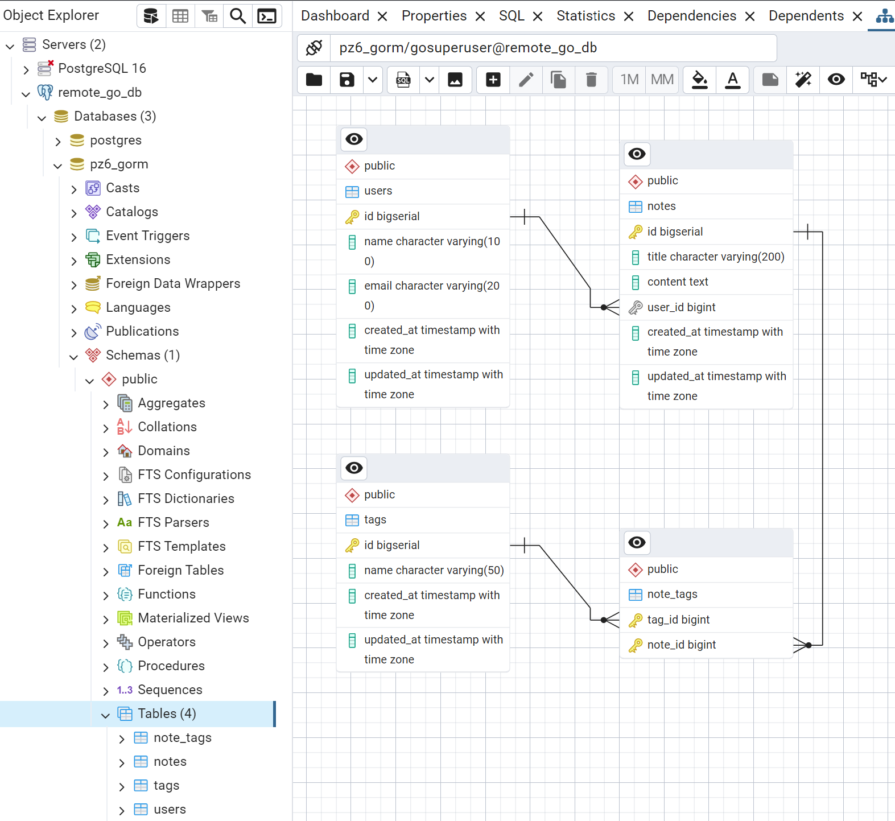
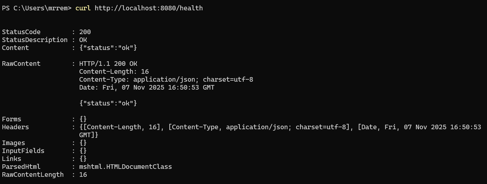
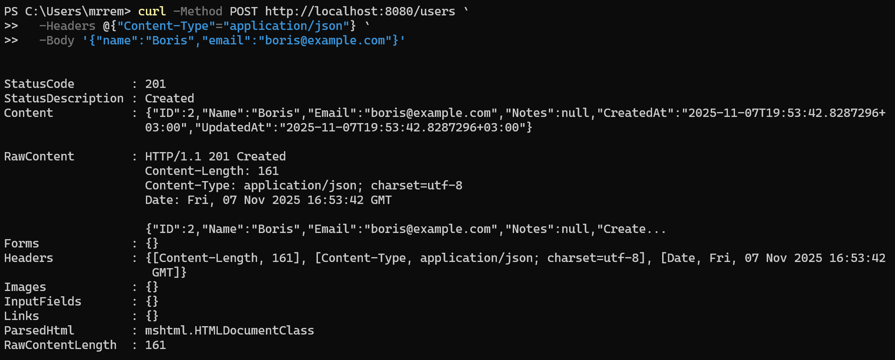
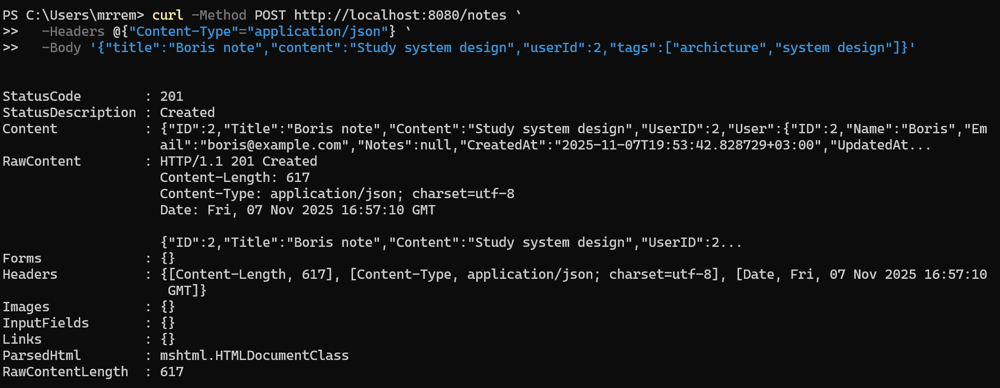
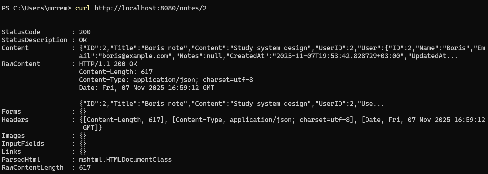

<h1>
Практическое задание №6<br><br>
Ремешевский В.А.<br>
ПИМО-01-25
</h1>

<h2><b>Тема</b><br>
Использование ORM (GORM). Модели, миграции и связи между таблицами.</h2><br>

# PZ6-GORM

## Краткое описание проекта

**PZ6-GORM** — это небольшой HTTP API‑сервис на Go, реализованный с использованием ORM GORM и PostgreSQL. Проект демонстрирует создание и миграцию схемы через GORM AutoMigrate, работу с отношениями 1:N (User→Notes) и M:N (Note↔Tag), а также пример запросов с предзагрузкой связанных сущностей (Preload).

## Окружение

- Go (в проекте указан go 1.25.1, но подойдёт 1.20+)
- PostgreSQL (локально или удалённый сервер)

## Структура проекта

```
pz6-gorm/
├── assets/
├── cmd/
│   └── server/
│       └── main.go
├── internal/
│   ├── db/
│   │   └── postgres.go
│   ├── http/
│   │   ├── handlers.go
│   │   └── router.go
│   └── models/
│       └── models.go
├── go.mod
└── README.md
```

## Что такое ORM
ORM (Object–Relational Mapping) — это технология (или библиотека), которая связывает объекты языка программирования (например, структуры или классы) с таблицами реляционной базы данных.

Проще говоря, ORM позволяет работать с базой через объекты и методы, а не через сырой SQL.

### Зачем она нужна, если есть `database/sql`

Пакет `database/sql` (в Go) — это низкоуровневый драйвер для общения с СУБД: ты сам пишешь SQL-запросы (`SELECT`, `INSERT`, `UPDATE`), сканируешь результаты в структуры и т.д.

ORM строится поверх `database/sql` и автоматизирует следующие задачи:
- Генерирует SQL,
- Маппит строки таблицы в структуры,
- Управляет связями (has one, has many, many-to-many),
- Обеспечивает единый слой доступа к данным.

### Преимущества
- Меньше шаблонного кода — не нужно писать `rows.Scan(...)`, `INSERT INTO`, `UPDATE ...`, т.д.
- Безопасность и читабельность — ORM экранирует параметры (защита от SQL-инъекций), код выглядит ближе к бизнес-логике.
- Портируемость — можно (иногда) сменить СУБД, не переписывая весь SQL вручную.

### Недостатки
- Производительность — ORM почти всегда немного медленнее «чистого SQL», особенно при сложных запросах или больших объёмах данных.
- Ограничения гибкости — ORM не всегда поддерживает сложные SQL-фичи (CTE, window functions, custom indexes) или делает код менее прозрачно для оптимизации.

---

## Как начать работу

### Инициализаци и установка зависимостей

```sh
cd pz6-gorm
go mod init example.com/pz6-gorm
go get gorm.io/gorm gorm.io/driver/postgres github.com/go-chi/chi/v5
```

### Настройка переменных окружения

Проект читает DSN из переменной окружения `DB_DSN`.

```env
$env:DB_DSN = "host=HOST user=USERNAME password=PASSWORD dbname=DBNAME port=PORT sslmode=disable"
```

- ```HOST``` — адрес сервера базы данных (```localhost``` для локальной базы или IP/домен удалённого сервера).
- ```USERNAME``` — имя пользователя базы данных.
- ```PASSWORD``` — пароль пользователя.
- ```DBNAME``` — имя базы данных.
- ```PORT``` — порт PostgreSQL (обычно ```5432```).
- ```sslmode``` — режим SSL (```disable``` для локальной разработки, ```require``` для продакшена при необходимости).

### Запуск приложения

```powershell
go run ./cmd/server
```

## AutoMigrate

При старте в `cmd/server/main.go` выполняется AutoMigrate:

```go
d := db.Connect()
if err := d.AutoMigrate(&models.User{}, &models.Note{}, &models.Tag{}); err != nil {
	log.Fatal("migrate:", err)
}
```

Это автоматически создаст таблицы `users`, `notes`, `tags` и промежуточную таблицу `note_tags` для связи M:N.

## Скриншоты

### Схема БД


### Проверка работоспособности
```sh
curl http://localhost:8080/health
```


### Создание пользователя
```sh
curl -Method POST http://localhost:8080/users `
  -Headers @{"Content-Type"="application/json"} `
  -Body '{"name":"Boris","email":"boris@example.com"}'
```


### Создание заметки с тегами
```sh
curl -Method POST http://localhost:8080/notes `
  -Headers @{"Content-Type"="application/json"} `
  -Body '{"title":"Boris note","content":"Study system design","userId":2,"tags":["archicture","system design"]}'
```


### Получение заметки по id (результат включает `User` и `Tags`)
```sh
curl http://localhost:8080/notes/2
```


---

## Возникшие проблемы и их решение

При создании заметки требовалось корректно привязывать теги без дублирования — решение: в `CreateNote` используется `FirstOrCreate` для тегов и затем создаётся связь many2many; после создания заметки используется `Preload("User").Preload("Tags")` для возврата полной структуры.
