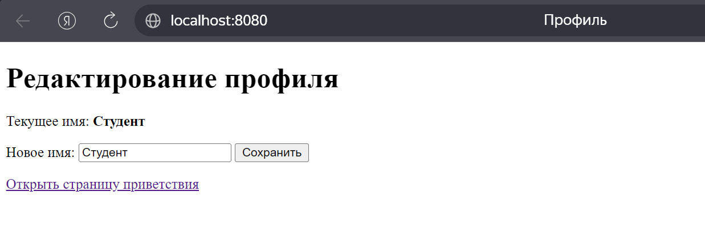
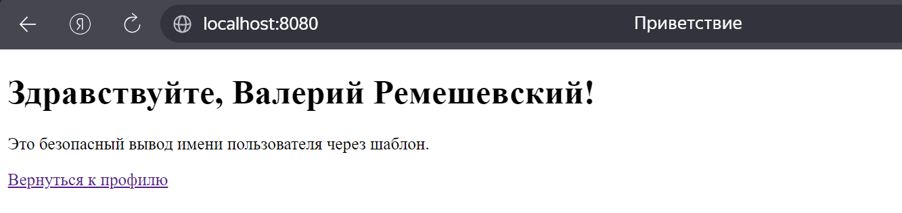
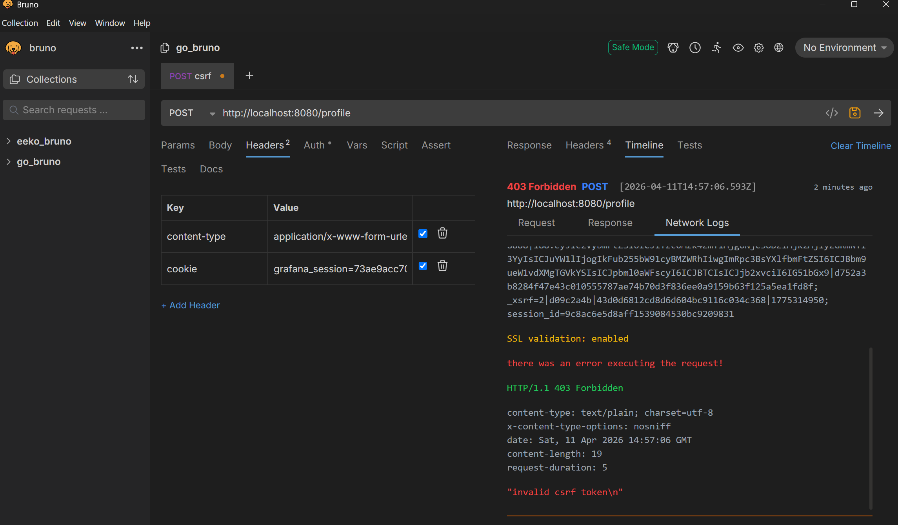
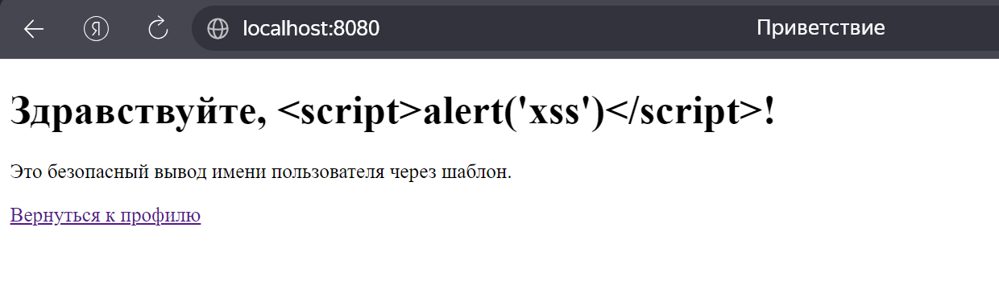

<h1>
Практическое задание №6<br><br>
Ремешевский В.А.<br>
ПИМО-01-25
</h1>

<h2><b>Тема</b><br>
Реализация защиты от CSRF/XSS. Работа с secure cookies.</h2>

### Цель практической работы
Освоить базовые практические подходы к защите web-приложения на Go от CSRF- и XSS-угроз, а также научиться безопасно использовать cookies для аутентификации и хранения пользовательского состояния.

# pz6-web-security

### Описание проекта
В проекте реализовано простое web-приложение на Go, которое защищает профиль пользователя от CSRF-атак и обеспечивает безопасное отображение пользовательских данных в HTML-шаблонах. Аутентификация выполняется через защищенную cookie-сессию, а CSRF-токен хранится на стороне сервера и передаётся в виде скрытого поля формы.

## Структура проекта
```
pz6-web-security/
├── assets/                            
├── cmd/                        
│   └── server/                 
│       └── main.go             
├── internal/                   
│   ├── auth/                   
│   │   ├── cookie.go           
│   │   └── csrf.go             
│   ├── httpapi/                
│   │   └── handler.go          
│   └── store/                  
│       └── store.go            
├── templates/                  
│   ├── hello.html              
│   └── profile.html            
├── go.mod                      
└── README.md                  
```

## Краткие пояснения

### Что такое CSRF
CSRF (Cross-Site Request Forgery) — это атака, при которой злоумышленник заставляет браузер авторизованного пользователя выполнить нежелательный запрос к доверенному сайту. В результате пользователь может выполнить действие без своего намерения, например изменить профиль или перевести деньги.

### Что такое XSS
XSS (Cross-Site Scripting) — это атака, при которой вредоносный скрипт внедряется в контент веб-страницы и выполняется в браузере других пользователей. XSS позволяет украсть сессии, перенаправлять на вредоносные сайты или подменять содержимое страницы.

### Роль `HttpOnly`, `Secure`, `SameSite`
- `HttpOnly`: флаг cookie, предотвращающий доступ к cookie из JavaScript. Это защищает куки от кражи через XSS-скрипты.
- `Secure`: флаг cookie, который указывает, что cookie должен передаваться только по HTTPS. Это защищает cookie от перехвата в незащищённом канале.
- `SameSite`: ограничивает отправку cookie вместе с кросс-сайт запросами. Значение `Lax` позволяет отправлять cookie при переходе по ссылке, но блокирует его при автоматических запросах из других сайтов, что помогает предотвратить CSRF.

## Как начать работу

### Инициализация и установка зависимостей
```sh
cd pz6-web-security/
go mod tidy
```

### Запуск приложения
```sh
go run ./cmd/server
```

## Важные фрагменты кода

### Установка cookie
```go
func SetSessionCookie(w http.ResponseWriter, value string) {
    http.SetCookie(w, &http.Cookie{
        Name:     SessionCookieName,
        Value:    value,
        Path:     "/",
        HttpOnly: true,
        Secure:   false,
        SameSite: http.SameSiteLaxMode,
        MaxAge:   3600,
    })
}
```

### Генерация CSRF-токена
```go
sessionID, err := auth.RandomToken(16)
if err != nil {
    http.Error(w, "failed to create session", http.StatusInternalServerError)
    return
}

csrfToken, err := auth.RandomToken(16)
if err != nil {
    http.Error(w, "failed to create csrf token", http.StatusInternalServerError)
    return
}
```

### Проверка CSRF-токена
```go
if err := r.ParseForm(); err != nil {
    http.Error(w, "bad form", http.StatusBadRequest)
    return
}

tokenFromForm := r.FormValue("csrf_token")
if tokenFromForm == "" || tokenFromForm != profile.CSRFToken {
    http.Error(w, "invalid csrf token", http.StatusForbidden)
    return
}
```

### Безопасный HTML-шаблон
```html
<h1>Здравствуйте, {{.Name}}!</h1>
<p>Это безопасный вывод имени пользователя через шаблон.</p>
```

### Опасный XSS-пример
```go
func unsafeHello(w http.ResponseWriter, name string) {
	html := "<html><body><h1>Здравствуйте, " + name + "!</h1></body></html>"
	w.Header().Set("Content-Type", "text/html; charset=utf-8")
	_, _ = w.Write([]byte(html))
}
```

## Скриншоты

### Переход на страницу профиля
```sh
curl http://localhost:8080/login
```


### Успешное изменение имени


### Ошибка при неверном CSRF-токене


### Безопасное отображение строки со script-тегом
```sh
curl http://localhost:8080/hello
```


## Выводы по реализованным механизмам безопасности

- В приложении реализовано серверное управление сессиями с использованием криптографически стойких токенов и cookie с флагом `HttpOnly`, что снижает риск их компрометации.
- Добавлена защита от CSRF-атак через уникальный токен, который проверяется при каждом POST-запросе.
- Использование `html/template` обеспечивает автоматическое экранирование данных и защиту от XSS-атак.
- Реализованы базовая валидация пользовательского ввода и ограничение допустимых HTTP-методов.
