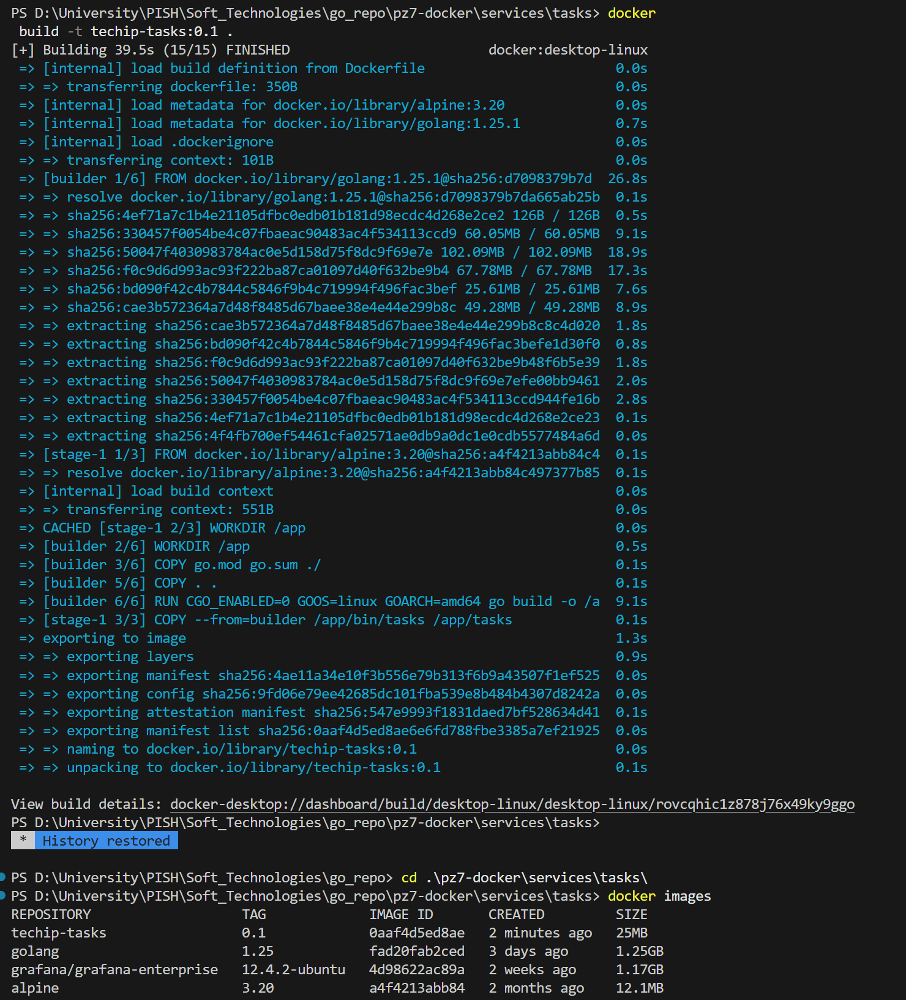
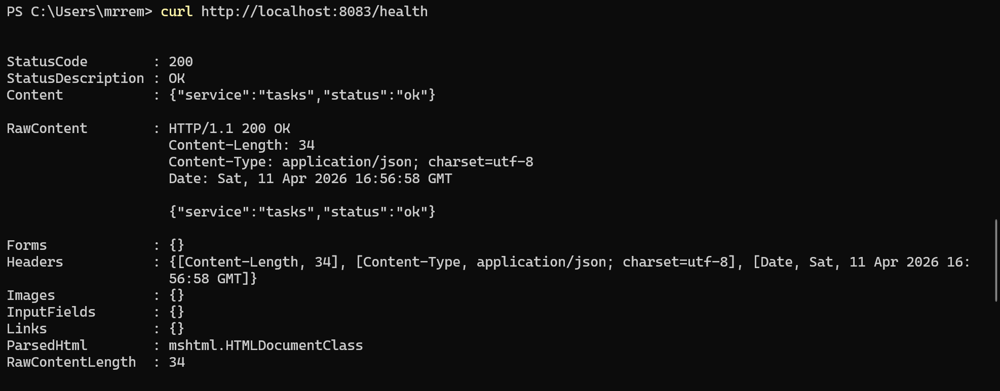
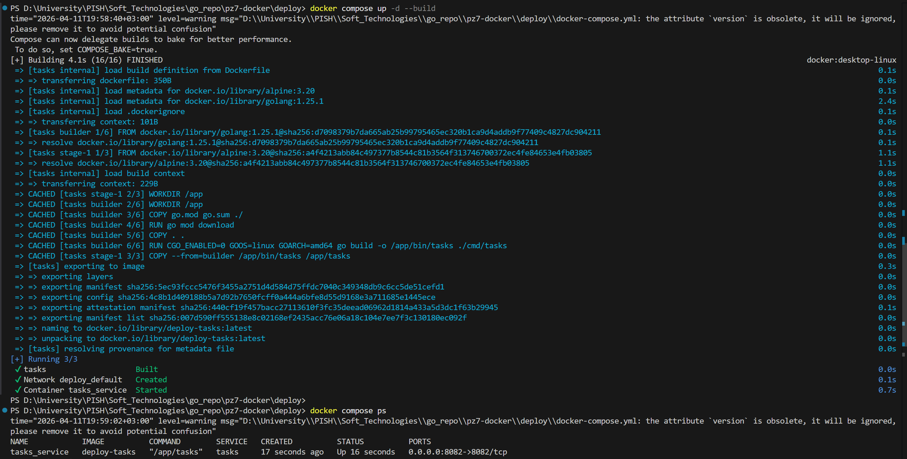
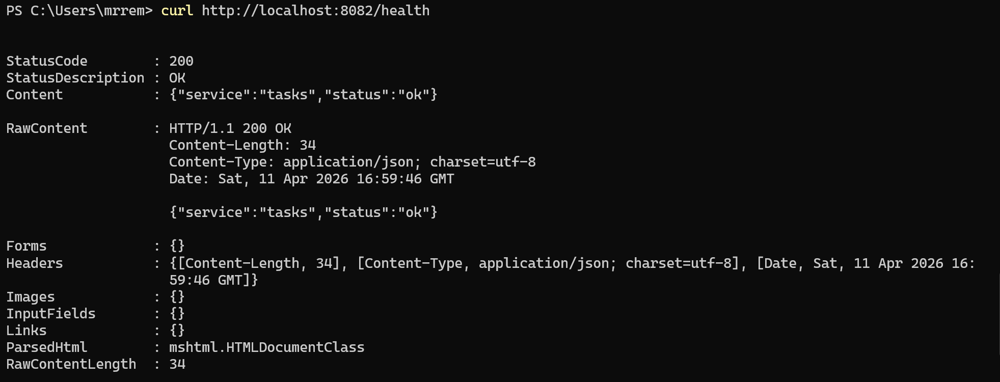

<h1>
Практическое задание №7<br><br>
Ремешевский В.А.<br>
ПИМО-01-25
</h1>

<h2><b>Тема</b><br>
Написание Dockerfile и сборка контейнера</h2>

## Цель практической работы
Освоить контейнеризацию backend-приложения на Go с помощью Docker, научиться писать `Dockerfile`, собирать Docker-образ и запускать контейнеризированный сервис в воспроизводимой среде.

# pz7-docker

## Краткое описание
Проект содержит сервис `tasks`, упакованный в Docker-контейнер. В нем реализована сборка Go-приложения в многослойном `Dockerfile`, что позволяет сформировать лёгкий и переносимый образ для запуска сервиса в контейнере.

## Структура проекта
```
pz7-docker/
├── assets/                          
├── deploy/                    
│   └── docker-compose.yml     
├── services/                  
│   └── tasks/                 
│       ├── .dockerignore      
│       ├── Dockerfile         
│       ├── go.mod             
│       └── cmd/               
│           └── tasks/         
│               └── main.go    
└── README.md                  
```

## Пояснения

### Зачем контейнеризировать backend-приложение
Контейнеризация позволяет упаковать приложение вместе со всей средой выполнения и зависимостями. Это делает запуск в разных окружениях предсказуемым, упрощает развертывание и уменьшает вероятность проблем, связанных с несовместимыми версиями библиотек.

### Что такое Docker-образ и контейнер
- Docker-образ — это зафиксированная файловая система с приложением, его зависимостями и инструкциями для запуска.
- Контейнер — это выполняемый экземпляр образа, изолированная среда, которая запускает приложение. Один образ может запускаться в нескольких контейнерах на разных машинах.

### Зачем нужен `.dockerignore`
Файл `.dockerignore` указывает, какие файлы и папки нельзя включать в контекст сборки Docker. Это ускоряет построение образа, уменьшает размер передаваемых данных и предотвращает попадание ненужных файлов (например, локальных артефактов, IDE-конфигов или временных папок) в образ.

## Как начать работу

### Инициализация и установка зависимостей
```sh
cd pz7-docker/services/tasks
go mod init example.com/pz7-docker
go mod tidy
```

### Запуск приложения

#### Запуск через сборку Docker-образа
```sh
docker build -t techip-tasks:0.1 .
docker run --rm -p 8082:8082 -e TASKS_PORT=8082 techip-tasks:0.1
```

- `docker build -t techip-tasks:0.1 .` — собирает образ из текущей папки и помечает его тегом `techip-tasks:0.1`.
- `docker run --rm -p 8082:8082 -e TASKS_PORT=8082 techip-tasks:0.1` — запускает контейнер и:
  - `--rm` удаляет контейнер после остановки;
  - `-p 8082:8082` пробрасывает порт 8082 контейнера на порт 8082 хоста;
  - `-e TASKS_PORT=8082` задаёт переменную окружения внутри контейнера.

Для просмотра локально собранных образов используйте:
```sh
docker images
```

#### Запуск через Docker Compose
```sh
cd ../..
cd deploy/
docker compose up -d --build
```

- `docker compose up -d --build` — поднимает сервисы в фоне и пересобирает образы перед запуском.
- `docker compose ps` — показывает статус контейнеров, запущенных через Compose.
- `docker compose logs -f` — выводит логи сервисов в реальном времени.

## Скриншоты

### Сборка образа и просмотр списка образов
```sh
docker build -t techip-tasks:0.1 .
docker images
```


### Health-эндпоинт приложения, запущенного из docker build
```sh
curl http://localhost:8083/health
```


### Запуск через Docker Compose и проверка контейнеров
```sh
docker compose up -d --build
docker compose ps
```


### Health-эндпоинт приложения, запущенного через Docker Compose
```sh
curl http://localhost:8082/health
```

