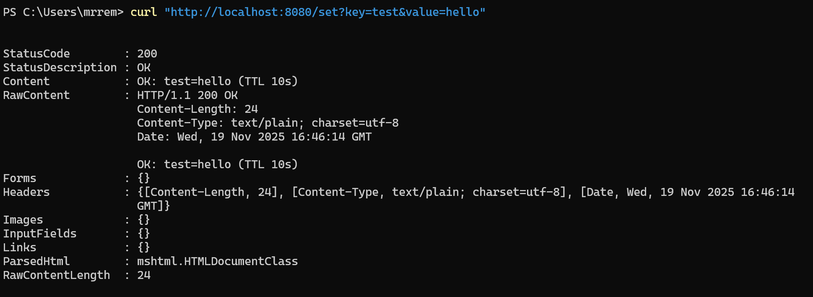
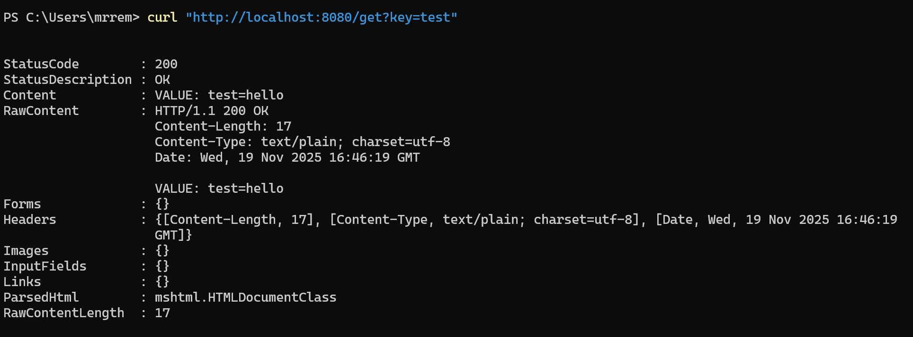
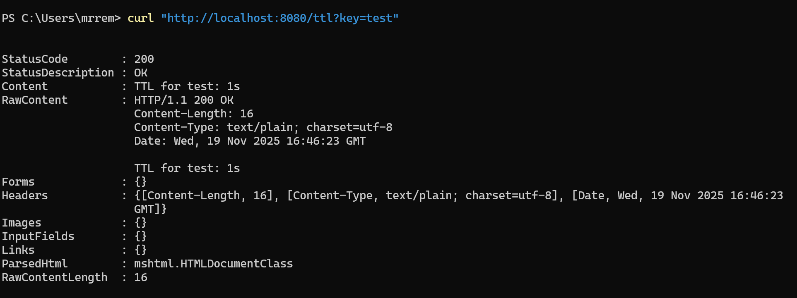

<h1>
Практическое задание №7<br><br>
Ремешевский В.А.<br>
ПИМО-01-25
</h1>

<h2><b>Тема</b><br>
Подключение и работа с Redis (set/get, TTL). Реализация простого кэша.</h2><br>

# PZ7-REDIS

## Краткое описание проекта

**PZ7-REDIS** — это HTTP API‑сервис на Go, демонстрирующий работу с Redis: установка и получение значений по ключу, а также работу с TTL (временем жизни ключа).  
Проект реализует простое взаимодействие с Redis через три эндпоинта:  
- `/set?key=...&value=...` — сохранить значение по ключу  
- `/get?key=...` — получить значение по ключу  
- `/ttl?key=...` — узнать оставшееся время жизни ключа (TTL)

## Структура проекта

```
pz7-redis/
├── assets/
├── cmd/
│   └── server/
│       └── main.go
├── internal/
│   └── cache/
│       └── cache.go
├── go.mod
├── .gitignore
└── README.md
```

---

## Как начать работу

### Инициализация и установка зависимостей

```sh
cd pz7-redis
go mod init example.com/pz7-redis
go get github.com/redis/go-redis/v9
go get github.com/joho/godotenv
```

### Настройка переменных окружения

Для запуска проекта необходимо создать файл `.env` в корне проекта со следующими переменными:

```env
REDIS_ADDR=localhost:6379
REDIS_PASSWORD=
```

- `REDIS_ADDR` — IP-адрес и порт сервера Redis (обычно `localhost:6379` для локального запуска).
- `REDIS_PASSWORD` — пароль для подключения к Redis (если не требуется, оставить пустым).

### Запуск приложения

```powershell
go run ./cmd/server
```

### Запуск сервера Redis

Локально или через Docker:

```powershell
docker run --name redis -p 6379:6379 redis
```

---

## Кратко: что делает Redis и зачем нужен TTL

**Redis** — это высокопроизводительное хранилище данных в памяти, часто используемое как кэш, брокер сообщений или база данных для временных данных.

**TTL (Time To Live)** — это время жизни ключа в Redis. После истечения TTL ключ автоматически удаляется.  
TTL позволяет хранить временные значения, например, кэшированные ответы, с автоматическим удалением по истечении заданного времени.

---

## Скриншоты

### Установка значения по ключу
```sh
curl "http://localhost:8080/set?key=test&value=hello"
```


### Получение значения по ключу
```sh
curl "http://localhost:8080/get?key=test"
```


### Получение TTL по ключу
```sh
curl "http://localhost:8080/ttl?key=test"
```
