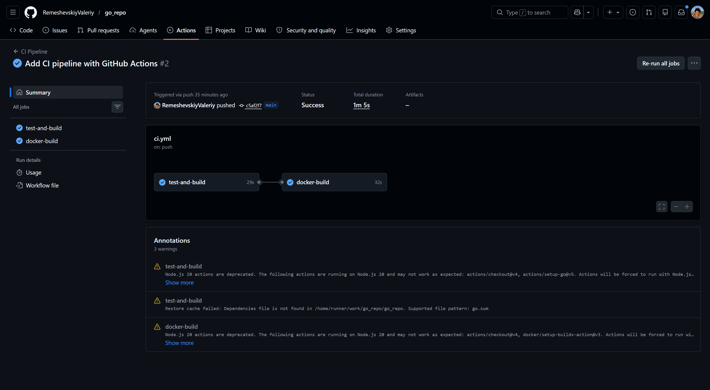

<h1>
Практическое задание №8<br><br>
Ремешевский В.А.<br>
ПИМО-01-25
</h1>

<h2><b>Тема</b><br>
Настройка GitHub Actions / GitLab CI для деплоя приложения</h2>

## Цель практической работы
Освоить основы CI/CD для backend-проекта на Go, научиться настраивать автоматический pipeline для проверки, сборки, упаковки Docker-образа и подготовки приложения к доставке.

# pz8-cicd

## Краткое описание
Проект демонстрирует настройку полноценного CI/CD pipeline с использованием **GitHub Actions**. Pipeline автоматически запускается при каждом push в репозиторий, проверяет исходный код, выполняет тесты, собирает Go-приложение и упаковывает его в Docker-образ. Это обеспечивает надежность и воспроизводимость процесса доставки приложения.

## Структура проекта
```
pz8-cicd/
├── assets/                          
├── deploy/                    
│   └── docker-compose.yml     
├── services/                  
│   └── tasks/                 
│       ├── .dockerignore      
│       ├── Dockerfile         
│       ├── go.mod             
│       ├── main_test.go       
│       └── cmd/               
│           └── tasks/         
│               └── main.go    
├── .github/                   
│   └── workflows/             
│       └── ci.yml             
└── README.md                  
```

---

## Пояснения

### Что такое CI и CD

**CI (Continuous Integration) — Непрерывная интеграция**
- Автоматическая проверка кода при каждом commit/push
- Включает: компиляцию, тестирование, анализ качества кода
- Цель: быстро выявить ошибки и конфликты слияния
- Запускается на каждое изменение в репозитории

**CD (Continuous Delivery/Deployment) — Непрерывная доставка/развертывание**
- Автоматическая подготовка приложения к production
- Включает: сборку артефактов (Docker-образ), публикацию в registry
- Continuous Delivery: код готов к deploy, но deploy запускается вручную
- Continuous Deployment: код автоматически развертывается в production

**В этой работе:**
- CI часть: тесты и сборка приложения
- CD часть: сборка Docker-образа и его подготовка

---

### Структура Pipeline

Pipeline состоит из двух последовательных **job**:

```
┌─────────────────────────────────────────────────────────┐
│ 1. test-and-build (29 сек)                              │
│    ├─ Checkout repository                               │
│    ├─ Setup Go 1.25.1                                   │
│    ├─ Show Go version                                   │
│    ├─ Download dependencies (go mod tidy)               │
│    ├─ Run tests (go test ./...)                         │
│    └─ Build application (go build ./...)                │
└──────────────────────────┬──────────────────────────────┘
                           │ (зависимость: needs: test-and-build)
                           ▼
┌─────────────────────────────────────────────────────────┐
│ 2. docker-build (32 сек)                                │
│    ├─ Checkout repository                               │
│    ├─ Set up Docker Buildx                              │
│    └─ Build Docker image                                │
└─────────────────────────────────────────────────────────┘
```

**Характеристики:**
- Запускается на: `ubuntu-latest` (GitHub-hosted runner)
- Запускается при: push на `main`/`master` или pull request в `main`/`master`
- Общее время выполнения: ~1 минута

---

### Выбранная платформа: GitHub Actions

**Альтернативы:**
- **GitLab CI** — если проект на GitLab
- **Jenkins** — для self-hosted решений
- **CircleCI**, **Travis CI** — для коммерческих проектов

---

### Полный YAML-файл Pipeline

```yaml
name: CI Pipeline

on:
  push:
    branches: [ "main", "master" ]
  pull_request:
    branches: [ "main", "master" ]

jobs:
  test-and-build:
    runs-on: ubuntu-latest

    steps:
      - name: Checkout repository
        uses: actions/checkout@v4

      - name: Setup Go
        uses: actions/setup-go@v5
        with:
          go-version: '1.25.1'

      - name: Show Go version
        run: go version

      - name: Download dependencies
        run: go mod tidy
        working-directory: ./pz8-cicd/services/tasks

      - name: Run tests
        run: go test ./...
        working-directory: ./pz8-cicd/services/tasks

      - name: Build application
        run: go build ./...
        working-directory: ./pz8-cicd/services/tasks

  docker-build:
    runs-on: ubuntu-latest
    needs: test-and-build

    steps:
      - name: Checkout repository
        uses: actions/checkout@v4

      - name: Set up Docker Buildx
        uses: docker/setup-buildx-action@v3

      - name: Build Docker image
        run: docker build -t techip-tasks:${{ github.sha }} .
        working-directory: ./pz8-cicd/services/tasks
```

---

### Пояснение шагов Pipeline

#### Job 1: `test-and-build`

| Шаг | Назначение | Команда |
|-----|-----------|---------|
| **Checkout repository** | Скачивает исходный код из branch | `actions/checkout@v4` |
| **Setup Go** | Устанавливает Go 1.25.1 в окружение | `actions/setup-go@v5` |
| **Show Go version** | Выводит установленную версию Go | `go version` |
| **Download dependencies** | Скачивает и обновляет зависимости | `go mod tidy` |
| **Run tests** | Запускает все тесты в проекте | `go test ./...` |
| **Build application** | Компилирует Go-приложение | `go build ./...` |

#### Job 2: `docker-build`

| Шаг | Назначение | Команда |
|-----|-----------|---------|
| **Checkout repository** | Скачивает исходный код из branch | `actions/checkout@v4` |
| **Set up Docker Buildx** | Инициализирует Docker Buildx для сборки | `docker/setup-buildx-action@v3` |
| **Build Docker image** | Собирает Docker-образ из Dockerfile | `docker build -t techip-tasks:${{ github.sha }} .` |

**Важные параметры:**
- `working-directory` — директория для выполнения команды
- `needs: test-and-build` — job запускается только если предыдущий успешен
- `runs-on: ubuntu-latest` — виртуальная машина GitHub

---

### Способ формирования тега образа

```yaml
docker build -t techip-tasks:${{ github.sha }} .
```

**Формат тега:** `techip-tasks:SHA_HASH`

Где `${{ github.sha }}` — 40-символьный хеш текущего commit. Пример:
```
techip-tasks:a1b2c3d4e5f6g7h8i9j0k1l2m3n4o5p6q7r8s9t
```

**Альтернативные варианты:**
```yaml
# По номеру версии
docker build -t techip-tasks:1.0.0 .

# По имени branch
docker build -t techip-tasks:${{ github.ref_name }} .

# По дате
docker build -t techip-tasks:$(date +%Y%m%d) .

# По номеру запуска
docker build -t techip-tasks:run-${{ github.run_number }} .
```

---

### Объяснение, где должны храниться секреты

**Секреты в GitHub Actions** — это зашифрованные переменные для хранения чувствительных данных.

**Где хранятся секреты:**

1. **На GitHub** (рекомендуется):
   - Путь: Repository → Settings → Secrets and variables → Actions
   - Кликнуть: "New repository secret"
   - Примеры: `REGISTRY_USERNAME`, `REGISTRY_PASSWORD`, `SSH_PRIVATE_KEY`

2. **В workflow файле** (ЗАПРЕЩЕНО):
   ```yaml
   # ❌ ПЛОХО — никогда так не делайте!
   env:
     REGISTRY_PASSWORD: "my-secret-password"
   ```

3. **В .env файле** (ЗАПРЕЩЕНО):
   ```
   # .env — НИКОГДА не коммитить!
   REGISTRY_PASSWORD=my-secret-password
   ```

**Как использовать секреты в workflow:**

```yaml
- name: Login to registry
  run: echo "${{ secrets.REGISTRY_PASSWORD }}" | docker login \
    -u "${{ secrets.REGISTRY_USERNAME }}" \
    --password-stdin ghcr.io
```

**Безопасность:**
- ✅ GitHub шифрует секреты в rest
- ✅ Секреты не печатаются в логах (показывает `***`)
- ✅ Каждый job запускается в чистой среде
- ✅ Секреты не видны после создания
- ✅ Доступны только в GitHub Actions контексте

**Типы данных, которые должны быть секретами:**
- Пароли регистров (Docker Hub, GHCR, GitLab Registry)
- SSH приватные ключи для развертывания
- API токены (GitHub, GitLab, внешних сервисов)
- Database credentials
- Токены аутентификации

---

## Как начать работу

### Инициализация и установка зависимостей

```sh
cd pz8-cicd/services/tasks
go mod init example.com/pz8-cicd
go mod tidy
```

### Запуск через сборку Docker-образа

```sh
docker build -t techip-tasks:0.1 .
docker run --rm -p 8082:8082 -e TASKS_PORT=8082 techip-tasks:0.1
```

**Объяснение аргументов `docker run`:**
- `--rm` — автоматически удаляет контейнер после остановки (не оставляет мусор)
- `-p 8082:8082` — пробрасывает порт контейнера (8082) на порт хоста (8082)
  - Формат: `-p ХОСТ_ПОРТ:КОНТЕЙНЕР_ПОРТ`
  - Теперь приложение доступно по `http://localhost:8082`
- `-e TASKS_PORT=8082` — задает переменную окружения `TASKS_PORT` внутри контейнера
  - Формат: `-e ПЕРЕМЕННАЯ=ЗНАЧЕНИЕ`

### Запуск через Docker Compose

```sh
cd ../..
cd deploy/
docker compose up -d --build
```

**Объяснение команды:**
- `docker compose up` — запускает сервисы, описанные в `docker-compose.yml`
- `-d` — запускает в фоне (detached mode), не блокирует терминал
- `--build` — пересобирает образы перед запуском

---

## Скриншоты

### Успешная сборка в GitHub Actions

```sh
# После выполнения на GitHub Actions можно просмотреть результаты
# Откройте репозиторий → Actions → последний запуск workflow
```

