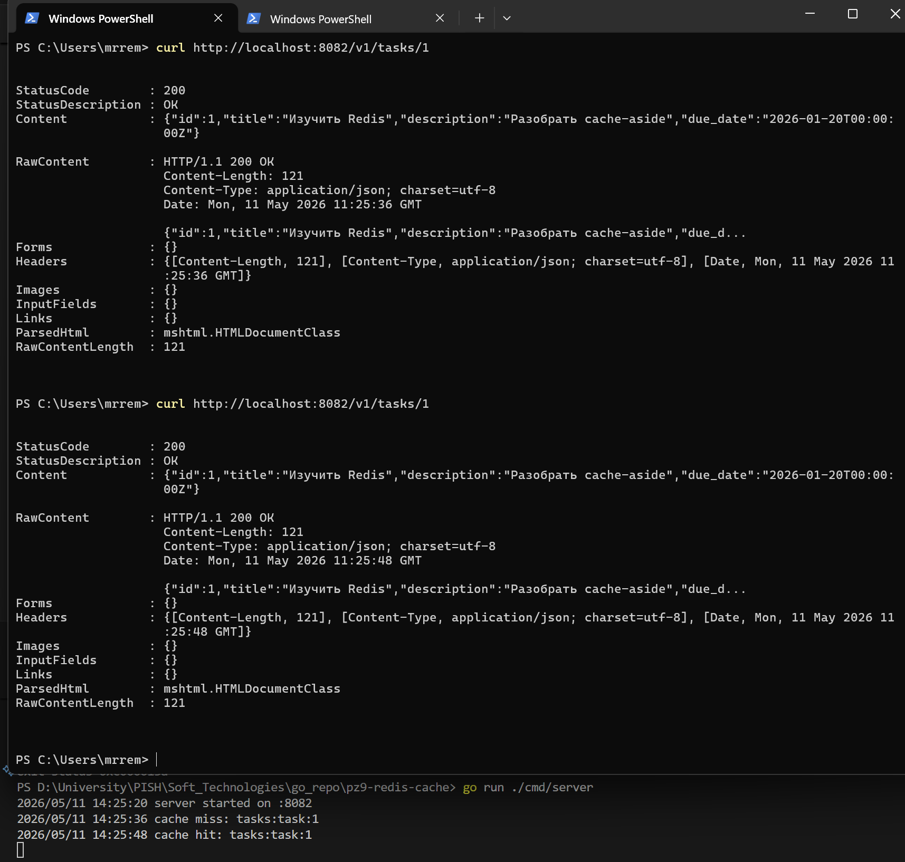
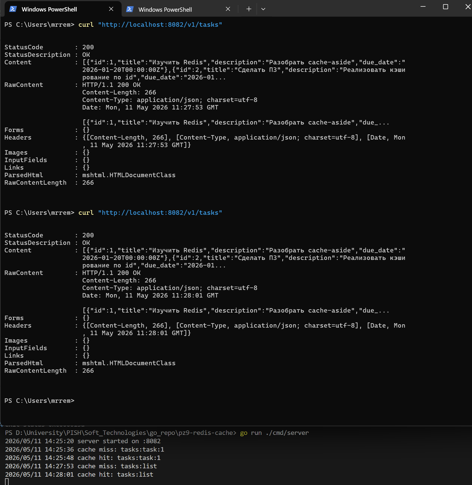
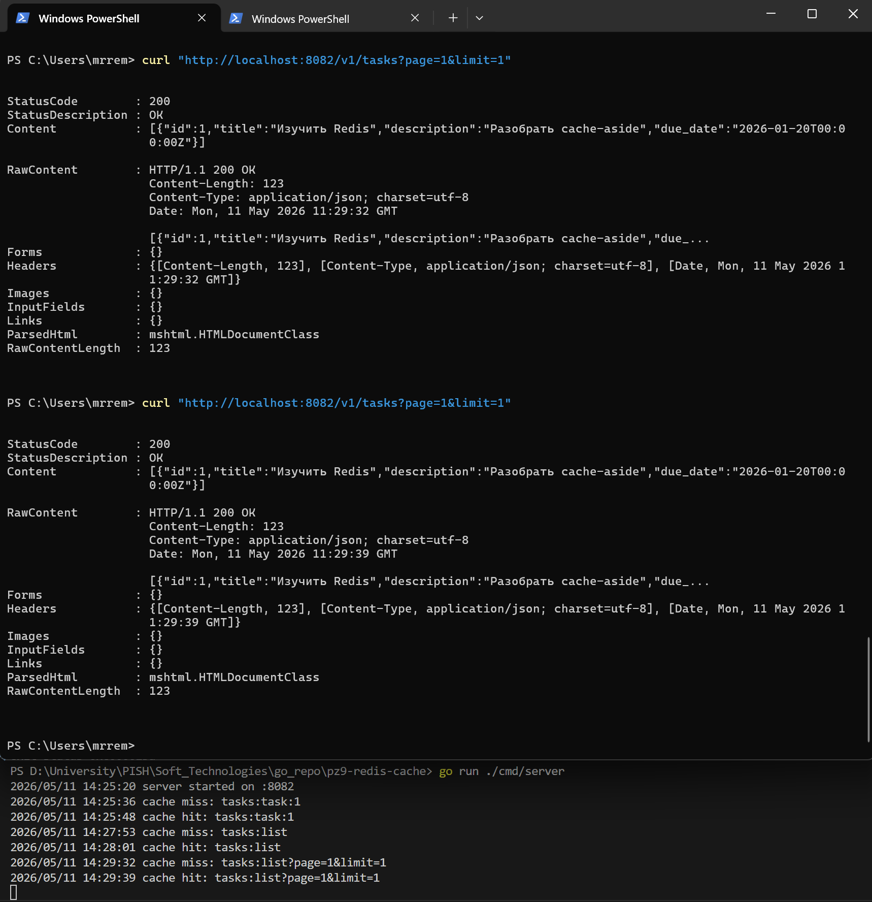
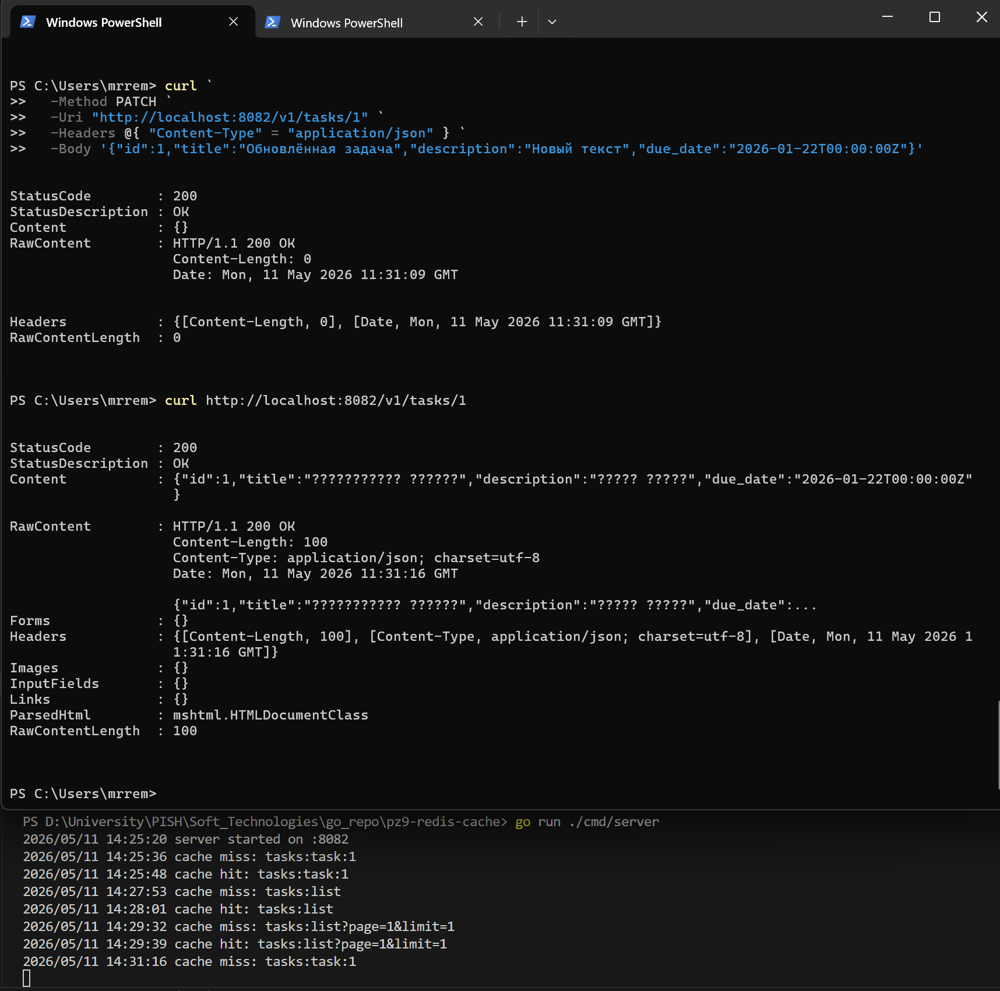
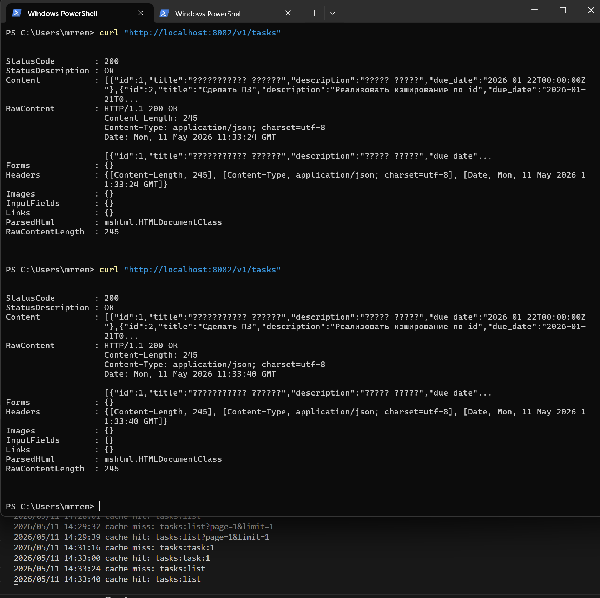
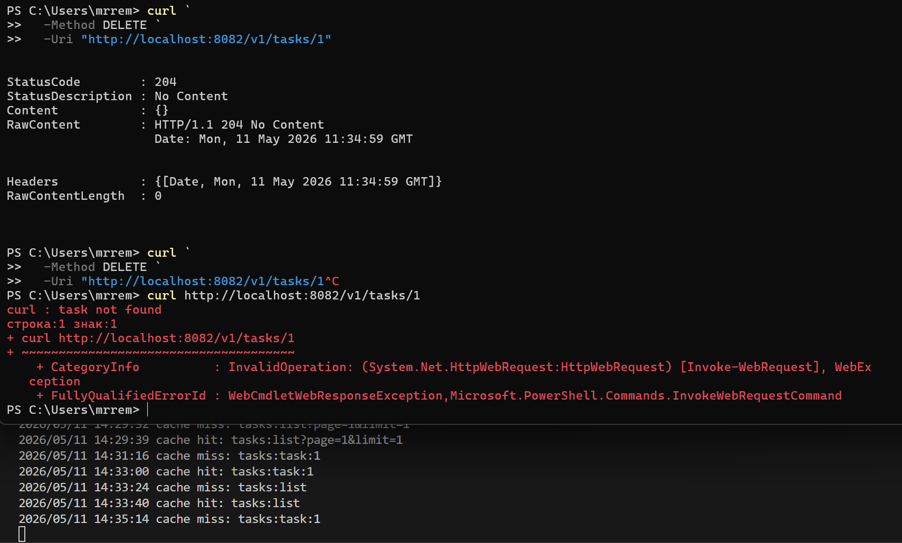
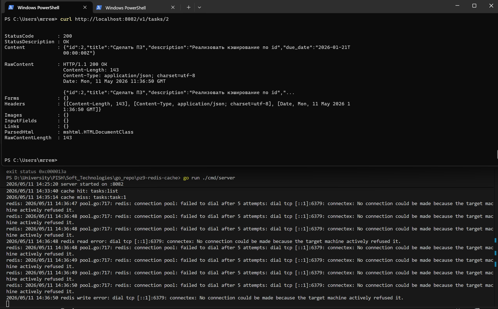

<h1>
Практическое задание №9<br><br>
Ремешевский В.А.<br>
ПИМО-01-25
</h1>

<h2><b>Тема</b><br>
Реализация распределённого кэша (Redis cluster).</h2>

## Цель практической работы

Освоить внедрение распределённого кэша в backend-приложение на Go и реализовать стратегию cache-aside с использованием Redis, корректного TTL, jitter и устойчивого поведения сервиса при недоступности кэша.

## О проекте

Проект `pz9-redis-cache` демонстрирует реализацию простого HTTP-сервиса на Go с кэшированием данных задач в Redis. В приложении реализованы:

- получение задачи по ID с кэшированием;
- получение списка задач и кеширование результата для маршрута `GET /v1/tasks`;
- поддержка пагинации `page` и `limit`;
- стратегия cache-aside;
- корректный TTL с jitter;
- устойчивое поведение сервиса при недоступности Redis;
- инвалидирование списка кеша после изменения данных.

## Структура проекта
```
pz9-redis-cache/
├── assets/
├── cmd/
│   └── server/
│       └── main.go
├── internal/
│   ├── cache/
│   │   ├── keys.go
│   │   ├── redis.go
│   │   └── ttl.go
│   ├── config/
│   │   └── config.go
│   ├── httpapi/
│   │   └── handler.go
│   ├── service/
│   │   └── task_service.go
│   └── task/
│       ├── model.go
│       └── repo.go
├── deploy/
│   └── redis/
│       └── docker-compose.yml
├── go.mod
└── README.md
```

## Вопросы и пояснения

1. Что такое cache-aside?
   - Cache-aside — стратегия, при которой приложение сначала пытается получить данные из кеша. Если данных нет, оно запрашивает их из основного хранилища, возвращает ответ клиенту и сохраняет данные в кеш для будущих запросов.

2. Почему Redis не должен быть источником истины?
   - Redis — это оперативный кеш. Он может быть очищен, устареть или стать недоступным. Истинные данные должны храниться в основной базе данных или другом долговременном хранилище, тогда кеш остаётся вспомогательным уровнем.

3. Зачем нужен TTL?
   - TTL ограничивает время жизни данных в кеше. Это помогает избежать устаревания, освобождать память и автоматически удалять кэшированные записи, когда они перестают быть актуальными.

4. Что такое jitter?
   - Jitter — случайная погрешность, добавляемая к TTL. Он предотвращает одновременное истечение большого числа ключей и лавинное увеличение нагрузки на основное хранилище.

5. Почему одинаковый TTL для всех ключей может быть проблемой?
   - Если многие ключи истекают одновременно, то возникает «cache stampede»: большое число запросов сразу попадает в основное хранилище. Разнородный TTL распределяет время обновления кеша.

6. Как должен вести себя сервис при недоступности Redis?
   - Сервис должен продолжать работать, обслуживая запросы из основного хранилища. Ошибки Redis должны логироваться, но не блокировать основной поток обработки.

7. Почему кэш нужно инвалидировать после изменения данных?
   - После изменения данных в источнике кеш становится устаревшим. Чтобы не отдавать пользователям неверную информацию, нужно удалить или обновить соответствующие ключи.

8. Чем кэширование одной сущности проще, чем кэширование списка?
   - Кэширование одной сущности обычно опирается на однозначный ключ, а при списках нужно учитывать фильтры, сортировку, пагинацию и инвалидировать больше наборов ключей.

9. В чём смысл ключа вида `tasks:task:<id>`?
   - Такой ключ уникально идентифицирует конкретную задачу и позволяет быстро получить её из кеша, не затрагивая другие записи.

10. Почему Redis рассматривается как внешняя инфраструктурная зависимость?
   - Redis запускается отдельно от приложения и представляет собой отдельный сервис. Это инфраструктурный компонент, на который приложение зависит, но который управляется и масштабируется отдельно.

## Как начать работу

### Инициализация и установка зависимостей

```sh
cd pz9-redis-cache
go get github.com/redis/go-redis/v9
go install github.com/redis/go-redis/v9@latest
go mod init example.com/pz9-redis-cache
go mod tidy
```

### Запуск приложения

```sh
go run ./cmd/server
```

---

## Запуск Redis для тестирования

В папке `deploy/redis` находится `docker-compose.yml`:

```yaml
version: "3.9"

services:
  redis:
    image: redis:7.4
    container_name: redis_cache
    ports:
      - "6379:6379"
```

### Запуск Redis

```sh
cd deploy/redis
docker compose up -d
```

### Остановка Redis

```sh
docker compose stop
```

## Скриншоты

### Получение задачи по id с кешированием
```sh
cd deploy/redis
docker compose up -d
cd ../..
curl http://localhost:8082/v1/tasks/1
curl http://localhost:8082/v1/tasks/1
```


### Получение списка задач с кешированием
```sh
curl "http://localhost:8082/v1/tasks"
curl "http://localhost:8082/v1/tasks"
```


### Получение списка задач с пагинацией и кешированием
```sh
curl "http://localhost:8082/v1/tasks?page=1&limit=1"
curl "http://localhost:8082/v1/tasks?page=1&limit=1"
```


### Обновление задачи и проверка кеша
```sh
curl \
  -Method PATCH \
  -Uri "http://localhost:8082/v1/tasks/1" \
  -Headers @{ "Content-Type" = "application/json" } \
  -Body '{"id":1,"title":"Обновлённая задача","description":"Новый текст","due_date":"2026-01-22T00:00:00Z"}'
curl http://localhost:8082/v1/tasks/1
curl http://localhost:8082/v1/tasks/1
```


### Инвалидирование кеша списка после PATCH
```sh
curl "http://localhost:8082/v1/tasks"
curl "http://localhost:8082/v1/tasks"
```


### Удаление задачи и проверка
```sh
curl \
  -Method DELETE \
  -Uri "http://localhost:8082/v1/tasks/1"
curl http://localhost:8082/v1/tasks/1
```


### Устойчивость при недоступном Redis
```sh
curl http://localhost:8082/v1/tasks/2
```

