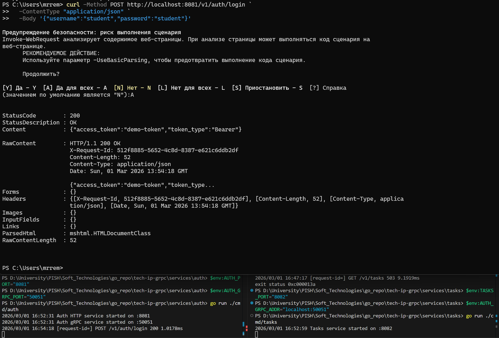
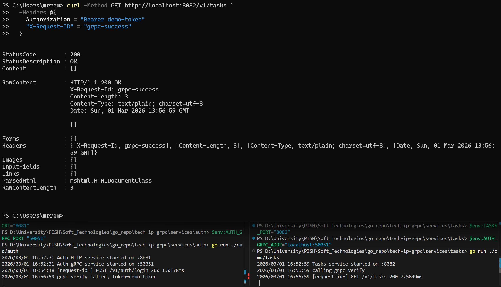
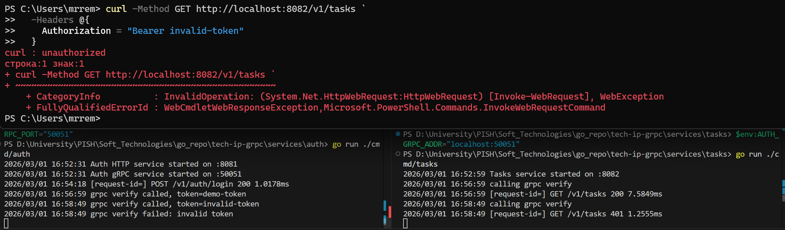
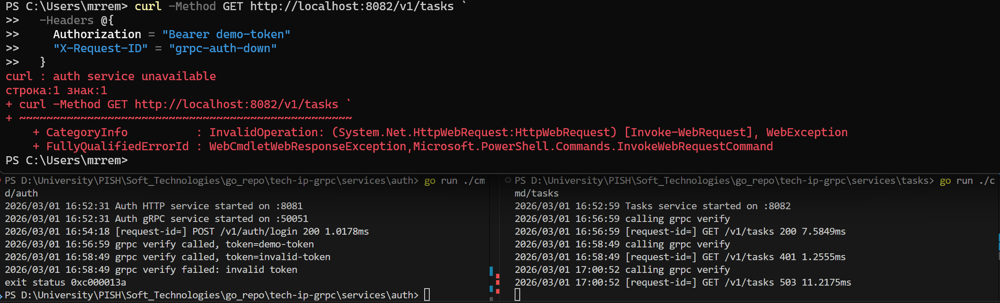

<h1>
Практическое задание №18<br><br>
Ремешевский В.А.<br>
ПИМО-01-25
</h1>

<h2><b>Тема</b><br>
gRPC: создание простого микросервиса, вызовы методов</h2>

# tech-ip-grpc

Простой учебный набор сервисов, общающихся по gRPC:

- **auth** – сервис проверки токенов;
- **tasks** – сервис списка задач, который запрашивает авторизацию у `auth`.

## Структура проекта
```
tech-ip-grpc/
├── assets/                            
├── docs/                                 
│   └── pz17_api.md                       
├── proto/                                
│   ├── auth.proto                        
│   └── authpb/                           
│       ├── auth.pb.go
│       └── auth_grpc.pb.go
├── services/
│   ├── auth/                          
│   │   ├── cmd/
│   │   │   └── auth/
│   │   │       └── main.go            
│   │   └── internal/
│   │       └── http/                  
│   │           └── handlers.go
│   │           └── router.go
│   │       └── grpc/                  
│   │           └── server.go
│   │       └── service/                  
│   │           └── auth.go
│   └── tasks/                         
│       ├── cmd/
│       │   └── tasks/
│       │       └── main.go            
│       └── internal/
│           ├── client/
│           |   └── authclient/          
│           │       └── client.go
│           │   └── authgrpc/          
│           │       └── client.go
│           ├── http/                     
│           │   ├── auth_middleware.go
│           │   ├── handlers.go
│           │   └── router.go
│           └── service/                  
│               └── task.go
├── shared/                               
│   ├── httpx/                            
│   │   └── client.go
│   └── middleware/                       
│       ├── logging.go
│       └── requestid.go
├── go.mod
└── README.md                            
```

---

## .proto файл

В описании протокола используется single-service `AuthService` с методом
`Verify`.

```protobuf
syntax = "proto3";
package auth;
option go_package = "example.com/tech-ip-grpc/proto/authpb;authpb";

service AuthService {
  rpc Verify (VerifyRequest) returns (VerifyResponse);
}

message VerifyRequest { string token = 1; }
message VerifyResponse { bool valid = 1; string subject = 2; }
```

Файл лежит в `proto/auth.proto`, генерируемые артефакты оказываются в
`proto/authpb/{auth.pb.go,auth_grpc.pb.go}`.

### Команды генерации

Сначала устанавливаем генераторы (один раз):

```powershell
# для protoc
go install google.golang.org/protobuf/cmd/protoc-gen-go@latest
go install google.golang.org/grpc/cmd/protoc-gen-go-grpc@latest
```

А затем запускаем сам `protoc` из корня проекта:

```sh
protoc --go_out=. --go-grpc_out=. proto/auth.proto
```

После этого в пакете `authpb` появляются сгенерированные структуры и интерфейсы.

## Описание ошибок и маппинг на HTTP

gRPC‑сервер `auth` возввращает ошибки с кодами из `google.golang.org/grpc/codes`:

- `codes.Unauthenticated` – токен пустой или неверный;
- `codes.DeadlineExceeded` – таймаут (например, при долгой валидации).

Клиент `services/tasks/internal/client/authgrpc` превращает их в собственные
ошибки:

```go
var (
    ErrUnauthorized   = errors.New("unauthorized")
    ErrAuthUnavailable = errors.New("auth service unavailable")
)
```

Наконец, HTTP‑middleware переводит эти ошибки в статусы:

| gRPC-код                | Go‑ошибка          | HTTP-статус      | Сообщение              |
|------------------------|--------------------|------------------|------------------------|
| Unauthenticated        | ErrUnauthorized    | 401 Unauthorized | `unauthorized`         |
| DeadlineExceeded/другое| ErrAuthUnavailable | 503 Service Unavailable | `auth service unavailable` |

Также промежуточные проверки (отсутствует заголовок, неверный формат)
возвращают 401.

---

## Как начать работу

### Инициализация и установка зависимостей

```sh
cd tech-ip-grpc
go mod tidy
go mod init example.com/tech-ip-grpc
go get google.golang.org/grpc
go get google.golang.org/protobuf
```

### Запуск приложений (PowerShell)

#### Auth

```powershell
$env:AUTH_PORT="8081"
$env:AUTH_GRPC_PORT="50051"
cd services/auth
go run ./cmd/auth
```

#### Tasks

```powershell
$env:TASKS_PORT="8082"
$env:AUTH_GRPC_ADDR="localhost:50051"
cd services/tasks
go run ./cmd/tasks
```

> В системе используется gRPC‑связь между сервисами; сервис `tasks`
> устанавливает соединение по адресу из переменной `AUTH_GRPC_ADDR`.

---

## Скриншоты

### Авторизация пользователя
```sh
curl -Method POST http://localhost:8081/v1/auth/login `
  -ContentType "application/json" `
  -Body '{"username":"student","password":"student"}'
```


### Успешный запрос к таскам через gRPC
```sh
curl -Method GET http://localhost:8082/v1/tasks `
  -Headers @{
    Authorization = "Bearer demo-token"
    "X-Request-ID" = "grpc-success"
  }
```


### Неверный токен
```sh
curl -Method GET http://localhost:8082/v1/tasks `
  -Headers @{
    Authorization = "Bearer invalid-token"
  }
```


### Когда auth-сервис недоступен
```sh
curl -Method GET http://localhost:8082/v1/tasks `
  -Headers @{
    Authorization = "Bearer demo-token"
    "X-Request-ID" = "grpc-auth-down"
  }
```


----