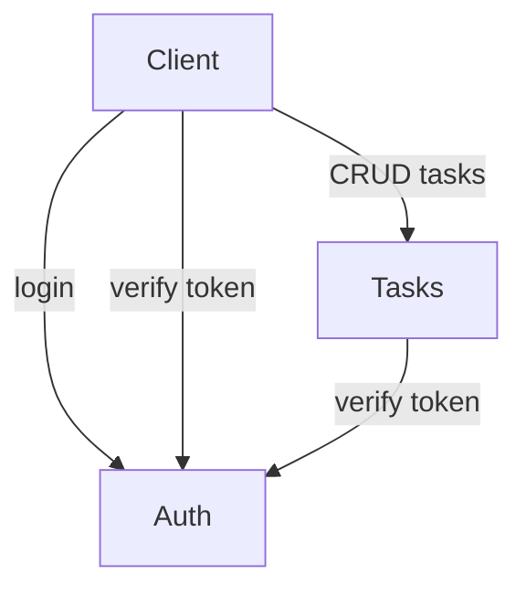
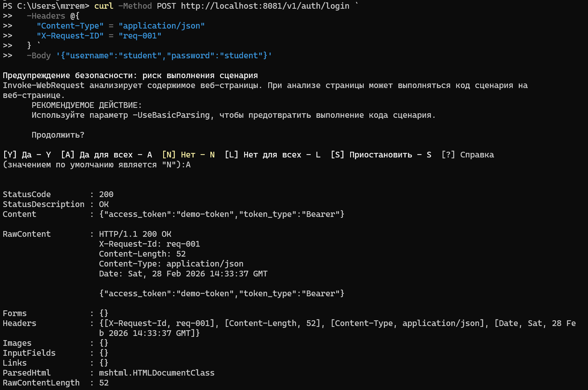
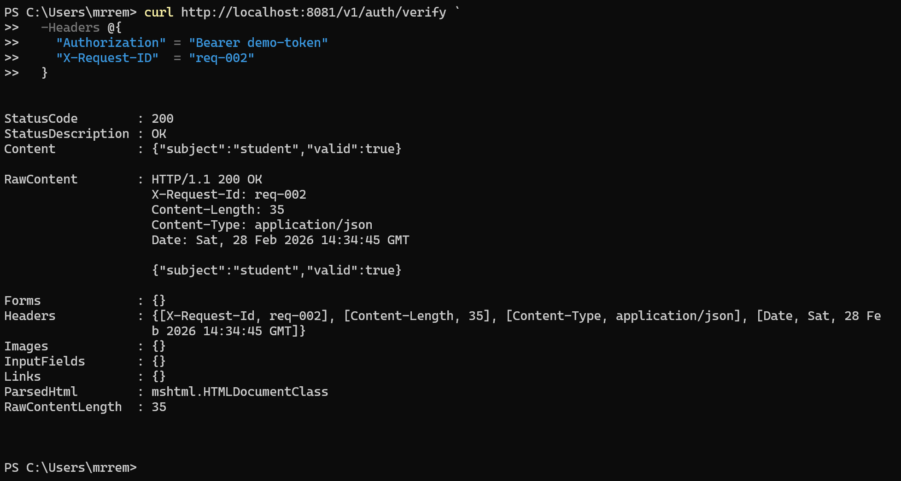
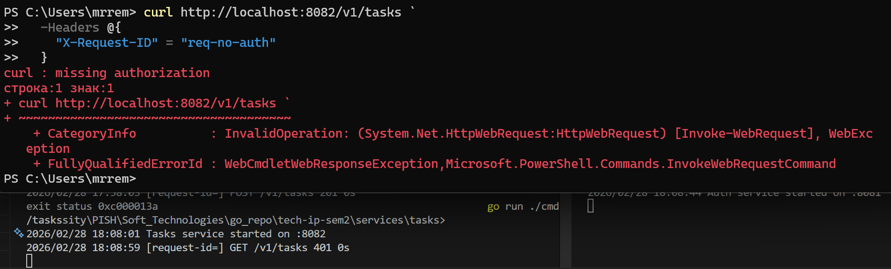
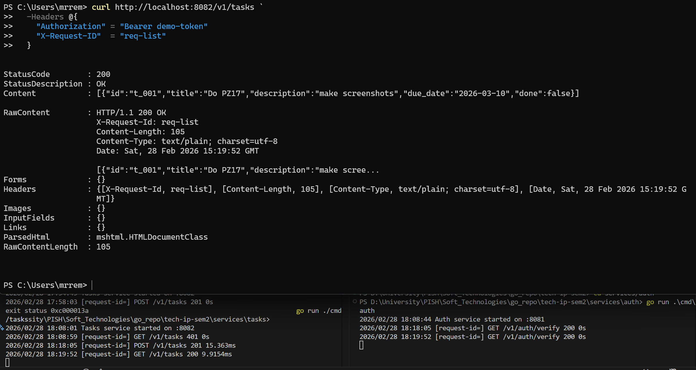
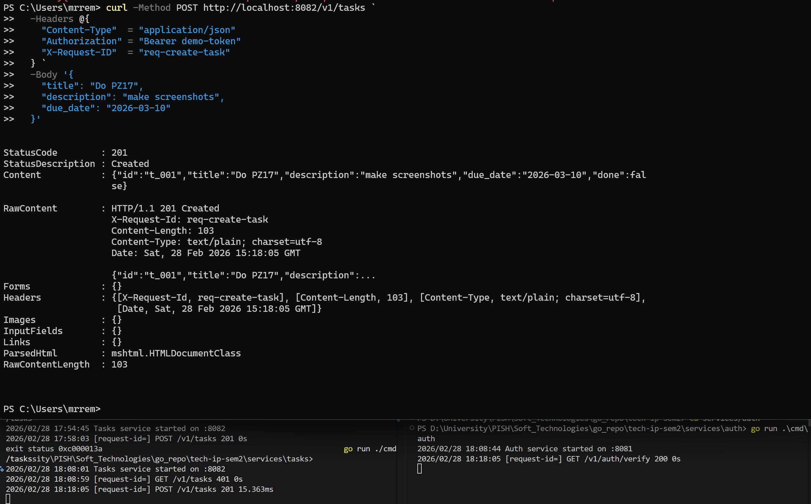
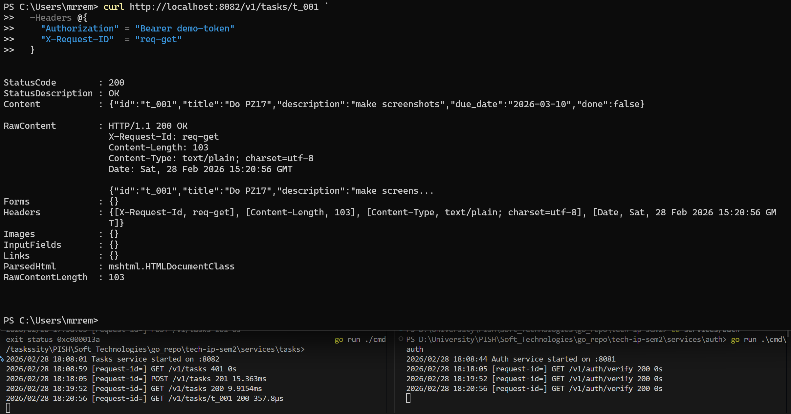
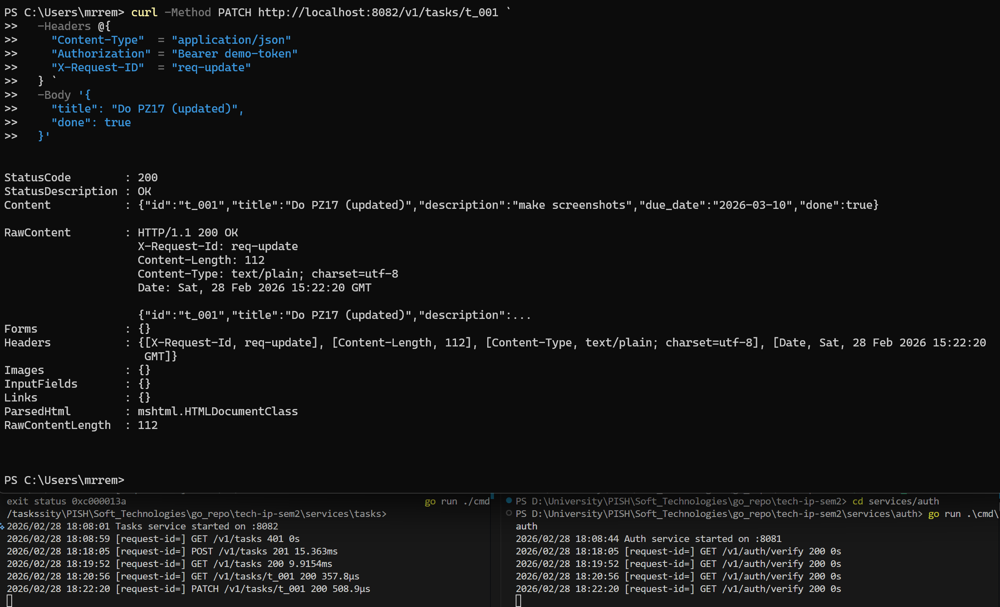
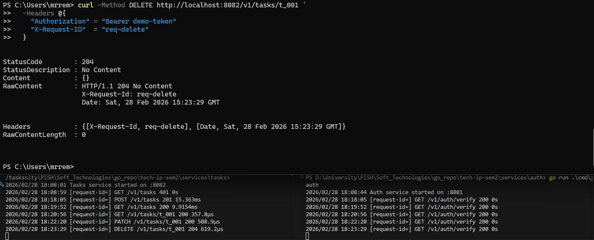
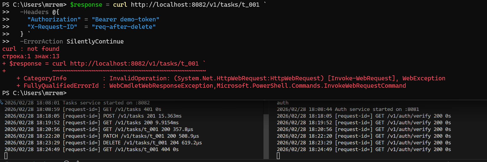

<h1>
Практическое задание №17<br><br>
Ремешевский В.А.<br>
ПИМО-01-25
</h1>

<h2><b>Тема</b><br>
Разделение монолита на 2 микросервиса. Взаимодействие через HTTP</h2>

# tech-ip-sem2

Проект демонстрирует разделение монолитного приложения на два микросервиса: **Auth** (авторизация) и **Tasks** (управление задачами). Сервисы взаимодействуют друг с другом через HTTP, реализуя базовую авторизацию и CRUD для задач.

## Структура проекта
```
tech-ip-sem2/
├── assets/                     
├── docs/                                   # Документация
│   └── pz17_api.md                         # Описание API и примеры запросов
├── services/
│   ├── auth/                               # Auth service
│   │   ├── cmd/
│   │   │   └── auth/
│   │   │       └── main.go                 # Точка входа Auth service
│   │   └── internal/
│   │       ├── http/                       # HTTP-слой (handlers, router)
│   │       │   ├── handlers.go
│   │       │   └── router.go
│   │       └── service/                    # Бизнес-логика авторизации
│   │           └── auth.go
│   └── tasks/                              # Tasks service
│       ├── cmd/
│       │   └── tasks/
│       │       └── main.go                 # Точка входа Tasks service
│       └── internal/
│           ├── client/
│           │   └── authclient/             # HTTP-клиент для Auth service
│           │       └── client.go
│           ├── http/                       # HTTP-слой Tasks service
│           │   ├── auth_middleware.go
│           │   ├── handlers.go
│           │   └── router.go
│           └── service/                    # Логика работы с задачами
│               └── task.go
├── shared/                                 # Общий код для сервисов
│   ├── httpx/                              # HTTP-клиент с таймаутом
│   │   └── client.go
│   └── middleware/                         # Общие middleware
│       ├── logging.go
│       └── requestid.go
├── go.mod
└── README.md
```

---

## Границы сервисов
- **Auth** — отвечает за авторизацию пользователей, выдачу и проверку токенов. Не хранит задачи.
- **Tasks** — управляет задачами (создание, просмотр, обновление, удаление). Для доступа к задачам требуется валидный токен, проверяемый через **Auth**.
- Каждый сервис запускается отдельно, имеет собственный порт и переменные окружения.
- Взаимодействие между сервисами происходит только через HTTP-запросы.
- **Tasks** не хранит пользователей, а только задачи. **Auth** не знает о задачах.
- Для проверки токена **Tasks** обращается к **Auth** по HTTP.
- Вся бизнес-логика разделена между сервисами, нет прямого доступа к данным другого сервиса.

---

## Схема взаимодействия



---

## Список эндпоинтов

### Auth
- POST `/v1/auth/login` — авторизация, выдача токена
- GET `/v1/auth/verify` — проверка токена

### Tasks
- GET `/v1/tasks` — список задач
- POST `/v1/tasks` — создать задачу
- GET `/v1/tasks/{id}` — получить задачу
- PATCH `/v1/tasks/{id}` — обновить задачу
- DELETE `/v1/tasks/{id}` — удалить задачу

Подробнее — см. [docs/pz17_api.md](docs/pz17_api.md)

---

## Как начать работу

### Инициализация и установка зависимостей

```sh
cd tech-ip-sem2/
go mod tidy
go mod init example.com/tech-ip-sem2
```

### Запуск приложений (PowerShell)

#### Auth
```powershell
$env:AUTH_PORT="8081"
cd services/auth
go run ./cmd/auth
```

#### Tasks
```powershell
$env:TASKS_PORT="8082"
$env:AUTH_BASE_URL="http://localhost:8081"
cd services/tasks
go run ./cmd/tasks
```

---

## Скриншоты

### Авторизация пользователя
```sh
curl -Method POST http://localhost:8081/v1/auth/login `
  -Headers @{
    "Content-Type" = "application/json"
    "X-Request-ID" = "req-001"
  } `
  -Body '{"username":"student","password":"student"}'
```


### Проверка токена
```sh
curl http://localhost:8081/v1/auth/verify `
  -Headers @{
    "Authorization" = "Bearer demo-token"
    "X-Request-ID"  = "req-002"
  }
```


### Получение списка задач (без авторизации)
```sh
curl http://localhost:8082/v1/tasks `
  -Headers @{
    "X-Request-ID" = "req-no-auth"
  }
```


### Получение списка задач (с авторизацией)
```sh
curl http://localhost:8082/v1/tasks `
  -Headers @{
    "Authorization" = "Bearer demo-token"
    "X-Request-ID"  = "req-list"
  }
```


### Создание задачи
```sh
curl -Method POST http://localhost:8082/v1/tasks `
  -Headers @{
    "Content-Type"  = "application/json"
    "Authorization" = "Bearer demo-token"
    "X-Request-ID"  = "req-create-task"
  } `
  -Body '{
    "title": "Do PZ17",
    "description": "make screenshots",
    "due_date": "2026-03-10"
  }'
```


### Получение задачи по id
```sh
curl http://localhost:8082/v1/tasks/t_001 `
  -Headers @{
    "Authorization" = "Bearer demo-token"
    "X-Request-ID"  = "req-get"
  }
```


### Обновление задачи
```sh
curl -Method PATCH http://localhost:8082/v1/tasks/t_001 `
  -Headers @{
    "Content-Type"  = "application/json"
    "Authorization" = "Bearer demo-token"
    "X-Request-ID"  = "req-update"
  } `
  -Body '{
    "title": "Do PZ17 (updated)",
    "done": true
  }'
```


### Удаление задачи
```sh
curl -Method DELETE http://localhost:8082/v1/tasks/t_001 `
  -Headers @{
    "Authorization" = "Bearer demo-token"
    "X-Request-ID"  = "req-delete"
  }
```


### Получение задачи после удаления
```sh
curl http://localhost:8082/v1/tasks/t_001 `
  -Headers @{
    "Authorization" = "Bearer demo-token"
    "X-Request-ID"  = "req-after-delete"
  }
```


---
